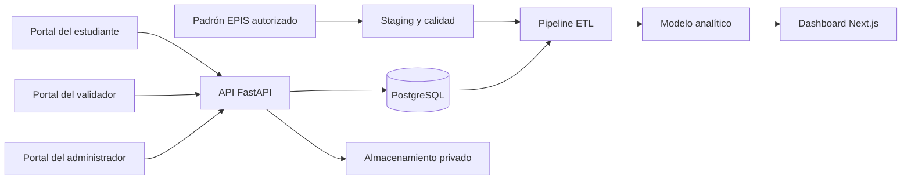

# Pulse EPIS

<p align="center">
  
</p>

<p align="center">
  <strong>Dashboard de acreditaciones y certificaciones de estudiantes de la EPIS</strong>
</p>

<p align="center">
  Aplicación de Inteligencia de Negocios para consolidar, validar y analizar las certificaciones obtenidas por estudiantes de la Escuela Profesional de Ingeniería de Sistemas de la Universidad Privada de Tacna.
</p>

## Descripción

Pulse EPIS busca proporcionar información confiable para la toma de decisiones académicas y los procesos de acreditación. La solución permitirá integrar el padrón institucional de estudiantes con las certificaciones declaradas y validadas, calcular indicadores reproducibles y detectar tendencias o brechas de competencias tecnológicas.

El proyecto no pretende descubrir estudiantes mediante scraping de redes profesionales. La población deberá obtenerse de un padrón EPIS autorizado, mientras que cada certificación deberá contar con evidencia y un estado de validación antes de ingresar en los indicadores oficiales.

## Estado del proyecto

> **Prototipo en desarrollo.** El frontend y los documentos académicos ya cuentan con una base funcional. Actualmente, los datos del dashboard son demostrativos y los scripts Python no constituyen todavía una API de producción.

| Componente | Estado |
|---|---|
| Dashboard y navegación | Prototipo funcional con datos simulados |
| Roles principales | Interfaz para administrador, validador y estudiante |
| Documentos FD01–FD04 | Versionados en `docs/` |
| ETL | Prueba de concepto en Python |
| API backend | Pendiente de implementación con FastAPI |
| Base de datos | Pendiente de implementación con PostgreSQL |
| Autenticación institucional | Pendiente |
| Docker y CI/CD | Planificados en el backlog |
| Despliegue público | Pendiente |

Consulta el [backlog del proyecto](https://github.com/Kiara1616/pulse-epis/issues) para conocer el avance y los criterios de aceptación.

## Funcionalidades previstas

- Autenticación con cuenta institucional y validación contra el padrón EPIS.
- Tres roles principales: administrador, validador y estudiante.
- Importación y conciliación del padrón por periodo académico.
- Registro de certificaciones y almacenamiento privado de evidencias.
- Flujo de observación, aprobación, rechazo y expiración.
- Indicadores por periodo, ciclo, cohorte, proveedor, nivel y tecnología.
- Análisis de cobertura, evolución y brechas de competencias.
- Exportaciones con filtros y fecha de corte.
- Auditoría de operaciones y decisiones de validación.
- Generación automática de diagramas y manuales desde el repositorio.

## Tecnologías

### Implementadas actualmente

| Capa | Tecnología | Uso |
|---|---|---|
| Frontend | Next.js 16 | Aplicación web y enrutamiento |
| Interfaz | React 19 y TypeScript | Componentes y lógica de presentación |
| Estilos | Tailwind CSS 4 | Sistema visual y diseño adaptable |
| Visualización | Recharts | Gráficos e indicadores |
| ETL demostrativo | Python, Pandas y Requests | Transformación inicial de datos |

### Arquitectura objetivo

| Capa | Tecnología prevista | Uso |
|---|---|---|
| API | FastAPI y Pydantic | Servicios REST, validación y OpenAPI |
| Persistencia | PostgreSQL | Datos operacionales, históricos y analíticos |
| Acceso a datos | SQLAlchemy y Alembic | ORM y migraciones versionadas |
| Identidad | Google OpenID Connect | Inicio de sesión institucional |
| Evidencias | Almacenamiento compatible con S3 | Archivos privados y acceso temporal |
| Pruebas | Pytest y Playwright | Pruebas del backend y recorridos web |
| Contenedores | Docker y Docker Compose | Entornos reproducibles |
| Automatización | GitHub Actions | Calidad, documentación y despliegue |
| Diagramas | Mermaid | Arquitectura como código |

Las tecnologías de la arquitectura objetivo se incorporarán mediante los issues y pull requests correspondientes; su inclusión en esta tabla no implica que ya estén implementadas.

## Arquitectura prevista



## Estructura actual

```text
pulse-epis/
├── backend/
│   ├── requirements.txt
│   └── scripts_etl/        # ETL demostrativo y datos de prueba
├── dashboard-app/
│   ├── public/             # Recursos gráficos institucionales
│   └── src/                # Aplicación Next.js
├── docs/
│   ├── 00-Problema-y-linea-base.md
│   ├── 01-Objetivos-medibles.md
│   ├── FD01-Informe-Factibilidad.md
│   ├── FD02-Informe-Vision.md
│   ├── FD03-EPIS-Informe Especificación Requerimientos.md
│   ├── FD04-EPIS-Informe Arquitectura de Software.md
│   └── schemas/            # Contratos y especificaciones
├── .gitignore
└── README.md
```

La estructura evolucionará para incorporar la aplicación FastAPI, migraciones, pruebas, diagramas, manuales, contenedores y workflows de GitHub Actions.

## Ejecución actual del frontend

### Requisitos

- Node.js 20 o superior.
- npm 10 o superior.

### Instalación

```bash
git clone https://github.com/Kiara1616/pulse-epis.git
cd pulse-epis/dashboard-app
npm ci
npm run dev
```

Abre [http://localhost:3000](http://localhost:3000) en el navegador.

### Comprobaciones disponibles

```bash
npm run lint
npm run build
```

## ETL demostrativo

El directorio `backend/scripts_etl` contiene una prueba de concepto que transforma registros simulados. No consulta todavía un padrón institucional ni una fuente real de certificaciones.

```bash
cd backend
python -m venv .venv

# Windows PowerShell
.venv\Scripts\Activate.ps1

pip install -r requirements.txt
cd scripts_etl
python main.py
```

## Estrategia Docker

Docker será el mecanismo estándar para reproducir la solución completa en desarrollo, pruebas y despliegue. No sustituye las tecnologías del proyecto: empaqueta el frontend, la API y sus dependencias.

La composición prevista será:

```text
Docker Compose
├── frontend    Next.js
├── backend     FastAPI
├── database    PostgreSQL
└── storage     Servicio S3 compatible para desarrollo
```

Cuando se complete la [contenerización](https://github.com/Kiara1616/pulse-epis/issues/19), la aplicación podrá iniciarse con:

```bash
docker compose up --build
```

Actualmente este comando aún no está disponible porque los archivos Docker forman parte del trabajo pendiente.

## Automatización y despliegue

El flujo objetivo del repositorio es:

```text
Issue → rama → pull request → revisión → CI → merge → despliegue
```

GitHub Actions deberá automatizar:

1. Lint, tipos, pruebas y build del frontend.
2. Validaciones y pruebas del backend y ETL.
3. Comprobación de migraciones y contratos de datos.
4. Generación de diagramas Mermaid.
5. Generación de OpenAPI y manuales técnicos.
6. Construcción de imágenes de contenedor.
7. Despliegue a staging y, con aprobación, a producción.
8. Publicación de reportes, diagramas y manuales como artefactos.

Consulta los issues de [integración continua](https://github.com/Kiara1616/pulse-epis/issues/8), [documentación automática](https://github.com/Kiara1616/pulse-epis/issues/18) y [despliegue público](https://github.com/Kiara1616/pulse-epis/issues/20).

## Plan académico

| Periodo | Entregables |
|---|---|
| Semana 1 | Título, problema sustentado y objetivos medibles |
| Semana 2 | FD01 Informe de Factibilidad y FD02 Informe de Visión |
| Semana 3 | FD03 SRS y FD04 SAD |
| Semanas 4–6 | Construcción, pruebas, documentación automática y despliegue público |

Los entregables están organizados mediante [milestones de GitHub](https://github.com/Kiara1616/pulse-epis/milestones).

## Flujo de contribución

1. Seleccionar un issue del backlog.
2. Crear una rama corta, por ejemplo `feat/9-fastapi-base` o `docs/3-fd01`.
3. Implementar el alcance y sus pruebas.
4. Abrir un pull request indicando `Closes #N`.
5. Solicitar revisión del otro integrante.
6. Fusionar únicamente cuando los criterios y verificaciones estén completos.

No deben subirse credenciales, tokens, padrones reales, correos personales ni evidencias de estudiantes al repositorio.

## Documentación

- [Problema, población y línea base](docs/00-Problema-y-linea-base.md)
- [Objetivos e indicadores medibles](docs/01-Objetivos-medibles.md)
- [FD01 — Informe de Factibilidad](docs/FD01-Informe-Factibilidad.md)
- [FD02 — Informe de Visión](docs/FD02-Informe-Vision.md)
- [FD03 — Especificación de Requisitos](docs/FD03-EPIS-Informe%20Especificación%20Requerimientos.md)
- [FD04 — Arquitectura de Software](docs/FD04-EPIS-Informe%20Arquitectura%20de%20Software.md)
- [Especificación del dashboard](docs/schemas/dashboard-spec.json)

## Equipo

- **Kiara Holly Zapana Murillo** — 2023077087
- **Vincenzo Rafael Lllanos Niño** — 2023076796

Proyecto académico de la Escuela Profesional de Ingeniería de Sistemas de la Universidad Privada de Tacna.

## Licencia

El repositorio todavía no declara una licencia de software. Hasta que se incorpore un archivo `LICENSE`, el código conserva los derechos de sus autores y no debe asumirse autorización de reutilización o redistribución.
