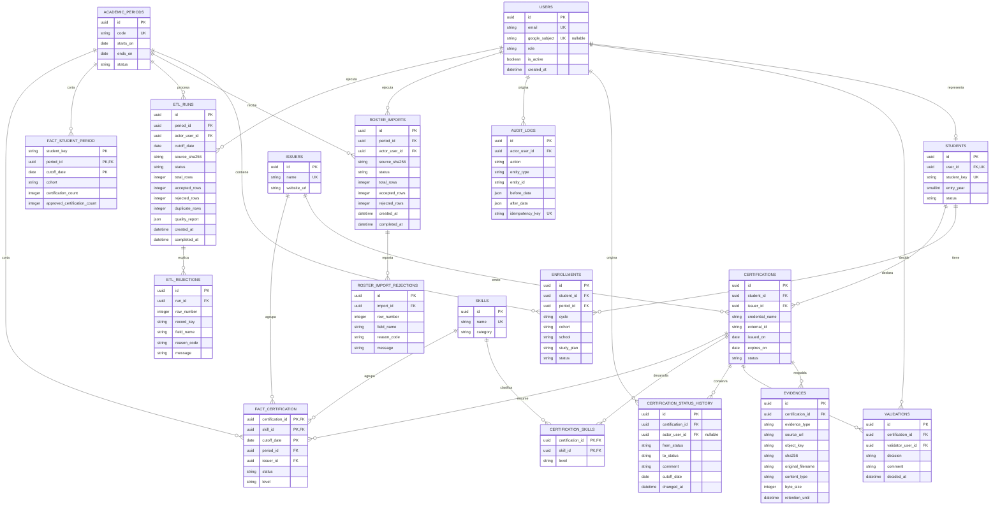

# Modelo de datos inicial

## Pulse EPIS — esquema operacional y analítico

Este modelo corresponde a los issues [#10 — Diseñar PostgreSQL y crear migraciones reproducibles](https://github.com/Kiara1616/pulse-epis/issues/10), [#11 — Implementar autenticación Google institucional y RBAC](https://github.com/Kiara1616/pulse-epis/issues/11), [#12 — Implementar importación y conciliación del padrón EPIS](https://github.com/Kiara1616/pulse-epis/issues/12), [#13 — Implementar registro de certificaciones y evidencias privadas](https://github.com/Kiara1616/pulse-epis/issues/13), [#14 — Implementar flujo de validación y auditoría de certificaciones](https://github.com/Kiara1616/pulse-epis/issues/14) y [#15 — Construir ETL idempotente y controles de calidad de datos](https://github.com/Kiara1616/pulse-epis/issues/15). Las migraciones se encuentran en `backend/migrations/versions/` y se ejecutan con Alembic.

El esquema separa la operación institucional de los hechos usados para indicadores. Las tablas analíticas conservan una fecha de corte para que los reportes sean reproducibles y no copian directamente el correo o código institucional.

`fact_student_period` conserva también cohorte y ciclo, de modo que la API analítica pueda aplicar esas dimensiones sin consultar ni exponer información personal del padrón.

## Reglas de integridad

- Los roles y estados se restringen mediante `CHECK` constraints para evitar valores fuera del contrato.
- `google_subject` es opcional hasta el primer login autorizado y luego vincula la cuenta local con el `sub` estable de Google mediante un índice único.
- El correo y el dominio de Google no reemplazan el padrón: una sesión solo se crea para un `users` provisionado y un `STUDENT` debe tener registro en `students`.
- Una importación del padrón se identifica por periodo y hash del archivo; los reintentos exactos no crean nuevos registros.
- Los lotes rechazados conservan únicamente metadatos y causas no sensibles por fila; el CSV original no se persiste.
- Una corrida ETL se identifica por periodo, fecha de corte y hash de la extracción; repetir la misma fuente es idempotente.
- `etl_runs` conserva filas, duplicados, calidad, estado y hash de fuente; `etl_rejections` conserva la causa por fila sin almacenar correos ni el extracto original.
- La publicación elimina y carga el snapshot de un periodo/corte dentro de la misma transacción; una corrida rechazada mantiene intacta la última publicación.
- El ETL extrae desde las tablas operativas autorizadas y no realiza búsqueda simulada por correo en Credly.
- `Enrollment` conserva escuela y plan por periodo para mantener el historial sin sobrescribir el contexto académico anterior.
- Una matrícula es única por estudiante y periodo (`student_id`, `period_id`).
- Una certificación es única por estudiante, emisor, nombre y fecha de emisión.
- El identificador externo de una certificación es único dentro de su emisor cuando existe.
- Una evidencia exige una URL o una clave de objeto y evita repetir el mismo hash para una certificación.
- Los archivos de evidencia se guardan con una clave aleatoria, metadatos de tipo/tamaño y `retention_until`; el acceso se entrega mediante tokens firmados de corta duración.
- La corrección de una certificación observada pasa a `RESUBMITTED` y no elimina las decisiones anteriores.
- Cada transición explícita agrega una fila en `certification_status_history`; la aplicación no ofrece actualización ni borrado de ese historial.
- `EXPIRED` es un estado derivado al evaluar una certificación `APPROVED` cuyo `expires_on` es anterior a la fecha de corte; el registro aprobado original se conserva.
- Solo `APPROVED` que siga vigente en la fecha de corte puede entrar en los KPI oficiales.
- Las fechas de periodo y certificación son consistentes; los contadores analíticos no pueden ser negativos ni superar el total.
- Las tablas de hechos incluyen fecha de corte y claves compuestas para evitar snapshots duplicados.
- Los índices cubren estados, periodos, estudiantes, emisores, validaciones, auditoría y consultas analíticas frecuentes.

Las migraciones se prueban con datos sintéticos contra PostgreSQL en CI y se revierten a `base` al finalizar la prueba. La conexión de identidad desde la API usa Google OIDC sin scopes de Gmail, sesiones firmadas y autorización RBAC en backend. El padrón se carga mediante un lote atómico, con HMAC para `student_key`, historial por periodo y reporte de rechazos sin PII. Las issues #13 y #14 cubren evidencias privadas, decisiones del validador y trazabilidad; el adaptador de almacenamiento de producción, purga programada y respaldos pertenecen a las issues #19 y #21.
