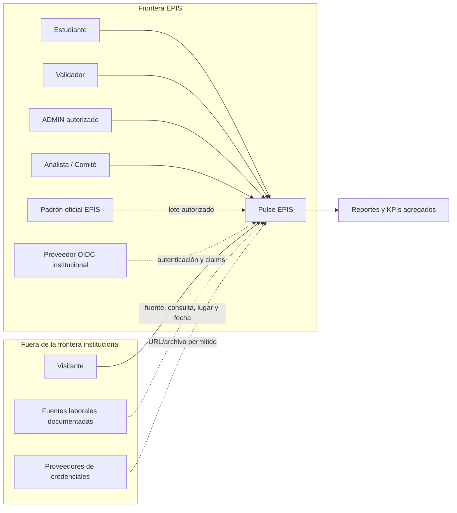
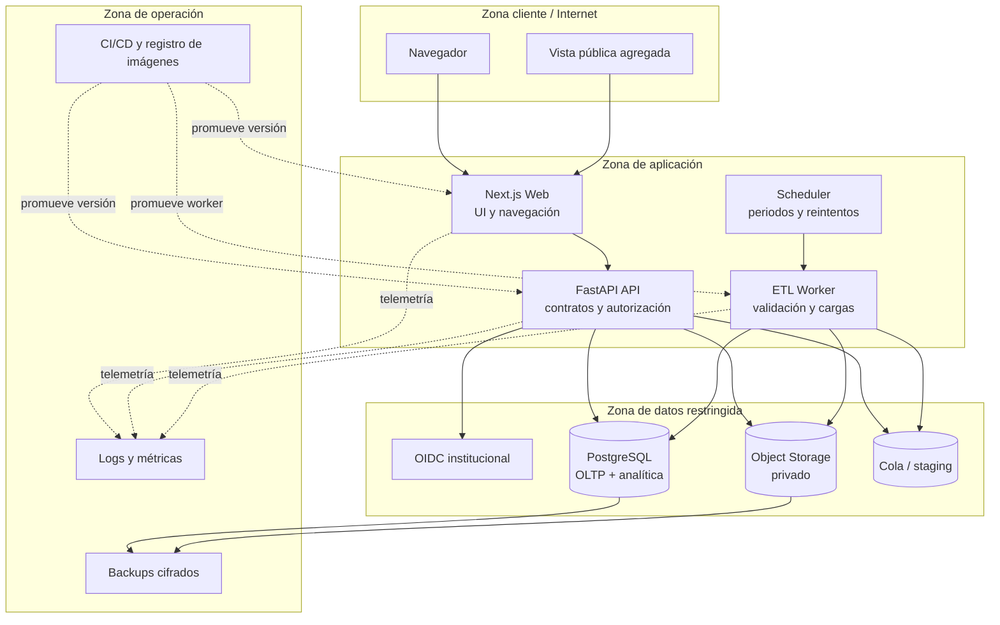
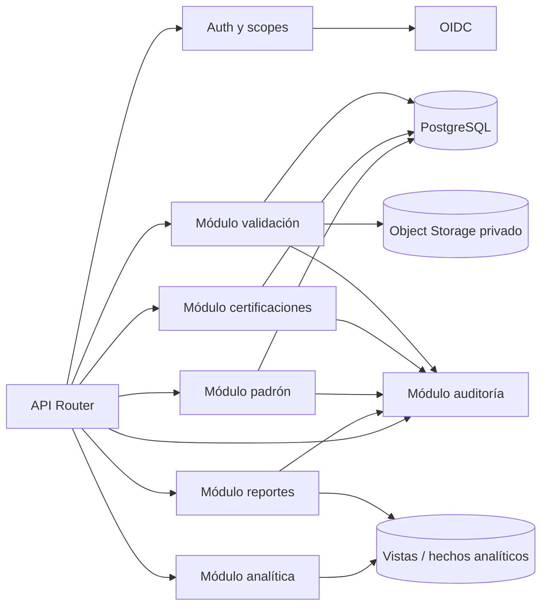
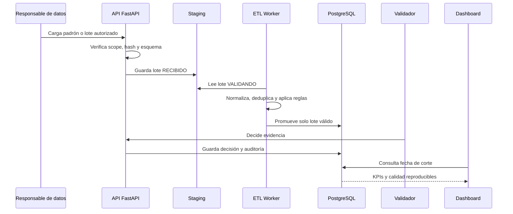
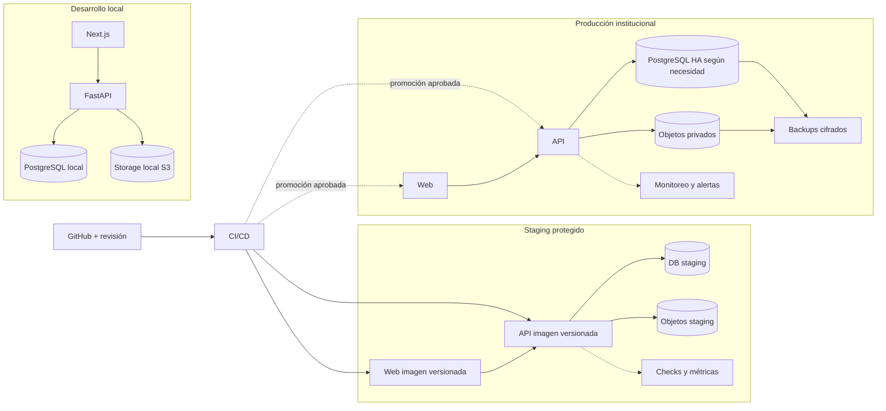

# Informe de Arquitectura de Software

## Pulse EPIS Dashboard de acreditaciones y certificaciones de estudiantes de la EPIS

**Universidad Privada de Tacna**<br>
**Facultad de Ingeniería — Escuela Profesional de Ingeniería de Sistemas**<br>
**Curso:** Inteligencia de Negocios<br>
**Integrantes:** Kiara Holly Zapana Murillo (2023077087) y Vincenzo Rafael Lllanos Niño (2023076796)<br>
**Versión:** 2.2<br>
**Fecha:** 12/09/2026

**Issue:** [#6 — Completar FD04: Documento de Arquitectura SAD](https://github.com/Kiara1616/pulse-epis/issues/6)

> La arquitectura debe respetar la población, el corte y la autoridad de fuentes definidos en [Problema, población y línea base](00-Problema-y-linea-base.md): el padrón EPIS es la fuente del denominador, mientras que las evidencias y validaciones sustentan las certificaciones.

> La API y el modelo analítico deben implementar los contratos descritos en [Objetivos e indicadores medibles](01-Objetivos-medibles.md) y [FD03 — Especificación de Requisitos](FD03-EPIS-Informe%20Especificación%20Requerimientos.md), incluyendo filtros, fecha de corte, trazabilidad, estados y errores.

## 1. Propósito, alcance y estado

La arquitectura convierte el prototipo Next.js y Python en una plataforma segura, trazable y desplegable para consolidar certificaciones de estudiantes de la EPIS. Se separan operación, evidencias, analítica y publicación para reducir el riesgo de mezclar datos nominales con indicadores agregados.

| Área | Estado actual del repositorio | Arquitectura objetivo |
|---|---|---|
| Frontend | Next.js, TypeScript, Recharts y JSON demostrativos | Next.js conectado a una API con contratos versionados |
| Backend | No existe API de producción | FastAPI modular con OpenAPI, validación y autorización |
| Datos | Archivos JSON y ETL de prueba | PostgreSQL operacional, staging y modelo analítico |
| Evidencias | Formulario y vistas simuladas | Objetos privados, hash, URLs temporales y retención |
| Identidad | Selector de rol para demostración | OIDC institucional, sesiones seguras y RBAC/scopes |
| Operación | No hay Docker, CI/CD ni ambientes | Desarrollo, staging y producción reproducibles |
| Resiliencia | No hay backups ni monitoreo | RPO/RTO definidos, alertas, restauración y rollback |

El prototipo no se presentará como producción. Las decisiones de este documento son el contrato técnico para los issues de construcción; cada componente pendiente conserva su issue de implementación y criterio de salida.

### 1.1 Alcance incluido

- Padrón autorizado por periodo, `student_key` y conciliación.
- Registro y validación de certificaciones y evidencias.
- API de indicadores, filtros, estados, calidad y reportes.
- Vistas nominales restringidas y publicación agregada.
- ETL idempotente, auditoría, respaldos y observabilidad.
- Despliegue reproducible con contenedores y promoción entre ambientes.

### 1.2 Fuera de alcance

No se hará scraping de LinkedIn ni búsqueda de identidades en perfiles públicos, no se reemplazará el sistema académico, no se almacenarán contraseñas de terceros y no se publicarán nombres, códigos, correos o rankings nominales sin autorización institucional explícita.

## 2. Principios y decisiones arquitectónicas

| ID | Decisión | Elección | Razón y consecuencia |
|---|---|---|---|
| ADR-001 | Forma de despliegue | Monolito modular con trabajador asíncrono | Reduce complejidad para el volumen inicial; los microservicios se difieren hasta que una métrica los justifique |
| ADR-002 | Frontend | Next.js y TypeScript | Reutiliza el prototipo; el cliente no será una frontera de seguridad |
| ADR-003 | API | FastAPI y Pydantic | Contratos tipados, validación explícita y afinidad con el ETL Python |
| ADR-004 | Persistencia | PostgreSQL con migraciones versionadas | Integridad transaccional, consultas por corte y trazabilidad |
| ADR-005 | Evidencias | Almacenamiento de objetos privado | Evita guardar PDFs en la base; permite hash, retención y URLs temporales |
| ADR-006 | Identidad | OIDC institucional | Centraliza altas, bajas y autenticación; la aplicación autoriza con claims/scopes |
| ADR-007 | Analítica | Hechos, dimensiones y vistas materializadas | KPIs rápidos y reproducibles sin copiar PII innecesaria |
| ADR-008 | Integración | Lotes idempotentes por hash y fecha de corte | Reintentos seguros y errores aislados sin publicar datos parciales |
| ADR-009 | Publicación | Agregados con umbrales de grupo | Reduce el riesgo de reidentificación en vistas públicas |

Las decisiones ADR son revisables mediante una nueva versión del documento. Cambiar de proveedor, finalidad, población o frontera de datos exige actualizar el ADR afectado y la matriz de riesgos de FD01.

## 3. C4 nivel 1 — Contexto del sistema

El siguiente diagrama está escrito como código Mermaid y representa el sistema, sus actores y sus dependencias externas. Las líneas discontinuas indican una entrada que debe estar autorizada y documentada antes de incorporarse a los indicadores.



Reglas del contexto:

1. El padrón EPIS es la autoridad del denominador; el portal público no identifica personas.
2. Las certificaciones entran a los KPIs solo después de validación, deduplicación y verificación de corte.
3. OIDC autentica, pero Pulse EPIS decide autorización, alcance de datos y auditoría.
4. Las fuentes externas entregan evidencia o señales documentadas; no reciben el padrón nominal.

## 4. C4 nivel 2 — Contenedores



| Contenedor | Responsabilidad | Interfaz principal | Datos que puede manejar |
|---|---|---|---|
| Next.js Web | Renderizar paneles, formularios y vistas públicas | HTTPS hacia API | No confía en el cliente para autorización; evita PII innecesaria |
| FastAPI API | Autenticar sesión, autorizar, validar entradas y exponer casos de uso | REST/JSON y descarga controlada | Nominales solo según scope |
| ETL Worker | Importar, normalizar, deduplicar y cargar por lote | Cola/staging y PostgreSQL | Padrón y evidencias durante ventanas restringidas |
| Scheduler | Lanzar cierres, reintentos y tareas de calidad | Cola / jobs | Metadatos de ejecución, no credenciales |
| PostgreSQL | Persistencia operacional, auditoría y consultas analíticas | SQL privado | Padrón, certificaciones, decisiones y hechos |
| Object Storage | Guardar PDFs y archivos originales | API de objetos con URLs temporales | Evidencias cifradas y privadas |
| OIDC institucional | Autenticar y entregar claims | OIDC/OAuth 2.0 | Identidad mínima, nunca evidencia |
| Logs y métricas | Observabilidad y alertas | Exportador interno | IDs técnicos, sin códigos/correos/documentos |
| CI/CD | Construir, probar y promover artefactos | GitHub Actions/registro | Código y artefactos, nunca datos productivos |

## 5. C4 nivel 3 — Componentes de la API



| Componente | Responsabilidad | Entradas | Salidas y errores críticos |
|---|---|---|---|
| Auth y scopes | Validar sesión, rol y scopes; denegar por defecto | Token OIDC | `401 UNAUTHENTICATED`, `403 FORBIDDEN` |
| Módulo padrón | Cargar, conciliar y cerrar el universo por periodo | CSV/lote autorizado | Resultado de lote, `422 VALIDATION_ERROR`, `409 PERIOD_CLOSED` |
| Módulo certificaciones | Registrar credenciales y evidencias | Formulario, URL o archivo | `PENDIENTE`, `409 DUPLICATE_RECORD`, `413 FILE_TOO_LARGE` |
| Módulo validación | Registrar decisiones y transiciones | Evidencia y decisión del validador | Historial, `422 EVIDENCE_UNSUPPORTED` |
| Módulo analítica | Aplicar fórmulas, filtros y fecha de corte | Hechos y dimensiones | KPIs, calidad y `N/D` cuando no hay comparación |
| Módulo reportes | Construir exportaciones autorizadas | KPIs, filtros y fuentes | CSV/PDF con metadatos; sin PII pública |
| Módulo auditoría | Registrar quién, qué, cuándo y sobre qué entidad | Evento de dominio | `AuditLog` inmutable para el alcance definido |

Los componentes son módulos del mismo servicio durante el MVP. Si el volumen o la frecuencia lo exige, el worker y la analítica podrán separarse sin cambiar los contratos públicos.

## 6. Vista de datos y contratos

### 6.1 Modelo operacional y analítico

El esquema operacional conserva la trazabilidad de la captura y decisión. El esquema analítico se construye desde cierres versionados y no debe ser la fuente de identidad.

| Entidad o hecho | Campos principales | Regla de protección |
|---|---|---|
| `Student` | `id`, `student_key`, código y correo cifrados, estado | Código/correo restringidos |
| `Enrollment` | estudiante, periodo, ciclo, cohorte y estado | El padrón define el denominador |
| `Certification` | estudiante, credencial, emisor, nivel, emisión, expiración y estado | Solo estados aprobados entran al KPI |
| `Evidence` | certificación, tipo, URL, `object_key`, hash y fecha | Archivo privado y URL temporal |
| `Validation` | certificación, validador, decisión, comentario y fecha | Inmutable; nuevas decisiones agregan historial |
| `Issuer` / `Skill` | nombres canónicos, alias y categorías | Catálogos versionados |
| `MarketDemand` | habilidad, fuente, consulta, ubicación, periodo y conteo | Nunca contiene identidades estudiantiles |
| `AuditLog` | principal, rol, scope, acción, entidad, antes, después y fecha | Sin documentos, códigos o correos |
| `EtlRun` | fuente, hash, inicio, fin, estado, filas y errores | Idempotencia por lote y corte |
| `fact_student_period` | estudiante seudonimizado, periodo, estado | Denominador por cierre |
| `fact_certification` | certificación, estado, proveedor, nivel y corte | Hecho reproducible |
| `fact_market_demand` | habilidad, fuente, ubicación, periodo y valor normalizado | Procedencia obligatoria |

No se copiarán nombres, correos ni códigos sin cifrar al esquema analítico. Los reportes públicos aplicarán umbrales mínimos de grupo y conservarán fecha de corte, filtros y metodología.

### 6.2 Idempotencia y consistencia

1. Cada lote recibe un `batch_id`, hash del archivo, fuente, periodo y fecha de corte.
2. La misma combinación de hash, fuente y periodo no se aplica dos veces.
3. La validación ocurre en staging; un lote con errores bloqueantes no se publica parcialmente.
4. Las promociones a tablas operacionales y hechos se realizan en transacción.
5. Los cierres publicados son inmutables; una corrección crea una nueva versión y conserva la anterior.

## 7. Interfaces y contratos

| Método y ruta | Propósito | Autorización | Entrada principal | Salida |
|---|---|---|---|---|
| `POST /imports/students` | Importar padrón | `ADMIN` + `PADRON_MANAGE` | CSV, periodo y fecha de corte | `batch_id`, totales y errores |
| `GET /etl/runs/{id}` | Consultar carga | `ADMIN` | `batch_id` | Estado, filas, causas y timestamps |
| `POST /certifications` | Registrar credencial | `STUDENT` | Emisor, nombre, fechas y URL/archivo | ID y estado `PENDIENTE` |
| `POST /certifications/{id}/evidence` | Adjuntar evidencia | `STUDENT` propietario | Archivo o URL permitida | Hash, metadatos y estado |
| `POST /validations/{id}` | Registrar decisión | `VALIDATOR` | Decisión, comentario y evidencia | Estado e historial |
| `GET /analytics/kpis` | Consultar KPIs | `ANALYTICS_READ` | Corte y filtros | Numerador, denominador, fórmula y calidad |
| `GET /analytics/vendors` | Participación por emisor | `ANALYTICS_READ` | Corte y filtros | Serie agregada |
| `GET /analytics/gaps` | Brechas por habilidad | `ANALYTICS_READ` | Habilidad, lugar y periodo | Oferta, demanda, fuente y fecha |
| `GET /reports/accreditation` | Generar reporte | `ANALYTICS_READ` autorizado | Corte y filtros | Artefacto con metadatos y fuentes |

La API usará paginación, esquemas validados, identificadores opacos, límites de archivo y respuestas sin datos personales salvo un scope explícito. Los códigos de error y el formato de respuesta se mantienen alineados con [FD03](FD03-EPIS-Informe%20Especificación%20Requerimientos.md).

## 8. Flujo de ingestión y validación



Los archivos externos se reciben únicamente por un canal autorizado. El worker no consulta identidades desde perfiles públicos. Una fuente de insignias puede entregar una URL o credencial verificable, pero no recibe el padrón completo.

## 9. Seguridad, privacidad y fronteras de confianza

### 9.1 Fronteras

| Frontera | Activos que cruza | Amenaza principal | Control obligatorio |
|---|---|---|---|
| B1 navegador ↔ aplicación | Sesión, filtros y respuestas | Manipulación del cliente o XSS | HTTPS, cookies seguras, CSP y no confiar en roles del frontend |
| B2 aplicación ↔ OIDC | Tokens y claims | Token robado o claim excesivo | OIDC validado, expiración, audience/issuer y rotación |
| B3 API ↔ datos | Padrón, decisiones y KPIs | Acceso horizontal/vertical | RBAC/scopes en servidor, consultas parametrizadas y auditoría |
| B4 API ↔ evidencias | PDFs y URLs | Descarga no autorizada | Bucket privado, cifrado, hash y URLs firmadas temporales |
| B5 externos ↔ ingestión | CSV, URL y señales laborales | Fuente falsa o payload malicioso | Validación de esquema, límites, antivirus y revisión humana |
| B6 CI/CD ↔ ambientes | Imágenes, migraciones y secretos | Despliegue de código no revisado | Branch protection, revisión, secretos fuera del repo y promoción aprobada |

### 9.2 Autorización

El MVP implementa `ADMIN`, `VALIDATOR` y `STUDENT`. `PADRON_MANAGE` permite administrar el padrón dentro de `ADMIN`; `ANALYTICS_READ` permite leer indicadores sin administrar ni validar. El visitante solo recibe agregados. La autorización se verifica en cada endpoint y no se puede cambiar desde el selector de demostración del frontend en producción.

### 9.3 Privacidad

- El `student_key` no contiene código ni correo.
- Padrón, evidencias y decisiones nominales quedan fuera de las vistas públicas.
- Logs, trazas y métricas no contienen documentos, códigos o correos.
- La retención y eliminación se configuran por finalidad y periodo.
- Los grupos pequeños se suprimen o agregan para reducir reidentificación.
- Las exportaciones incluyen solo los campos permitidos por el scope solicitado.

## 10. C4 nivel 4 — Despliegue y ambientes



| Ambiente | Propósito | Datos permitidos | Promoción |
|---|---|---|---|
| Desarrollo | Construcción y pruebas rápidas | Sintéticos únicamente | Rama/PR y checks locales |
| Staging | Validar migraciones, contratos, seguridad y rendimiento | Sintéticos o anonimizados | CI exitoso y revisión |
| Producción | Piloto o servicio institucional | Datos autorizados reales | Aprobación, backup verificado y rollback preparado |

La arquitectura objetivo requiere contenedores, PostgreSQL, almacenamiento privado, CI/CD y monitoreo. En el estado actual estos archivos no existen; corresponden a los issues [#8 CI](https://github.com/Kiara1616/pulse-epis/issues/8), [#9 API](https://github.com/Kiara1616/pulse-epis/issues/9), [#10 base de datos](https://github.com/Kiara1616/pulse-epis/issues/10), [#19 contenedores](https://github.com/Kiara1616/pulse-epis/issues/19) y [#20 staging](https://github.com/Kiara1616/pulse-epis/issues/20).

## 11. Respaldo, monitoreo y rollback

### 11.1 Objetivos de recuperación

| Activo | Backup | RPO objetivo | RTO objetivo | Prueba de restauración |
|---|---|---:|---:|---|
| PostgreSQL | Diario completo + WAL según infraestructura | 24 h en MVP | 4 h en piloto | Trimestral y antes de migraciones mayores |
| Evidencias | Versionado/copia diaria de objetos | 24 h | 8 h en piloto | Muestra mensual de descarga y hash |
| Configuración/secrets | Secret manager y exportación controlada | 24 h | 4 h | Semestral, sin exponer valores |
| Imágenes y migraciones | Registro inmutable y repositorio Git | 0 h frente a commit | 1 h para volver a imagen previa | Cada release |

Los RPO/RTO son objetivos iniciales; el responsable institucional debe confirmarlos antes de producción. Las copias deben cifrarse, tener acceso restringido, conservar retención definida y estar separadas del ambiente principal.

### 11.2 Monitoreo y alertas

| Señal | Umbral inicial | Acción |
|---|---|---|
| Salud de API | 3 fallos consecutivos o p95 > 2 s | Alertar soporte y retirar instancia no saludable |
| Errores 5xx | > 2% durante 5 min | Abrir incidente, revisar logs y evaluar rollback |
| Lotes ETL | Estado `RECHAZADO` o retraso sobre ventana | No publicar KPI y notificar a responsable de datos |
| Base de datos | Conexiones, espacio o réplica sobre umbral | Escalar capacidad o pausar cargas |
| Storage | Fallo de firma, espacio o hash inconsistente | Bloquear descarga/promoción y revisar evidencia |
| Seguridad | Intentos 401/403 anómalos | Revisar auditoría, revocar sesión o bloquear origen |
| Backups | Falta de ejecución o restore fallido | Incidente crítico; no promover cambios destructivos |

Cada alerta debe incluir servicio, ambiente, timestamp, `requestId`/`batch_id`, severidad, responsable y enlace al runbook. Nunca debe incluir PII.

### 11.3 Estrategia de rollback

1. Detectar el incidente y congelar importaciones o publicaciones afectadas.
2. Identificar la última versión saludable de imagen, migración y contrato.
3. Si el problema es de aplicación, volver a la imagen anterior manteniendo migraciones compatibles.
4. Si el problema es de datos, restaurar a un ambiente aislado, validar integridad y promover solo después de aprobación.
5. Verificar health checks, RBAC, consultas KPI, evidencia y auditoría.
6. Comunicar el alcance, preservar logs y registrar causa raíz.

Las migraciones destructivas no se ejecutan en la misma promoción que el código que las requiere. Se prefiere expand/contract: agregar columnas compatibles, desplegar código, migrar datos y retirar lo antiguo después de una ventana de seguridad.

## 12. Calidad, seguridad y pruebas de arquitectura

| Nivel | Prueba | Criterio de salida | Estado actual |
|---|---|---|---|
| Diagramas | Mermaid en revisión y render de cada vista | Contexto, contenedores, componentes y despliegue sin referencias huérfanas | Documentado; automatización pendiente en #18 |
| Contratos | OpenAPI/JSON Schema y respuestas de error | Cliente y API validan el mismo contrato | `dashboard-spec.json` existe; API pendiente |
| Seguridad | RBAC horizontal/vertical y acceso a objetos | `STUDENT` no ve terceros, `VALIDATOR` no administra y visitante solo ve agregados | Demo client-side; backend pendiente |
| Datos | Lotes, deduplicación, fórmulas y cortes | Resultados idempotentes y reproducibles | ETL demostrativo; pruebas pendientes en #15/#16 |
| Integración | API, PostgreSQL, storage y worker | Flujo completo con errores controlados | Pendiente en #9/#10/#13/#14 |
| Rendimiento | p95, lotes y consultas materializadas | Cumple metas de FD03 | Pendiente |
| Recuperación | Backup, restore y rollback | RPO/RTO verificados en staging | Pendiente en #21 |

## 13. Migración desde el prototipo

La secuencia recomendada mantiene la aplicación demostrativa ejecutable mientras se incorpora el backend:

1. Proteger `main`, activar CI y mantener datos sintéticos en desarrollo.
2. Crear PostgreSQL, migraciones y contratos de datos.
3. Inicializar FastAPI con health check, configuración por entorno y OpenAPI.
4. Implementar OIDC/RBAC y reemplazar el selector de rol por una sesión real.
5. Implementar padrón, `student_key`, certificaciones, evidencias y auditoría.
6. Convertir el ETL en worker idempotente con staging y controles de calidad.
7. Llevar KPIs, filtros, brechas y fecha de corte al backend.
8. Conectar Next.js a la API y retirar JSON duplicados de producción.
9. Contenerizar, desplegar staging, probar restauración y preparar rollback.
10. Ejecutar el piloto, conciliar indicadores y decidir la publicación institucional.

## 14. Estructura recomendada

La estructura objetivo se alinea con las carpetas actuales y los issues pendientes:

```text
pulse-epis/
  dashboard-app/                 # Next.js actual -> apps/web en migración futura
  backend/scripts_etl/           # ETL demostrativo -> workers/etl
  services/api/                  # FastAPI pendiente (#9)
  database/migrations/           # PostgreSQL/Alembic pendiente (#10)
  storage/                       # Contrato de objetos privados pendiente (#13/#19)
  tests/                         # Unitarias, integración y seguridad
  docs/
    architecture/                # Diagramas y decisiones como código
    schemas/                     # Contratos JSON/OpenAPI
  infrastructure/                # Docker, ambientes y despliegue
  .github/workflows/             # CI/CD pendiente (#8/#20)
```

## 15. Conclusión

La arquitectura es implementable con un monolito modular, PostgreSQL, almacenamiento privado, un worker ETL y una interfaz Next.js. Las fronteras de confianza, responsabilidades, contratos, respaldos, monitoreo y rollback quedan definidas para que el sistema pueda evolucionar sin exponer datos nominales ni depender de scraping.

El repositorio actual sigue siendo un prototipo: no contiene FastAPI, PostgreSQL, OIDC, Docker, CI/CD ni observabilidad productiva. Por ello, la arquitectura solo se considera lista para implementación cuando los issues de infraestructura, seguridad, datos e integración cierren sus criterios y un staging demuestre el flujo completo con datos sintéticos antes de recibir el padrón real.
