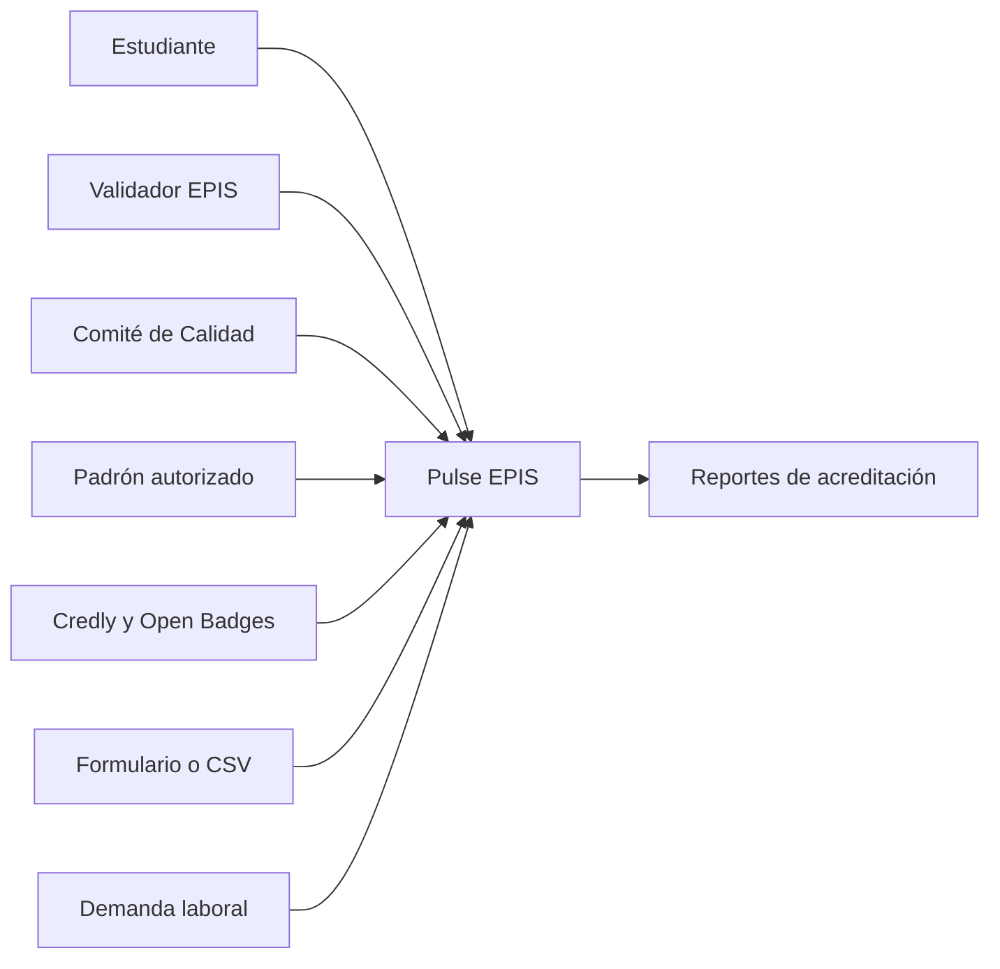
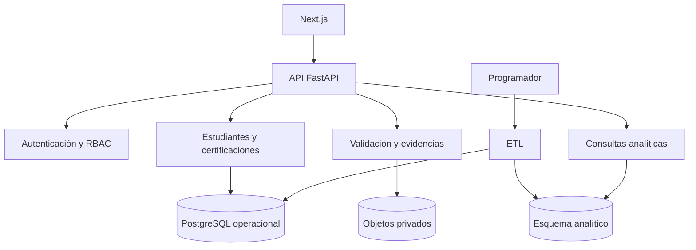
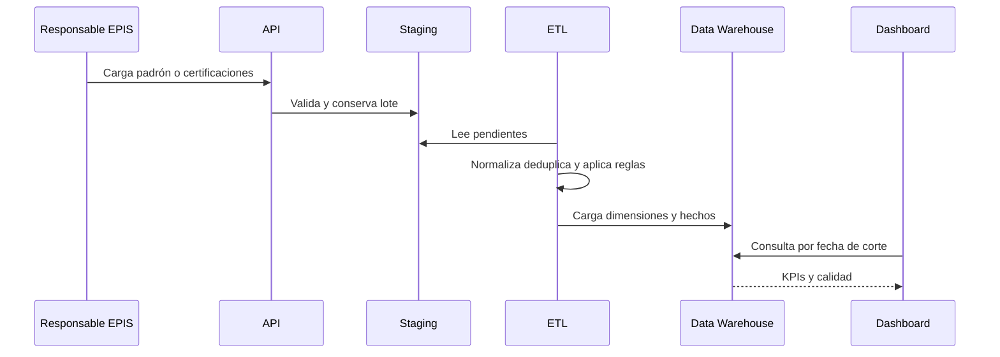
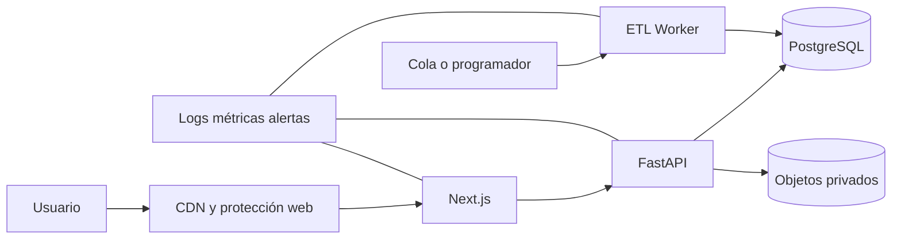

# Informe de Arquitectura de Software

## Pulse EPIS Dashboard de acreditaciones y certificaciones de estudiantes de la EPIS

**Integrantes:** Kiara Holly Zapana Murillo (2023077087) y Vincenzo Rafael Lllanos Niño (2023076796)  
**Versión:** 2.0  
**Fecha:** 09/09/2026

> La arquitectura debe respetar la población, el corte y la autoridad de fuentes definidos en [Problema, población y línea base](00-Problema-y-linea-base.md): el padrón EPIS es la fuente del denominador, mientras que las evidencias y validaciones sustentan las certificaciones.

> La API y el modelo analítico deben implementar los contratos descritos en [Objetivos e indicadores medibles](01-Objetivos-medibles.md), incluyendo filtros, fecha de corte y trazabilidad.

## 1 Propósito y alcance

La arquitectura convierte el prototipo Next.js y Python en una plataforma segura, trazable y escalable. Se separan operación, evidencias y analítica. Para el volumen inicial se recomienda un monolito modular con trabajadores asíncronos; los microservicios agregarían complejidad prematura.

## 2 Decisiones arquitectónicas

| Decisión | Elección | Razón |
|---|---|---|
| Frontend | Next.js y TypeScript | Aprovecha el prototipo |
| API | FastAPI | Validación tipada y afinidad con ETL Python |
| Persistencia | PostgreSQL | Integridad y consultas analíticas |
| Evidencias | Objetos privados | Evita almacenar PDFs en la base |
| ETL | Python programado | Reutiliza código existente |
| Identidad | SSO institucional OIDC | Centraliza altas y bajas |
| Despliegue | Contenedores y CI CD | Reproducibilidad |
| Analítica | Esquema estrella y vistas materializadas | KPIs rápidos y reproducibles |

## 3 Vista de contexto



## 4 Vista lógica



## 5 Vista de datos

El esquema operacional conserva estudiantes, matrículas, certificaciones, evidencias y decisiones. El esquema analítico tendrá:

- `fact_certification`, una fila por certificación y estado al corte.
- `fact_student_period`, una fila por estudiante y periodo para denominadores.
- `fact_market_demand`, conteos por habilidad, fuente, ubicación y periodo.
- dimensiones de estudiante seudonimizado, tiempo, proveedor, nivel, habilidad y periodo.

No se copiarán nombre, correo ni código sin cifrar a analítica. Los reportes públicos aplicarán umbrales mínimos de grupo.

## 6 Flujo de ingestión



Cada ejecución será idempotente. Los archivos entran a staging, se identifican por hash y se promueven en transacción. Los errores quedan asociados al lote y no contaminan datos publicados.

## 7 API propuesta

| Método y ruta | Propósito | Rol |
|---|---|---|
| POST `/imports/students` | Importar padrón | Responsable |
| POST `/certifications` | Registrar credencial | Estudiante |
| POST `/certifications/{id}/evidence` | Adjuntar evidencia | Estudiante |
| POST `/validations/{id}` | Registrar decisión | Validador |
| GET `/analytics/kpis` | KPIs filtrados | Analista |
| GET `/analytics/vendors` | Participación por emisor | Analista |
| GET `/analytics/gaps` | Brechas por habilidad | Analista |
| GET `/reports/accreditation` | Generar reporte | Analista |
| GET `/etl/runs` | Estado de cargas | Responsable |

Se usarán paginación, esquemas validados, identificadores opacos, límites de archivo y respuestas sin datos personales salvo autorización.

## 8 Seguridad y privacidad

- SSO u OIDC, sesiones seguras y segundo factor institucional.
- RBAC con denegación por defecto.
- TLS, cifrado de campos y objetos privados.
- URLs de evidencia firmadas y temporales.
- Secretos fuera del repositorio y rotación.
- Auditoría de accesos, importaciones, validaciones y exportaciones.
- Política de retención y atención de derechos.
- Prohibición de códigos, correos o documentos en logs.

## 9 Escalabilidad

La primera versión operará con una instancia web, API, PostgreSQL y trabajador. El crecimiento seguirá estas etapas:

1. Caché y vistas materializadas para agregados.
2. Cola de trabajos para cargas y verificaciones.
3. Almacén analítico separado al incorporar otras escuelas.
4. Partición por periodo y evidencias por institución y año.
5. Réplica de lectura y autoescalado solo cuando las métricas lo justifiquen.

La entidad `organization` permitirá múltiples escuelas aunque el MVP use solo EPIS.

## 10 Despliegue



Habrá desarrollo, pruebas y producción, migraciones versionadas y despliegue desde una rama protegida. Datos productivos no se copiarán a desarrollo.

## 11 Calidad y pruebas

| Nivel | Cobertura |
|---|---|
| Unitarias | normalización, fórmulas, vigencia y duplicados |
| Integración | API, base, objetos y ETL |
| End to end | registro, validación, filtro y exportación |
| Seguridad | autorización horizontal, archivos, sesiones y secretos |
| Datos | completitud, unicidad, consistencia y conciliación |
| Rendimiento | dashboard y lotes semestrales |
| Recuperación | respaldo y restauración |

## 12 Migración desde el prototipo

1. Publicar el código real en `pulse-epis` y proteger la rama principal.
2. Sustituir `mock-data.json` y copias de `etl_data.json` por una API única.
3. Corregir `dashboard-spec.json` para el dominio de certificaciones.
4. Crear migraciones y datos sintéticos de prueba.
5. Implementar autenticación, padrón, formulario y validación.
6. Llevar cálculos al backend o almacén analítico.
7. Conectar filtros y exportaciones reales.
8. Añadir CI, pruebas, análisis de dependencias y staging.
9. Ejecutar piloto y conciliar indicadores.
10. Habilitar producción, monitoreo, respaldo y soporte.

## 13 Estructura recomendada

```text
pulse-epis/
  apps/web/
  services/api/
  workers/etl/
  packages/contracts/
  database/migrations/
  infrastructure/
  docs/
  tests/
  .github/workflows/
```

## 14 Conclusión

La arquitectura prioriza trazabilidad y privacidad. El estudiante se identifica mediante padrón institucional y clave interna; las credenciales se vinculan con evidencia validada. Así se puede iniciar con pocos recursos y escalar sin rehacer el núcleo.
