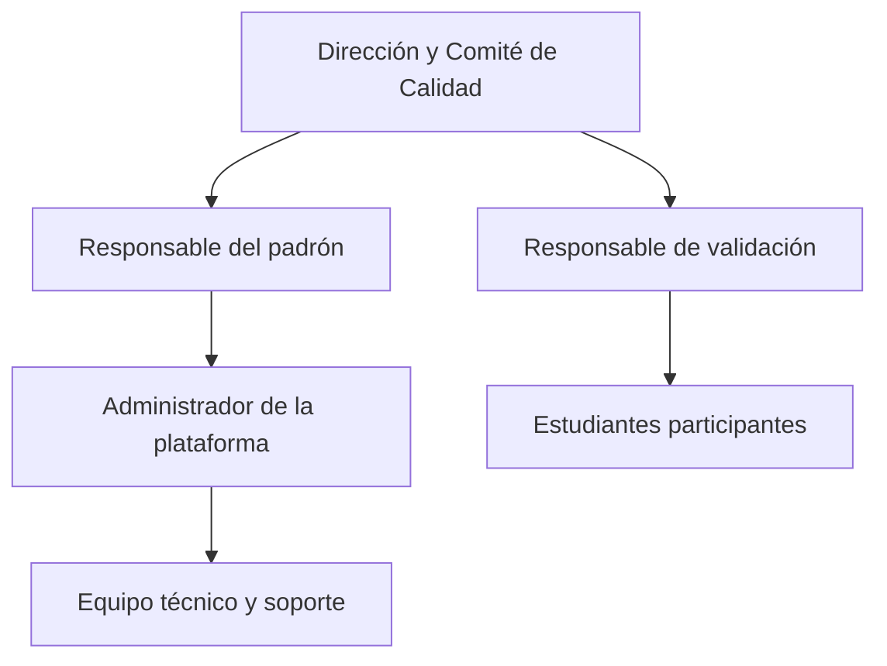
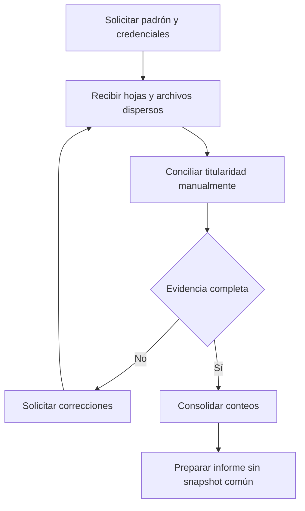
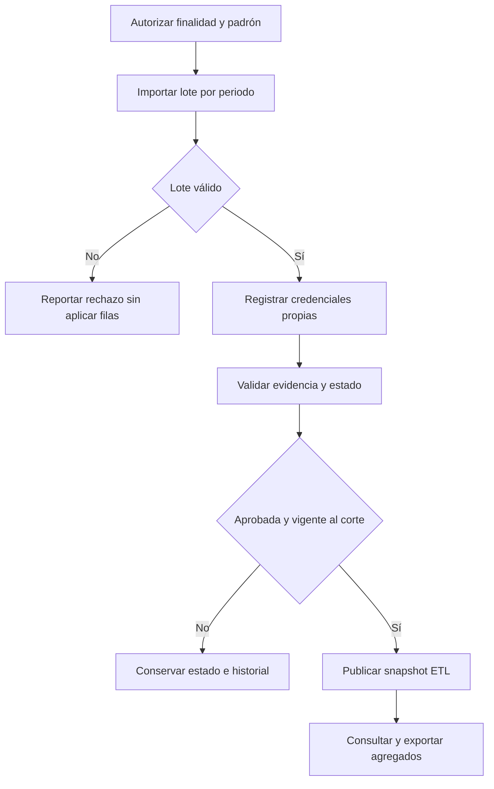
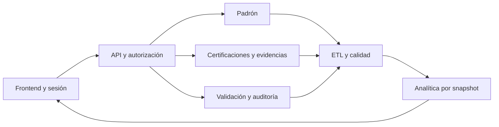
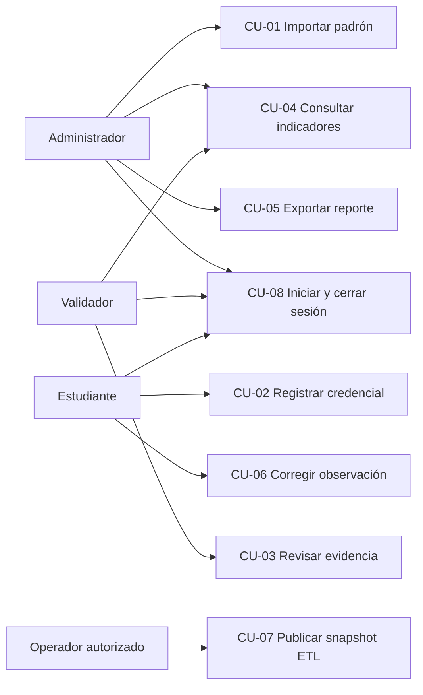
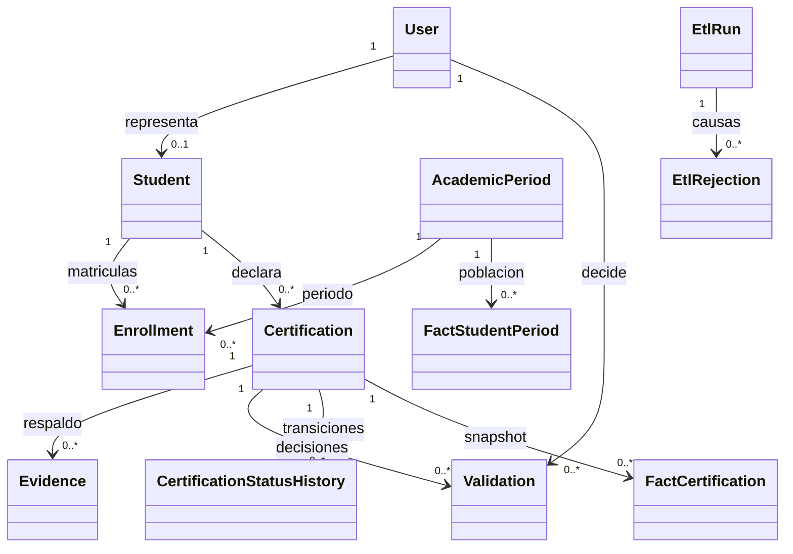
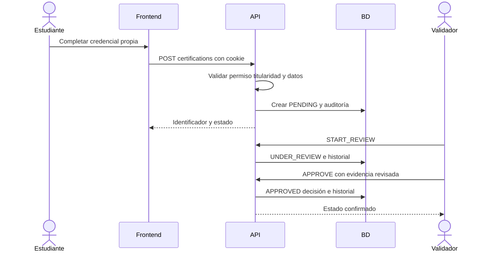

# Especificación de Requerimientos de Software

**Proyecto:** Pulse EPIS Dashboard de certificaciones tecnológicas verificadas de estudiantes de la EPIS<br>
**Institución:** Universidad Privada de Tacna Facultad de Ingeniería Escuela Profesional de Ingeniería de Sistemas<br>
**Curso:** Inteligencia de Negocios<br>
**Integrantes:** Kiara Holly Zapana Murillo (2023077087) y Vincenzo Rafael Lllanos Niño (2023076796)<br>
**Código:** FD03<br>
**Versión:** 3.1<br>
**Fecha:** 02/10/2026<br>
**Base técnica:** main cf7ab75 y documentación del PR 51 a618c3e

## Control de versiones

| Versión | Fecha | Autores | Motivo |
|---|---|---|---|
| 2.x | Septiembre 2026 | Kiara Zapana y Vincenzo Lllanos | Desarrollo de las fuentes del proyecto |
| 3.0 | 01/10/2026 | Vincenzo Lllanos | Generación académica FD01 a FD04 en PR 51 |
| 3.1 | 02/10/2026 | Equipo del proyecto | Organización documental y actualización contra el código |

Revisión y aprobación académica: sin acta registrada. La versión del documento no certifica una aprobación ni un despliegue institucional.

## 1 Introducción

El SRS define necesidades, requisitos finales, reglas, escenarios y pruebas de aceptación para Pulse EPIS. Distingue el alcance objetivo de la implementación verificada. La fuente del denominador es el padrón por periodo; la fuente del numerador es el snapshot de certificaciones elegibles, con corte y decisiones trazables.


## 2 Generalidades de la institución

### 2.1 Nombre y contexto

La unidad de aplicación es la Escuela Profesional de Ingeniería de Sistemas de la Universidad Privada de Tacna. La solución sirve a responsables del padrón, validadores, estudiantes y consumidores de reportes de calidad. Se consulta el [portal institucional](https://www.upt.edu.pe/) como referencia de identidad institucional, sin copiar información del proyecto NODIEX usado como ejemplo de formato.

### 2.2 Misión visión y estructura de responsabilidades

La misión y visión oficiales de la Universidad no se transcriben ni se sustituyen por formulaciones inventadas. La visión del producto se define en FD02. El siguiente esquema es funcional para el piloto, no un organigrama oficial aprobado.



## 3 Visionamiento de la institución y levantamiento

### 3.1 Problema objetivos y alcance

El problema es producir mediciones de certificación reproducibles sobre una población institucional conciliada. Los objetivos de negocio son disponer de evidencia para acreditación y mejora curricular; los objetivos de diseño son separar identidad, evidencia, decisión y snapshot con acceso mínimo. [Objetivos medibles](../proyecto/01-Objetivos-medibles.md) conserva OBJ-01 a OBJ-07.

El sistema objetivo administrará el padrón autorizado, recepción y validación de evidencias, normalización de credenciales, generación de indicadores y reportes. Habrá vistas privadas de administración y vistas agregadas de consulta.

El repositorio contiene una aplicación Next.js con datos JSON demostrativos para varias vistas analíticas, navegación por páginas, `AuthBoundary`, `RoleProvider`/`RoleGate`, formularios de estudiante, un ETL Python reproducible y una API FastAPI con OIDC/RBAC y login local para desarrollo. El registro privado de certificaciones de #13, la bandeja conectada de validaciones de #14 y la sesión del frontend ya cuentan con persistencia y pruebas; los KPI analíticos sobre datos reales, la importación CSV desde la interfaz y la exportación PDF/CSV siguen registrados como `Pendiente` o `Parcial`.

### 3.2 Viabilidad y evidencia del levantamiento

FD01 concluye viabilidad condicionada. La información disponible procede del repositorio, sus issues, contratos, pruebas y referencias de formato. No hay actas de entrevistas, encuestas ni mediciones del tiempo institucional de consolidación incorporadas como evidencia. Esas fuentes deben añadirse con autor, fecha, población y alcance antes de afirmar hallazgos de campo.

### 3.3 Hallazgos y oportunidades

La implementación permite separar flujos por rol, persistir decisiones y publicar cortes reproducibles. Las oportunidades pendientes son cierre institucional autorizado, exportación PDF operativa, captura completa de habilidades, demanda laboral externa y recuperación integral. No se atribuyen tasas de ahorro o demanda externa sin una fuente medida.

## 4 Análisis de procesos

### 4.1 Proceso actual del problema

Este proceso representa la hipótesis de consolidación manual descrita en la línea base y debe validarse con EPIS; no se atribuye a una entrevista inexistente.



### 4.2 Proceso propuesto




## 5 Especificación de requerimientos de software


### 5.1 Requerimientos funcionales iniciales

El análisis inicial identifica seis necesidades: conciliar estudiantes, registrar credenciales, revisar evidencias, publicar mediciones por corte, restringir datos y generar reportes. Se descomponen en RF-01 a RF-18 para definir autorización, reglas, errores y verificación. La propuesta inicial no se presenta como acta de levantamiento aprobada.

| Necesidad inicial | Requisitos finales |
|---|---|
| Identidad y acceso institucional | RF-01, RF-03, RF-11 |
| Padrón confiable | RF-02, RF-06, RF-16 |
| Declaración y revisión de credenciales | RF-04, RF-05, RF-13, RF-14, RF-17 |
| Indicadores comparables | RF-07, RF-08, RF-09, RF-10 |
| Reportes trazables | RF-12, RF-18 |
| Comparación laboral documentada | RF-15 |

### 5.2 Requerimientos funcionales finales

| ID | Requerimiento | Prioridad | Criterio de aceptación | Estado verificable |
|---|---|---|---|---|
| RF-01 | Autenticar usuario y autorizar acciones | Crítica | Una petición sin sesión falla; rol de cliente no concede permisos | Implementado: sesión local limitada a development/test, OIDC y dependencias RBAC |
| RF-02 | Importar padrón por periodo | Crítica | ADMIN envía CSV válido; lote inválido no aplica filas; repetición exacta es idempotente | API y pantalla implementadas; periodo inicial requiere preparación |
| RF-03 | Generar identidad analítica interna | Crítica | Código normalizado genera HMAC estable; respuesta analítica no revela código ni correo | Implementado en padrón y hechos |
| RF-04 | Registrar credencial y evidencia propia | Crítica | STUDENT crea PENDING; fechas válidas; URL o archivo admitido; no opera sobre otro titular | API y formulario implementados; habilidades no se capturan en el formulario actual |
| RF-05 | Revisar y decidir una certificación | Crítica | VALIDATOR toma revisión antes de decidir; observación y rechazo exigen comentario | API y bandeja implementadas |
| RF-06 | Detectar duplicados | Alta | Registro repetido retorna 409; carga repetida no duplica población | Restricciones de base, padrón y ETL implementados |
| RF-07 | Normalizar emisores niveles y habilidades | Alta | Alias canónicos reproducibles; corrida guarda hash y calidad | ETL implementado con catálogos versionados |
| RF-08 | Calcular KPIs por fecha de corte | Crítica | Numerador y denominador corresponden a snapshot; múltiple habilidad no duplica credencial | API y dashboard implementados; sin cierre institucional real |
| RF-09 | Filtrar analítica | Alta | Periodo, corte, cohorte y ciclo restringen población; emisor y nivel solo restringen numerador | Implementado; filtro de área tecnológica pendiente |
| RF-10 | Mostrar evolución | Alta | Serie por cortes publicados del mismo periodo respeta filtros | Implementado por corte; crecimiento entre periodos pendiente |
| RF-11 | Restringir datos nominales | Crítica | Analítica exige ANALYTICS_READ y devuelve agregados; STUDENT solo consulta sus registros | Implementado en endpoints actuales; publicación pública pendiente |
| RF-12 | Exportar reporte CSV y PDF | Alta | CSV descarga datos disponibles con fuente y corte; PDF operativo debe conservar filtros y metodología | CSV implementado; PDF operativo y metadatos completos de todos los filtros pendientes |
| RF-13 | Registrar auditoría de cambios | Crítica | Registro, adjunto y transición generan entradas sin binarios ni secretos | Implementado en operaciones cubiertas; UI general de auditoría pendiente |
| RF-14 | Gestionar vigencia al corte | Alta | APPROVED expirado se deriva EXPIRED; expiring_soon usa ventana de 90 días | Implementado; no existe notificación automática de vencimiento |
| RF-15 | Importar demanda laboral con procedencia | Media | Cada dato conserva fuente, ubicación, fecha y método de normalización | Pendiente; skill_gaps mide brecha interna, no mercado laboral |
| RF-16 | Ejecutar ETL y conservar calidad | Alta | Misma fuente y corte reutilizan corrida; errores no reemplazan último snapshot | CLI y workflow implementados; UI/API de administración de corridas pendiente |
| RF-17 | Corregir y reenviar una observación | Alta | PATCH propio cambia OBSERVED a RESUBMITTED conservando historial y exige nueva revisión | API implementada; interfaz de corrección pendiente |
| RF-18 | Generar paquete de acreditación | Media | Incluye datos autorizados, reglas, calidad, fuentes, filtros y acta de cierre | Pendiente; documentación académica no equivale a paquete institucional |

Implementado describe código y pruebas disponibles; no significa aceptación institucional. Parcial identifica una brecha concreta. Pendiente significa ausencia de esa capacidad en el corte técnico revisado.

### 5.3 Requerimientos no funcionales

| ID | Atributo y prioridad | Criterio verificable | Método y estado |
|---|---|---|---|
| RNF-01 | Rendimiento alta | p95 de consultas analíticas menor a 2 s con volumen y concurrencia acordados | Prueba de carga con dataset, hardware y muestras; medición operativa pendiente |
| RNF-02 | Disponibilidad alta | 99.5% en ventana y periodo de medición aprobados | Monitor HTTPS/readiness existente; historial institucional pendiente |
| RNF-03 | Seguridad crítica | Sin sesión, permiso o titularidad se deniega operación; no se aceptan roles del cliente | Pruebas auth, certificaciones y validación disponibles; evaluación de seguridad operativa pendiente |
| RNF-04 | Privacidad crítica | Indicadores no revelan código, correo ni student_key; acceso a evidencias expira | Pruebas de API y tokens disponibles; retención y controles institucionales pendientes |
| RNF-05 | Usabilidad y accesibilidad alta | Flujos de registro, importación y revisión navegables con teclado, errores identificables y objetivo WCAG 2.1 AA | E2E cubre roles; auditoría completa y evaluación con usuarios pendientes |
| RNF-06 | Mantenibilidad alta | CI ejecuta lint, tipos, build, pruebas, enlaces y generación; API documentada | Workflows y suites disponibles; OpenAPI se extrae de FastAPI |
| RNF-07 | Recuperación alta | RPO objetivo 24 h y RTO objetivo 4 h para base y evidencias; restauración trimestral comprobada | Backup de base versionado; copia conjunta, retención externa y simulacro pendientes |
| RNF-08 | Observabilidad media | Logs estructurados sin PII; alerta tiene receptor y procedimiento | Middleware y monitor versionados; responsable y alertas externas por confirmar |
| RNF-09 | Portabilidad media | Mismo commit despliega frontend, API y PostgreSQL con Compose; secretos externos | Dockerfiles y CI implementados; host y DNS institucionales por configurar |
| RNF-10 | Calidad de datos crítica | Completitud al menos 95%, duplicados menor a 1%, rechazos explicados y snapshot atómico | ETL y pruebas disponibles; metas institucionales deben medirse con datos autorizados |

El plan de carga debe acordar número de estudiantes, credenciales por estudiante, tamaño de archivos, concurrencia, hardware y número de solicitudes. Sin esos parámetros no se afirma cumplimiento de p95 ni capacidad para una cantidad inventada de usuarios.


### 5.4 Reglas de negocio

| ID | Regla |
|---|---|
| RN-01 | Solo el padrón activo del periodo integra el denominador |
| RN-02 | Solo una certificación validada cuenta en KPIs oficiales |
| RN-03 | Una credencial vencida sigue en histórico, no como vigente |
| RN-04 | Código y correo son restringidos y no aparecen públicamente |
| RN-05 | Posibles duplicados se excluyen hasta resolverlos |
| RN-06 | La inferencia desde correo es auxiliar y no reemplaza el ciclo oficial |
| RN-07 | Toda métrica laboral conserva consulta, fuente, lugar y fecha |
| RN-08 | Catálogos versionados permiten reproducir cierres |
| RN-09 | El estudiante solo consulta sus datos y modifica registros abiertos |
| RN-10 | Eliminación y retención siguen la política institucional |
| RN-11 | No se realiza scraping de LinkedIn ni búsqueda de identidades desde perfiles públicos; las fuentes laborales son agregadas y trazables |

### 5.5 Estados errores y contratos

#### 5.5.1 Estados de una certificación

Los estados siguientes corresponden a la implementación de certificaciones. Un duplicado se rechaza mediante restricción/error, y no es un estado persistido de la máquina. `Vigente`, `Próxima a vencer` y `Vencida` se derivan de una certificación validada, su fecha de expiración y la fecha de corte; no reemplazan la decisión del validador.

| Estado | Significado | Puede entrar en KPI oficial | Transición permitida |
|---|---|:---:|---|
| `PENDING` | Registro enviado y en cola de revisión | No | `UNDER_REVIEW` |
| `UNDER_REVIEW` | Un validador tomó el registro para revisarlo | No | `APPROVED`, `OBSERVED` o `REJECTED` |
| `OBSERVED` | Falta información o evidencia corregible | No | `RESUBMITTED` después de una corrección |
| `RESUBMITTED` | El estudiante corrigió una observación y espera nueva revisión | No | `UNDER_REVIEW` |
| `APPROVED` | El validador confirmó titularidad, emisor, fechas y evidencia | Sí, si no está duplicada y cumple el corte | `EXPIRED` solo como estado derivado |
| `REJECTED` | La evidencia no satisface las reglas o no se pudo verificar | No | Nuevo registro según política |
| `EXPIRED` | Certificación aprobada cuya expiración es anterior al corte | No como vigente; sí en histórico | Estado derivado, no decisión manual |

Solo `VALIDATOR` puede registrar una decisión de aprobación, observación o rechazo. `ADMIN` puede administrar el flujo y consultar auditoría según permisos, pero no valida por defecto. Ninguna transición debe eliminar la decisión anterior: cada cambio conserva autor, fecha, comentario y estado previo.

#### 5.5.2 Estados de una carga

La API del padrón retorna `APPLIED` o `REJECTED`; la validación previa no expone los estados objetivo RECIBIDO/VALIDANDO de versiones anteriores. La carga es atómica y conserva reporte e idempotencia. Las corridas ETL tienen su propio estado y no deben confundirse con lotes de padrón.

#### 5.5.3 Errores y contrato de respuesta

El middleware devuelve un sobre plano con `code`, `message`, `details` y `request_id`; además envía el encabezado `X-Request-ID`. No utiliza el sobre anidado ni requestId de la propuesta anterior.

```json
{
  "code": "VALIDATION_ERROR",
  "message": "Request validation failed",
  "details": [
    {"loc": ["body", "issued_on"], "message": "Field required", "type": "missing"}
  ],
  "request_id": "identificador-de-la-solicitud"
}
```

| Código o familia | HTTP | Situación | Acción |
|---|---|---|---|
| UNAUTHENTICATED | 401 | Sesión ausente o inválida | Autenticar de nuevo |
| FORBIDDEN | 403 | Permiso insuficiente | Denegar acción y datos |
| VALIDATION_ERROR | 422 | Campo o formato inválido | Corregir el dato indicado |
| DUPLICATE_RECORD | 409 | Credencial repetida | Conservar registro previo |
| EVIDENCE_UNSUPPORTED | 422 | Archivo no admitido | Usar formato permitido |
| PERIOD_NOT_FOUND / SNAPSHOT_NOT_FOUND | 404 | Periodo o snapshot ausente | Preparar periodo/revisar ETL |
| ANALYTICS_UNAVAILABLE | 503 | Servicio analítico no disponible | Revisar base y readiness |
| INTERNAL_ERROR | 500 | Falla inesperada | Correlacionar request_id en logs |

Límites de evidencia, estados no corregibles y otros errores específicos se consultan en OpenAPI y en sus rutas. La paginación general y rate limiting son objetivos de endurecimiento: no se documentan como controles implementados de todos los endpoints.

## 6 Fase de desarrollo

### 6.1 Perfiles de usuario

Los actores de negocio describen quién participa o tiene interés en el proceso. No son, por sí mismos, roles técnicos de autorización.

| Actor de negocio | Objetivo | Operación principal |
|---|---|---|
| Administrador | Mantener la configuración del producto | Periodos, catálogos, políticas y usuarios autorizados |
| Responsable de datos | Mantener confiable el universo EPIS | Importar, conciliar y corregir el padrón |
| Validador | Asegurar que una credencial sea válida | Aprobar, observar o rechazar evidencias |
| Analista | Interpretar resultados | Consultar indicadores y generar reportes |
| Estudiante | Declarar sus logros | Registrar y revisar sus propias evidencias |
| Visitante | Conocer resultados generales | Consultar datos agregados autorizados |

Dirección EPIS y Comité de Calidad son interesados y consumidores de reportes. No se modelan como roles técnicos adicionales del MVP.

#### 6.1.1 Roles técnicos y permisos

El RBAC implementa únicamente estos tres roles técnicos de autorización:

| Rol técnico | Permisos base | Restricciones |
|---|---|---|
| `ADMIN` | Periodos, catálogos, configuración, padrón y auditoría según permisos | No valida evidencias ni publica datos nominales por defecto |
| `VALIDATOR` | Consulta de evidencia necesaria y decisión de validación | No administra usuarios, periodos, catálogos ni padrón |
| `STUDENT` | Registro y consulta de sus propias certificaciones | No consulta ni modifica datos de otros estudiantes |

El permiso `PADRON_MANAGE` está asignado al rol `ADMIN`; esas cuentas actúan como responsables de datos. El alcance `ANALYTICS_READ` está asignado a ADMIN y VALIDATOR. Un analista independiente de solo lectura aún no está implementado; la tabla de actores expresa la necesidad futura, no una asignación actual de permisos. El visitante es un actor propuesto: aún no existe un endpoint analítico público.

| Actor de negocio | Autorización MVP | Regla verificable |
|---|---|---|
| Administrador | `ADMIN` | Solo opera capacidades asignadas |
| Responsable de datos | `ADMIN` + `PADRON_MANAGE` | Importa y concilia, pero no valida por defecto |
| Validador | `VALIDATOR` | Decide evidencias y no administra el sistema |
| Analista | `ANALYTICS_READ` | Solo lectura de indicadores y reportes permitidos |
| Estudiante | `STUDENT` | Solo sus propios datos |
| Visitante propuesto | Público agregado pendiente | Nunca recibirá datos nominales |

La sesión determina el rol; el frontend no permite elegirlo. El backend verificará cada permiso, aplicará denegación por defecto y registrará la identidad, rol técnico, alcance y acción en `AuditLog`.

### 6.2 Modelo conceptual y diagrama de paquetes



### 6.3 Diagrama de casos de uso



Los diagramas identifican actores y responsabilidades; los escenarios siguientes precisan contratos y resultados, y evitan modelar un visitante como si ya tuviera acceso analítico.

### 6.4 Escenarios de casos de uso

#### 6.4.1 CU-01 Importar padrón

**Objetivo:** completar importar padrón con autorización y trazabilidad.<br>
**Actor principal:** ADMIN con PADRON_MANAGE.<br>
**Requisitos relacionados:** RF-02, RF-03, RF-06, RF-16.<br>
**Precondiciones:** Existe sesión y periodo en academic_periods; fuente autorizada en UTF-8 con las siete columnas.<br>
**Disparador:** Responsable envía CSV para un periodo.

**Flujo principal**

1. Seleccionar periodo y archivo en la pantalla de padrón, o enviar POST /api/v1/padron/imports.
2. API verifica sesión, permiso, tamaño, cabecera y correspondencia del periodo.
3. Se normalizan filas, correo, escuela, estado y código; se calcula HMAC y hash de contenido.
4. Si todas las filas son válidas, se aplica la transacción y se registra APPLIED.
5. Respuesta informa aceptadas, rechazadas e idempotencia; ADMIN revisa el historial.

**Flujos alternativos**

- A1 Archivo ya aplicado: retorna el mismo reporte con idempotent=true, sin volver a crear alumnos.
- A2 Periodo nuevo no ofrecido por la UI: preparar el periodo por el procedimiento administrativo; no fabricar un snapshot.

**Excepciones y errores**

- E1 Una fila inválida: REJECTED, causas genéricas por fila y cero cambios parciales.
- E2 Sin sesión o permiso: 401/403. Periodo inexistente, formato o límite inválido: error contractual, sin aplicar el lote.

**Postcondiciones:** Población y matrícula quedan conciliadas únicamente si el lote se aplica; reporte de errores y hash quedan disponibles.<br>
**Reglas y restricciones:** Atomicidad e idempotencia; no conservar el CSV original ni código en claro.<br>
**Verificación:** backend/tests/test_roster.py y test_database_migrations.py.


#### 6.4.2 CU-02 Registrar certificación y evidencia

**Objetivo:** completar registrar certificación y evidencia con autorización y trazabilidad.<br>
**Actor principal:** STUDENT titular.<br>
**Requisitos relacionados:** RF-04, RF-06, RF-13.<br>
**Precondiciones:** Sesión vinculada a un estudiante autorizado; emisor, nombre y fechas válidos.<br>
**Disparador:** Estudiante elige Nueva certificación.

**Flujo principal**

1. Completar nombre, emisor, emisión, expiración opcional y URL; seleccionar archivo si corresponde.
2. POST /certifications valida permiso y titular, sin aceptar estado del cliente.
3. API crea registro PENDING con auditoría.
4. Si hay archivo, frontend envía una segunda solicitud multipart al endpoint de evidencia.
5. Archivo se valida y guarda con clave aleatoria y SHA-256; el portal recarga la lista.

**Flujos alternativos**

- A1 Evidencia por URL: se conserva como fuente según contrato; no descarga ni verifica automáticamente al emisor.
- A2 API permite asociar habilidades; el formulario actual envía skills vacío y no ofrece edición de habilidades.

**Excepciones y errores**

- E1 Fecha inválida o campos faltantes: 422, sin nueva credencial válida.
- E2 Registro repetido: 409 DUPLICATE_RECORD. Archivo no admitido o grande: 422/413.
- E3 Si falla el adjunto después de crear el registro, la certificación PENDING permanece; no hay transacción única entre ambos HTTP. Adjuntar al registro existente por API y evitar volver a crear el mismo registro.

**Postcondiciones:** Existe certificación PENDING; solo si el adjunto tuvo éxito existe evidencia de archivo asociada.<br>
**Reglas y restricciones:** Solo propietario; evidencia fuera de ruta pública; no participa en KPI antes de aprobación y ETL.<br>
**Verificación:** backend/tests/test_certifications.py.


#### 6.4.3 CU-03 Revisar y decidir evidencia

**Objetivo:** completar revisar y decidir evidencia con autorización y trazabilidad.<br>
**Actor principal:** VALIDATOR con CERTIFICATION_VALIDATE.<br>
**Requisitos relacionados:** RF-05, RF-13, RF-14.<br>
**Precondiciones:** Certificación PENDING o RESUBMITTED y evidencia accesible; sesión de validador.<br>
**Disparador:** Validador abre la bandeja.

**Flujo principal**

1. GET /validations carga registros al corte solicitado.
2. Solicitar enlace temporal para la evidencia y comprobar titularidad, emisor, fechas y consistencia.
3. Enviar START_REVIEW para pasar a UNDER_REVIEW.
4. Decidir APPROVE, OBSERVE o REJECT; las dos últimas acciones exigen comentario.
5. API confirma transición y agrega decisión, historial y auditoría en la misma transacción.

**Flujos alternativos**

- A1 OBSERVE pide corrección conservando el comentario y las decisiones anteriores.
- A2 Token de evidencia expirado: pedir un nuevo enlace como usuario autorizado.

**Excepciones y errores**

- E1 Aprobar directamente desde PENDING o decidir sobre estado final: error de transición; no modifica estado.
- E2 Observación/rechazo sin comentario: validación falla. ADMIN y STUDENT sin permiso reciben 403.

**Postcondiciones:** Estado persistido, decisión e historial consistentes; un snapshot ya publicado no cambia hasta una nueva corrida ETL.<br>
**Reglas y restricciones:** No autovalidación; EXPIRED es derivado; historial sin endpoint de modificación.<br>
**Verificación:** backend/tests/test_validation.py.


#### 6.4.4 CU-04 Consultar indicadores y filtros

**Objetivo:** completar consultar indicadores y filtros con autorización y trazabilidad.<br>
**Actor principal:** ADMIN o VALIDATOR con ANALYTICS_READ.<br>
**Requisitos relacionados:** RF-08, RF-09, RF-10, RF-11, RF-14.<br>
**Precondiciones:** Sesión autorizada y snapshot publicado para periodo/corte.<br>
**Disparador:** Usuario abre una vista analítica habilitada.

**Flujo principal**

1. Frontend carga /indicators/periods y selecciona periodo.
2. Usuario aplica corte, cohorte, ciclo, emisor o nivel.
3. Frontend solicita /indicators/overview con filtros y cookie.
4. Servicio utiliza hechos al corte y población ACTIVE; emisor/nivel restringen credenciales, sin reducir indebidamente el denominador.
5. UI muestra KPIs, desgloses y evolución por corte; brecha por habilidad representa cobertura interna.

**Flujos alternativos**

- A1 Sin corte solicitado: toma el último publicado para el periodo.
- A2 Población cero: cobertura 0 según contrato actual, con contexto de población en el reporte.

**Excepciones y errores**

- E1 Sin snapshot: SNAPSHOT_NOT_FOUND; mostrar estado vacío/error y revisar ETL.
- E2 Servicio no disponible: ANALYTICS_UNAVAILABLE; no rellenar con cifras demostrativas.
- E3 STUDENT o visitante no autorizado: 403/401; no hay endpoint público.

**Postcondiciones:** Lectura agregada sin cambiar operación ni exponer identificadores nominales.<br>
**Reglas y restricciones:** Varias habilidades no duplican el KPI de credenciales; ventana de expiración 90 días.<br>
**Verificación:** backend/tests/test_analytics.py y dashboard-app/tests/e2e.


#### 6.4.5 CU-05 Exportar reporte

**Objetivo:** completar exportar reporte con autorización y trazabilidad.<br>
**Actor principal:** Usuario autorizado en vista con ExportButton.<br>
**Requisitos relacionados:** RF-12, RF-18.<br>
**Precondiciones:** Datos agregados cargados y al menos una fila exportable.<br>
**Disparador:** Usuario selecciona Exportar Reporte.

**Flujo principal**

1. UI toma las filas visibles cargadas desde API.
2. Construye CSV UTF-8 con BOM, cabecera y metadatos de fuente/corte configurados en esa pantalla.
3. Escapa comillas, separadores y saltos de línea.
4. Navegador descarga el archivo; no crea una solicitud de exportación en backend.

**Flujos alternativos**

- A1 Con cero filas, botón deshabilitado.
- A2 PDF operativo y paquete de acreditación: escenario objetivo, todavía sin implementación; debe incorporar filtros, fórmulas, calidad, fuentes y autorización.

**Excepciones y errores**

- E1 Si la consulta falla, no exportar datos anteriores como un corte nuevo.
- E2 No todas las pantallas adjuntan todos los filtros o metodología; no presentar el CSV actual como paquete oficial completo.

**Postcondiciones:** CSV local con datos disponibles; no se genera un PDF operativo ni acta institucional.<br>
**Reglas y restricciones:** Exportar solo filas autorizadas; información nominal excluida de la analítica actual.<br>
**Verificación:** dashboard-app/src/shared/ui/ExportButton.tsx y validación manual del archivo.


#### 6.4.6 CU-06 Corregir una observación

**Objetivo:** completar corregir una observación con autorización y trazabilidad.<br>
**Actor principal:** STUDENT titular.<br>
**Requisitos relacionados:** RF-17, RF-13.<br>
**Precondiciones:** Certificación propia OBSERVED; sesión válida. La UI de corrección aún está pendiente.<br>
**Disparador:** Estudiante recibe observación y prepara corrección por API.

**Flujo principal**

1. Consultar registro y comentario autorizado.
2. Enviar PATCH /certifications/{id} con campos corregibles y, si procede, evidencia adicional.
3. Backend verifica titularidad y estado y valida los campos.
4. Corrección cambia OBSERVED a RESUBMITTED; conserva decisiones e historial.
5. Validador debe ejecutar START_REVIEW antes de una nueva decisión.

**Flujos alternativos**

- A1 Registros PENDING y RESUBMITTED permiten correcciones conforme al contrato.
- A2 La edición desde portal requiere completar la interfaz; actualmente el procedimiento se verifica por API.

**Excepciones y errores**

- E1 Estado no corregible: error, sin alterar la aprobación o rechazo.
- E2 Registro ajeno: no revelar datos; duplicado o formato inválido: error contractual.

**Postcondiciones:** Nueva versión del contenido con trazabilidad; observación previa no se elimina.<br>
**Reglas y restricciones:** Historial append-only; solo propietario y estados abiertos.<br>
**Verificación:** backend/tests/test_certifications.py y test_validation.py.


#### 6.4.7 CU-07 Publicar snapshot ETL

**Objetivo:** completar publicar snapshot etl con autorización y trazabilidad.<br>
**Actor principal:** Operador autorizado de la infraestructura.<br>
**Requisitos relacionados:** RF-07, RF-08, RF-16.<br>
**Precondiciones:** Base migrada con periodo, matrícula y certificaciones; acceso operativo autorizado a CLI o workflow.<br>
**Disparador:** Operador fija periodo y fecha de corte.

**Flujo principal**

1. Ejecutar python -m backend.scripts_etl.main con period-code y cutoff-date.
2. Extraer datos operacionales autorizados y calcular hash determinista.
3. Normalizar emisores, niveles y habilidades; evaluar fechas, estados, duplicados y completitud.
4. Si el lote es válido, reemplazar hechos del periodo/corte dentro de una transacción.
5. Conservar EtlRun y consultar API para comprobar corte y población.

**Flujos alternativos**

- A1 Misma fuente, periodo y corte: retorna corrida existente.
- A2 Cambios de fuente generan nuevo hash y permiten recalcular el corte con trazabilidad.

**Excepciones y errores**

- E1 Registros inválidos: ETL deja rechazos y preserva el último snapshot publicado.
- E2 Periodo inexistente o base no disponible: falla controlada sin publicar conteos.

**Postcondiciones:** Snapshot consistente publicado o corrida rechazada con causas; no hay interfaz web de ejecución ETL actual.<br>
**Reglas y restricciones:** El operador CLI no es un cuarto rol de usuario web; exige permisos de infraestructura.<br>
**Verificación:** backend/tests/test_etl.py y test_analytics.py.


#### 6.4.8 CU-08 Iniciar y cerrar sesión

**Objetivo:** completar iniciar y cerrar sesión con autorización y trazabilidad.<br>
**Actor principal:** ADMIN VALIDATOR o STUDENT provisionado.<br>
**Requisitos relacionados:** RF-01, RF-11.<br>
**Precondiciones:** Proveedor configurado y cuenta habilitada; STUDENT vinculado al padrón.<br>
**Disparador:** Usuario inicia acceso al portal.

**Flujo principal**

1. Frontend consulta configuración de autenticación.
2. En development/test permite login local; en ambientes externos usa Google OIDC con identidad básica.
3. Backend valida credenciales/proveedor, usuario provisionado y pertenencia; deriva rol desde política server-side.
4. Emite cookie de sesión y frontend consulta /auth/me.
5. Al cerrar sesión, backend invalida la sesión y UI restringe las páginas.

**Flujos alternativos**

- A1 Sesión expirada requiere autenticación nueva.
- A2 Cuenta Google del dominio permitido sin provisión no obtiene acceso por el dominio únicamente.

**Excepciones y errores**

- E1 Credenciales inválidas o cuenta deshabilitada: denegar sesión.
- E2 Proveedor local en staging/production: configuración rechazada.
- E3 OIDC sin configurar: no simular login institucional exitoso.

**Postcondiciones:** Sesión válida con permisos del servidor, o rechazo sin acceso privilegiado.<br>
**Reglas y restricciones:** Cliente no selecciona rol; no solicitar Gmail ni almacenar contraseñas externas.<br>
**Verificación:** backend/tests/test_auth.py y flujos E2E de roles.


### 6.5 Modelo lógico y análisis de objetos

El modelo implementado es el [esquema operacional y analítico](../proyecto/05-Modelo-de-datos.md). `User` guarda identidad y rol; `Student` vincula user y student_key; `Enrollment` fija periodo y población; `Certification`, `Evidence`, `Validation` e historial conservan el expediente; `EtlRun` y las tablas de hechos sustentan un corte. El código universitario no se guarda en claro y el correo operacional es restringido, sin afirmar que exista cifrado por campo no implementado.



### 6.6 Diagrama de secuencia del registro y revisión



## 7 Historias de usuario

### HU-01 Cobertura real

Como consumidor autorizado del Comité de Calidad quiero conocer la proporción de estudiantes activos con certificación válida para sustentar un informe.

**Aceptación:** dado un periodo cerrado, al consultar cobertura se muestran numerador, denominador, fórmula y fecha reproducibles.

### HU-02 Evidencia estudiantil

Como estudiante quiero registrar una credencial para que sea evaluada.

**Aceptación:** si pertenezco al padrón y envío evidencia válida, recibo identificador y estado pendiente.

### HU-03 Privacidad

Como visitante quiero consultar resultados generales sin datos personales.

**Aceptación:** ninguna respuesta pública contiene nombre, código, correo o grupos con riesgo de reidentificación.

### HU-04 Calidad

Como responsable de datos con permiso `PADRON_MANAGE` quiero conocer errores de carga.

**Aceptación:** una importación informa totales, filas y causas sin aplicar parcialmente un lote inválido.

## 8 Trazabilidad

| Objetivo | Requisitos relacionados | Issue(s) de implementación | Prueba o artefacto |
|---|---|---|---|
| `OBJ-01` — Padrón conciliado | RF-02, RF-03, RF-16 | [#2](https://github.com/Kiara1616/pulse-epis/issues/2), [#12](https://github.com/Kiara1616/pulse-epis/issues/12), [#15](https://github.com/Kiara1616/pulse-epis/issues/15) | T-01, T-02, T-08: lote válido, clave interna y calidad |
| `OBJ-02` — Evidencia aprobada | RF-04, RF-05, RF-06, RF-14, RF-17 | [#2](https://github.com/Kiara1616/pulse-epis/issues/2), [#13](https://github.com/Kiara1616/pulse-epis/issues/13), [#14](https://github.com/Kiara1616/pulse-epis/issues/14) | T-03, T-04, T-07: registro, decisión, duplicidad y estado |
| `OBJ-03` — Cobertura real | RF-08, RF-09 | [#2](https://github.com/Kiara1616/pulse-epis/issues/2), [#16](https://github.com/Kiara1616/pulse-epis/issues/16), [#17](https://github.com/Kiara1616/pulse-epis/issues/17) | T-05, T-06: fórmula, denominador y filtros |
| `OBJ-04` — Vigencia y estados | RF-05, RF-06, RF-14 | [#2](https://github.com/Kiara1616/pulse-epis/issues/2), [#14](https://github.com/Kiara1616/pulse-epis/issues/14), [#16](https://github.com/Kiara1616/pulse-epis/issues/16) | T-07: transiciones y cálculo al corte |
| `OBJ-05` — Calidad de datos | RF-06, RF-07, RF-16 | [#2](https://github.com/Kiara1616/pulse-epis/issues/2), [#15](https://github.com/Kiara1616/pulse-epis/issues/15) | T-08: idempotencia, completitud, unicidad y errores |
| `OBJ-06` — Evolución comparable | RF-09, RF-10 | [#2](https://github.com/Kiara1616/pulse-epis/issues/2), [#16](https://github.com/Kiara1616/pulse-epis/issues/16), [#17](https://github.com/Kiara1616/pulse-epis/issues/17) | T-09: series por periodo y fecha de corte |
| `OBJ-07` — Brechas documentadas | RF-15 | [#2](https://github.com/Kiara1616/pulse-epis/issues/2), [#16](https://github.com/Kiara1616/pulse-epis/issues/16) | T-10: fuente, ubicación, fecha y normalización |
| Objetivo de solución BI — acceso trazable | RF-01, RF-11, RF-12, RF-13, RNF-03, RNF-04 | [#4](https://github.com/Kiara1616/pulse-epis/issues/4), [#5](https://github.com/Kiara1616/pulse-epis/issues/5), [#11](https://github.com/Kiara1616/pulse-epis/issues/11), [#17](https://github.com/Kiara1616/pulse-epis/issues/17) | T-11, T-12: matriz RBAC, privacidad y exportación |


Cada requisito funcional se vincula a un caso de uso y a evidencia de código/prueba en la matriz siguiente. La existencia de una prueba no equivale a ejecución exitosa en un ambiente institucional.


### 8.1 Matriz de requisitos casos de uso y pruebas

| Requisito | Casos de uso | Evidencia disponible | Validación pendiente |
|---|---|---|---|
| RF-01 | CU-08 | test_auth y dependencias RBAC | Configuración OIDC institucional |
| RF-02 | CU-01 | test_roster y pantalla padrón | Periodo nuevo y fuente institucional |
| RF-03 | CU-01 | HMAC y test_roster | Acuerdo de claves y rotación |
| RF-04 | CU-02 | test_certifications y formulario | Captura de habilidades en UI |
| RF-05 | CU-03 | test_validation y bandeja | Responsables designados |
| RF-06 | CU-01 CU-02 | Pruebas de unicidad/idempotencia | Medición de duplicados reales |
| RF-07 | CU-07 | test_etl y catálogos | Catálogo aprobado por EPIS |
| RF-08 | CU-04 CU-07 | test_analytics y useAnalytics | Conciliación manual institucional |
| RF-09 | CU-04 | test_analytics y filtros | Filtro de área |
| RF-10 | CU-04 | Evolución por cortes y pruebas | Comparación entre periodos |
| RF-11 | CU-04 CU-08 | Pruebas de agregado y acceso | Vista pública y umbrales |
| RF-12 | CU-05 | ExportButton CSV | PDF operativo y todos los metadatos |
| RF-13 | CU-02 CU-03 CU-06 | Auditoría e historial en pruebas | UI general de auditoría |
| RF-14 | CU-03 CU-04 | Estados derivados y ventana 90 días | Notificaciones de vencimiento |
| RF-15 | CU-04 objetivo | Sin integración laboral externa | Fuente y método de demanda |
| RF-16 | CU-07 | test_etl y CLI | Gestión web de corridas |
| RF-17 | CU-06 | PATCH propio y test_validation | Formulario de corrección |
| RF-18 | CU-05 objetivo | Sin paquete institucional | Cierre, calidad, fuentes y acta |

### 8.2 Escenarios de calidad y aceptación

| Requisito | Estímulo y contexto | Respuesta y medida de aceptación |
|---|---|---|
| RNF-01 | Consultas simultáneas con volumen acordado | p95 menor a 2 s; guardar hardware, dataset y mediciones |
| RNF-02 | Sondeo en ventana de servicio | Disponibilidad al menos 99.5% sobre ventana aprobada |
| RNF-03 | Cuenta intenta operación de otro rol/titular | 401/403 o recurso no visible, cero cambio de datos |
| RNF-04 | Token vencido o respuesta analítica | Denegar descarga y excluir PII de indicadores |
| RNF-05 | Usuario navega con teclado y lector | Flujos completables y auditoría WCAG 2.1 AA |
| RNF-06 | Cambio en fuente documental/API | CI detecta enlaces/contratos rotos y regenera artefactos |
| RNF-07 | Pérdida de base y evidencias en ambiente de ensayo | Restaurar conjunto coherente; RPO 24 h y RTO 4 h |
| RNF-08 | Error controlado o caída de servicio | request_id en respuesta/log; alerta con receptor registrado |
| RNF-09 | Mismo commit en host limpio | Compose inicia dependencias y readiness pasa |
| RNF-10 | Lote inválido o repetido | Último snapshot íntegro, reporte de causas y no duplicación |


## 9 Plan de pruebas y criterios de terminación

Las suites `test_auth`, `test_roster`, `test_certifications`, `test_validation`, `test_etl`, `test_analytics` y `test_database_migrations` verifican permisos, atomicidad, duplicados, estados, idempotencia, fórmulas y esquema. Los E2E por roles verifican la navegación implementada. Las pruebas de carga, accesibilidad completa, demanda externa, exportación PDF y restauración institucional permanecen como criterios abiertos.

La versión productiva debe superar pruebas unitarias, integración, end to end, autorización horizontal y vertical, seguridad, accesibilidad, carga, respaldo y restauración. Las pruebas de autorización deben demostrar que `STUDENT` solo ve sus datos, `VALIDATOR` no administra, `ADMIN` respeta sus permisos, `ANALYTICS_READ` no modifica datos y el visitante solo recibe agregados. Una muestra será conciliada manualmente con padrón y evidencias por EPIS.

## 10 Referencias

- [Visión FD02](FD02-Informe-Vision.md).
- [Arquitectura FD04](FD04-Arquitectura-Software.md).
- [Objetivos y criterios](../proyecto/01-Objetivos-medibles.md).
- [Diccionario de indicadores](../proyecto/09-Diccionario-indicadores.md).
- [Contrato de API](../proyecto/15-API-y-contratos.md).
