<p align="center">
  
</p>

<p align="center">
  <strong>UNIVERSIDAD PRIVADA DE TACNA</strong><br>
  <strong>FACULTAD DE INGENIERÍA</strong><br>
  <strong>Escuela Profesional de Ingeniería de Sistemas</strong>
</p>

<p align="center">
  <strong>Pulse EPIS: plataforma de inteligencia de negocios para la gestión y análisis de certificaciones tecnológicas verificadas de estudiantes de la EPIS</strong>
</p>

<p align="center">
  Curso: Inteligencia de Negocios<br>
  Docente: Patrick Cuadros Quiroga
</p>

<p align="center">
  Integrantes:<br>
  <strong>Zapana Murillo, Kiara Holly (2023077087)</strong><br>
  <strong>Lllanos Niño, Vincenzo Rafael (2023076796)</strong>
</p>

<p align="center">
  <strong>Tacna – Perú</strong><br>
  <strong><em>2026</em></strong>
</p>

---

<p align="center">
  <strong>Pulse EPIS</strong><br>
  Plataforma de inteligencia de negocios para la gestión y análisis de certificaciones tecnológicas verificadas
</p>

# Documento de Especificación de Requerimientos de Software

<p align="center">Código FD03<br>Versión <em>3.5</em></p>

**CONTROL DE VERSIONES**

| Versión | Hecha por | Revisada por | Aprobada por | Fecha | Motivo |
|---|---|---|---|---|---|
| 2.x | KHZM / VRLN | — | — | Septiembre 2026 | Elaboración de los requerimientos iniciales |
| 3.0 | VRLN | — | — | 01/10/2026 | Elaboración del documento académico |
| 3.1 | KHZM / VRLN | — | — | 02/10/2026 | Organización y revisión de requerimientos |
| 3.3 | KHZM / VRLN | — | — | 06/10/2026 | Actualización de presentación y contenido |
| 3.4 | — | — | — | 09/10/2026 | Ampliación a 15 casos de uso, objetos y secuencias |
| 3.5 | — | — | — | 09/10/2026 | Adecuación del formato SRS y diagramas Mermaid |

**ÍNDICE GENERAL**

- [INTRODUCCIÓN](#introducción)
- [1. Generalidades de la institución](#1-generalidades-de-la-institución)
  - [1.1. Nombre de la institución](#11-nombre-de-la-institución)
  - [1.2. Visión](#12-visión)
  - [1.3. Misión](#13-misión)
  - [1.4. Organigrama](#14-organigrama)
- [2. Visionamiento de la institución](#2-visionamiento-de-la-institución)
  - [2.1. Descripción del Problema](#21-descripción-del-problema)
  - [2.2. Objetivos de Negocios](#22-objetivos-de-negocios)
  - [2.3. Objetivos de Diseño](#23-objetivos-de-diseño)
  - [2.4. Alcance del Proyecto](#24-alcance-del-proyecto)
  - [2.5. Viabilidad del Sistema](#25-viabilidad-del-sistema)
  - [2.6. Información Obtenida del Levantamiento de Información](#26-información-obtenida-del-levantamiento-de-información)
    - [2.6.1. Hallazgos Clave del Contexto Académico](#261-hallazgos-clave-del-contexto-académico)
    - [2.6.2. Oportunidades Identificadas](#262-oportunidades-identificadas)
- [3. Análisis de Procesos](#3-análisis-de-procesos)
  - [3.1. Diagrama del Proceso Actual — Diagrama de Actividades](#31-diagrama-del-proceso-actual--diagrama-de-actividades)
  - [3.2. Diagrama del Proceso Propuesto — Diagrama de Actividades Inicial](#32-diagrama-del-proceso-propuesto--diagrama-de-actividades-inicial)
- [4. Especificación de Requerimientos de Software](#4-especificación-de-requerimientos-de-software)
  - [4.1. Cuadro de Requerimientos Funcionales Inicial](#41-cuadro-de-requerimientos-funcionales-inicial)
  - [4.2. Cuadro de Requerimientos No Funcionales](#42-cuadro-de-requerimientos-no-funcionales)
  - [4.3. Cuadro de Requerimientos Funcionales Final](#43-cuadro-de-requerimientos-funcionales-final)
  - [4.4. Reglas de Negocio](#44-reglas-de-negocio)
- [5. Fase de Desarrollo](#5-fase-de-desarrollo)
  - [5.1. Perfiles de Usuario](#51-perfiles-de-usuario)
  - [5.2. Modelo Conceptual](#52-modelo-conceptual)
    - [5.2.1. Diagrama de Paquetes](#521-diagrama-de-paquetes)
    - [5.2.2. Diagrama de Casos de Uso](#522-diagrama-de-casos-de-uso)
    - [5.2.3. Escenarios de Caso de Uso (Narrativa)](#523-escenarios-de-caso-de-uso-narrativa)
  - [5.3. Modelo Lógico](#53-modelo-lógico)
    - [5.3.1. Análisis de objetos](#531-análisis-de-objetos)
    - [5.3.2. Diagrama de Secuencia](#532-diagrama-de-secuencia)
    - [5.3.3. Diagrama de Clases](#533-diagrama-de-clases)

## INTRODUCCIÓN

El SRS define necesidades, requisitos finales, reglas, escenarios y pruebas de aceptación para Pulse EPIS. Distingue el alcance objetivo de la implementación verificada. La fuente del denominador es el padrón por periodo; la fuente del numerador es el snapshot de certificaciones elegibles, con corte y decisiones trazables.

Pulse EPIS integra el registro y la revisión de certificaciones con indicadores de inteligencia de negocios para la EPIS. La población académica autorizada determina el denominador de cobertura; las credenciales, sus evidencias y decisiones alimentan el numerador. El sistema debe permitir explicar cada resultado por periodo, corte y reglas aplicadas.

Este SRS organiza el contexto institucional, el problema y los objetivos; describe los procesos; establece requisitos y reglas; y desarrolla quince casos de uso con narrativa, objetos y secuencias. Los diagramas se mantienen en bloques Mermaid dentro del documento. El alcance implementado se distingue de las ampliaciones previstas para evitar que una función pendiente se interprete como disponible.

La especificación se relaciona con [FD01 — Factibilidad](FD01-Informe-Factibilidad.md), [FD02 — Visión](FD02-Informe-Vision.md), [FD04 — Arquitectura](FD04-Arquitectura-Software.md), el [diccionario de indicadores](../proyecto/09-Diccionario-indicadores.md) y los [contratos de API](../proyecto/15-API-y-contratos.md).

## 1. Generalidades de la institución

La unidad de aplicación es la EPIS de la Universidad Privada de Tacna. El proyecto utiliza su contexto académico para definir población, responsabilidades de revisión y necesidades de información. Los siguientes apartados distinguen identidad institucional de las responsabilidades propuestas para operar Pulse EPIS.

### 1.1. Nombre de la institución

La unidad de aplicación es la Escuela Profesional de Ingeniería de Sistemas de la Universidad Privada de Tacna. La solución sirve a responsables del padrón, validadores, estudiantes y consumidores de reportes de calidad. Se consulta el [portal institucional](https://www.upt.edu.pe/) como referencia de identidad institucional.

### 1.2. Visión

En el ámbito del proyecto, se busca que la EPIS disponga de información verificable sobre certificaciones tecnológicas para orientar acreditación y mejora curricular. Esta orientación se expresa mediante indicadores de cobertura, vigencia, habilidades y evolución vinculados a una población académica definida.

La visión del producto se desarrolla en FD02. Esta formulación describe el aporte esperado de Pulse EPIS y no reemplaza una declaración oficial de visión de la Universidad o de la Escuela.

### 1.3. Misión

Pulse EPIS contribuye a organizar las evidencias de certificación, facilitar su revisión y convertir registros admitidos en información de gestión. El sistema reduce la dispersión documental y permite relacionar estudiante, periodo, credencial, sustento y decisión sin publicar expedientes individuales.

La finalidad de la solución es apoyar a los responsables académicos en la preparación de información y el análisis de resultados. La declaración oficial de misión institucional corresponde a la Universidad; este apartado delimita la contribución del sistema al ámbito de la EPIS.

### 1.4. Organigrama

El siguiente esquema presenta responsabilidades funcionales para el proyecto y debe formalizarse antes de operar con datos reales. No sustituye el organigrama institucional aprobado.

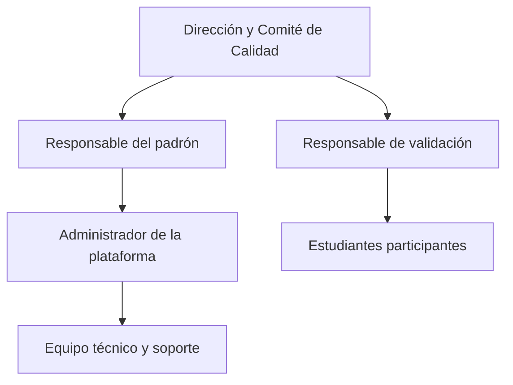
```mermaid
flowchart TD
    D[Dirección y Comité de Calidad] --> R[Responsable del padrón]
    D --> V[Responsable de validación]
    R --> A[Administrador de la plataforma]
    V --> E[Estudiantes participantes]
    A --> T[Equipo técnico y soporte]
```

*Fuente: Elaboración propia.*

Dirección y Comité de Calidad definen necesidades de información. Los responsables del padrón y de validación actúan sobre población y evidencias; el administrador gestiona permisos y configuración, y el soporte técnico mantiene el servicio. La jerarquía funcional no implica que un rol pueda ejecutar todas las acciones de los otros.

## 2. Visionamiento de la institución

El visionamiento relaciona las necesidades académicas con el alcance del producto. La solución debe producir indicadores interpretables sobre una población conocida, conservar decisiones y proteger evidencias. Los objetivos institucionales y los mecanismos técnicos se definen por separado para evaluar si el sistema aporta información útil, además de ejecutar correctamente sus operaciones.

### 2.1. Descripción del Problema

La dispersión de padrones, credenciales y evidencias dificulta producir una medición comparable de certificaciones de estudiantes. Contar únicamente a quienes presentan documentos omite a la población sin registros, y mezclar declaraciones pendientes con credenciales admitidas altera la cobertura. La falta de un contexto común de periodo y corte también dificulta explicar diferencias entre informes.

La línea base del proyecto plantea esa situación como problema a contrastar con la EPIS. No existen actas incorporadas que permitan atribuir tiempos, porcentajes de error o costos institucionales a un levantamiento de campo concluido. La propuesta requiere verificar esas condiciones antes de cuantificar mejoras.

Pulse EPIS aborda el problema con padrón autorizado, registro propio, revisión humana e indicadores sobre hechos publicados. Su valor excede un archivo de certificados: permite conocer cobertura, distribución por habilidad, vigencia y evolución con reglas de conteo y acceso definidas.

### 2.2. Objetivos de Negocios

| ID | Objetivo institucional | Resultado esperado |
|---|---|---|
| ON-01 | Conocer cobertura de certificaciones verificadas | Numerador y población académica identificables por periodo y corte. |
| ON-02 | Sustentar información de calidad académica | Evidencias y decisiones vinculadas con los resultados consultados. |
| ON-03 | Orientar revisión curricular y acompañamiento | Distribución y brechas internas por habilidades, interpretadas dentro de su alcance. |
| ON-04 | Mejorar la organización documental | Expedientes consultables por personas autorizadas y estados de revisión explícitos. |
| ON-05 | Proteger información estudiantil | Lectura agregada para gestión y acceso nominal limitado a tareas autorizadas. |

Los objetivos medibles del proyecto se mantienen en [OBJ-01 a OBJ-07](../proyecto/01-Objetivos-medibles.md). Los beneficios se verificarán mediante un piloto y una comparación con la línea base institucional; no se atribuyen ahorros o mejoras porcentuales sin medición.

### 2.3. Objetivos de Diseño

| ID | Objetivo de diseño | Mecanismo previsto o implementado |
|---|---|---|
| OD-01 | Separar identidad, expediente y análisis | Clave analítica interna, autorización y hechos por corte. |
| OD-02 | Mantener consistencia de decisiones | Máquina de estados, bloqueo transaccional e historial. |
| OD-03 | Publicar resultados de calidad controlada | ETL, identificación de fuente, rechazos y publicación atómica. |
| OD-04 | Facilitar uso del portal | Formularios y filtros con errores claros y contexto visible. |
| OD-05 | Permitir mantenimiento y evolución | Backend modular, contratos HTTP, migraciones y pruebas. |
| OD-06 | Sostener operación y recuperación | Contenedores, configuración externa y respaldo conjunto de base y evidencias. |

El diseño utiliza Next.js, React y TypeScript para el portal; FastAPI para servicios y contratos; PostgreSQL, SQLAlchemy y Alembic para persistencia. Los objetivos de rendimiento, disponibilidad y recuperación requieren pruebas en el ambiente acordado; no se consideran alcanzados por la existencia de esas tecnologías.

### 2.4. Alcance del Proyecto

El problema es producir mediciones de certificación reproducibles sobre una población institucional conciliada. Los objetivos de negocio son disponer de evidencia para acreditación y mejora curricular; los objetivos de diseño son separar identidad, evidencia, decisión y snapshot con acceso mínimo. [Objetivos medibles](../proyecto/01-Objetivos-medibles.md) conserva OBJ-01 a OBJ-07.

El sistema objetivo administrará el padrón autorizado, recepción y validación de evidencias, normalización de credenciales, generación de indicadores y reportes. Habrá vistas privadas de administración y vistas agregadas de consulta.

El repositorio contiene frontend Next.js conectado a FastAPI, sesión OIDC/RBAC y login local exclusivo de desarrollo. La importación CSV del padrón desde UI/API, el registro privado con evidencia, la bandeja de revisión, los snapshots analíticos y la exportación CSV están implementados y probados con datos sintéticos. El piloto reproduce los tres roles y contrasta los indicadores; no acredita cifras institucionales. La exportación PDF operativa, el cierre institucional y las capacidades parciales indicadas en la tabla de requisitos siguen pendientes.

La operación actual incluye tres roles técnicos: ADMIN, VALIDATOR y STUDENT. Las consultas analíticas están restringidas; la vista pública y el rol independiente de solo lectura son ampliaciones pendientes. La ejecución ETL corresponde a un operador con acceso de infraestructura, no a un cuarto rol web.

El proyecto no emite certificaciones de terceros, no reemplaza el sistema académico y no verifica automáticamente la autenticidad ante todos los emisores. La brecha interna por habilidad no representa demanda laboral. La comparación laboral externa y el paquete de acreditación requieren fuentes, metodología y capacidades adicionales.

### 2.5. Viabilidad del Sistema

| Dimensión | Evaluación para Pulse EPIS | Condición de aceptación |
|---|---|---|
| Técnica | El repositorio integra portal, API, persistencia, revisión y analítica con pruebas sintéticas. | Verificar capacidad, seguridad y recuperación en el ambiente de operación. |
| Económica | La evaluación de FD01 es condicionada; el ahorro monetizado supuesto no basta para justificar toda la inversión. | Revisar recursos y medir beneficios con datos institucionales antes de aprobar operación. |
| Operativa | El flujo distingue responsabilidades y conserva estados. | Designar responsables, autorizar padrón y comprobar tareas completas con usuarios. |
| Protección de información | Los controles limitan acceso y publicación de evidencias. | Definir finalidad, autorización, conservación y responsabilidades de tratamiento. |
| Social | La información puede apoyar gestión académica y acompañamiento. | Interpretar resultados sin rankings nominales ni atribuir falta de competencia a falta de registro. |
| Ambiental | La gestión digital puede reducir copias y circulación de papel. | Evitar atribuir un impacto cuantificado sin medición y controlar almacenamiento y conservación. |

El estudio detallado y sus supuestos se mantienen en FD01. La viabilidad técnica no equivale a autorización para tratar información real, y la demostración no permite medir cobertura o ahorro institucional.

### 2.6. Información Obtenida del Levantamiento de Información

FD01 concluye viabilidad condicionada. La información disponible procede del repositorio, sus issues, contratos, pruebas y referencias de formato. No hay actas de entrevistas, encuestas ni mediciones del tiempo institucional de consolidación incorporadas como evidencia. Esas fuentes deben añadirse con autor, fecha, población y alcance antes de afirmar hallazgos de campo.

| Fuente disponible | Información obtenida | Límite |
|---|---|---|
| Documentos FD01 y FD02 | Problema, alcance y objetivos | Su aceptación institucional requiere revisión. |
| Código y contratos | Operaciones, permisos y reglas implementadas | No prueban uso institucional ni cobertura real. |
| Pruebas y piloto sintético | Comportamiento de roles, estados e indicadores | No sustituyen entrevistas, padrón autorizado o mediciones de campo. |
| Issues del repositorio | Funciones pendientes y decisiones de construcción | No representan actas de aprobación académica. |

Los participantes previstos son Dirección EPIS, Comité de Calidad, responsables de padrón y validación, estudiantes y soporte. Su participación debe documentarse con fecha, responsabilidad y alcance antes de presentar el levantamiento como concluido.

#### 2.6.1. Hallazgos Clave del Contexto Académico

La implementación permite separar flujos por rol, persistir decisiones y publicar cortes reproducibles. Las oportunidades pendientes son cierre institucional autorizado, exportación PDF operativa, captura completa de habilidades, demanda laboral externa y recuperación integral en el ambiente institucional. No se atribuyen tasas de ahorro o demanda externa sin una fuente medida.

La revisión documental muestra que población, declaración y aprobación son conceptos distintos que deben conservarse en los conteos. También identifica limitaciones de captura de habilidades, interfaz de corrección y metadatos de exportación. Estos son hallazgos de la revisión del sistema; no constituyen resultados de encuestas sobre la EPIS.

#### 2.6.2. Oportunidades Identificadas

Las oportunidades prioritarias son cerrar la autorización y conciliación del padrón, completar tareas parciales de interfaz y comprobar recuperación conjunta. Después corresponde fortalecer la conservación de publicaciones históricas, los reportes institucionales y la integración de fuentes externas documentadas.

La ampliación a otras escuelas requerirá definir ámbitos de datos y permisos antes de incorporar usuarios. El crecimiento se evaluará por volumen de hechos, evidencias, periodos y consultas, conservando integridad y contexto metodológico.

## 3. Análisis de Procesos

Los procesos describen cómo se organiza la información antes y después de la solución. El proceso actual es una hipótesis documental a validar; el propuesto define las responsabilidades y controles que deben comprobarse en el piloto.

### 3.1. Diagrama del Proceso Actual — Diagrama de Actividades

Este proceso representa la hipótesis de consolidación manual descrita en la línea base y debe validarse con EPIS; no se atribuye a una entrevista inexistente.

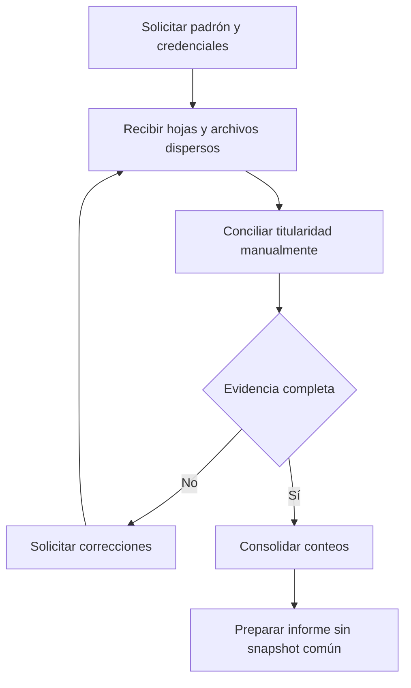
```mermaid
flowchart TD
    A[Solicitar padrón y credenciales] --> B[Recibir hojas y archivos dispersos]
    B --> C[Conciliar titularidad manualmente]
    C --> D{Evidencia completa}
    D -->|No| E[Solicitar correcciones]
    E --> B
    D -->|Sí| F[Consolidar conteos]
    F --> G[Preparar informe sin snapshot común]
```

### 3.2. Diagrama del Proceso Propuesto — Diagrama de Actividades Inicial

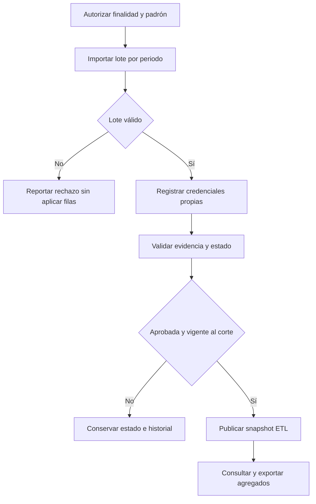
```mermaid
flowchart TD
    A[Autorizar finalidad y padrón] --> B[Importar lote por periodo]
    B --> C{Lote válido}
    C -->|No| D[Reportar rechazo sin aplicar filas]
    C -->|Sí| E[Registrar credenciales propias]
    E --> F[Validar evidencia y estado]
    F --> G{Aprobada y vigente al corte}
    G -->|No| H[Conservar estado e historial]
    G -->|Sí| I[Publicar snapshot ETL]
    I --> J[Consultar y exportar agregados]
```

## 4. Especificación de Requerimientos de Software

Los cuadros distinguen necesidades iniciales, atributos de calidad y requisitos finales verificables. Los identificadores RF y RNF conservan la correspondencia con FD04. Las reglas de negocio y contratos permiten interpretar entradas, estados y resultados.

### 4.1. Cuadro de Requerimientos Funcionales Inicial

Las necesidades iniciales se expresan como resultados esperados. El cuadro no acredita entrevistas realizadas ni tiempos de proceso medidos. Su descomposición final se mantiene en RF-01 a RF-18.

| ID | Nombre | Descripción | Actor | Prioridad | Criterio de aceptación |
|---|---|---|---|---|---|
| RFI-01 | Identidad institucional | Reconocer cuentas habilitadas y vincular estudiantes a población autorizada. | Administrador / estudiante | Crítica | Una cuenta sin provisión no obtiene acceso por el dominio únicamente. |
| RFI-02 | Población académica | Conciliar estudiantes y matrículas por periodo antes de medir cobertura. | Responsable de datos | Crítica | La población aceptada se concilia con el padrón y no se duplica al repetir la carga. |
| RFI-03 | Expediente de certificación | Recibir credenciales, fuentes y archivos del titular para su revisión. | Estudiante / validador | Crítica | Cada credencial conserva titular, evidencia y estado de revisión. |
| RFI-04 | Información de gestión | Consultar cobertura, vigencia y habilidades sobre cortes publicados. | Usuario con lectura analítica | Alta | Numerador, denominador y fecha de corte son identificables. |
| RFI-05 | Reportes trazables | Exportar información autorizada para revisión y preparación de informes. | Usuario con lectura analítica | Alta | El archivo conserva datos de la vista y distingue el alcance del reporte. |
| RFI-06 | Comparación laboral documentada | Relacionar habilidades con fuentes externas de demanda cuando se definan. | Analista autorizado propuesto | Media | Cada dato externo conserva procedencia y método; capacidad pendiente. |

### 4.2. Cuadro de Requerimientos No Funcionales

| ID | Descripción | Prioridad |
|---|---|---|
| RNF-01 | Rendimiento: p95 de consultas analíticas menor a 2 s con volumen y concurrencia acordados. | Alta |
| RNF-02 | Disponibilidad: 99.5% en ventana y periodo de medición aprobados. | Alta |
| RNF-03 | Seguridad: Sin sesión, permiso o titularidad se deniega operación; no se aceptan roles del cliente. | Crítica |
| RNF-04 | Privacidad: Indicadores no revelan código, correo ni student_key; acceso a evidencias expira. | Crítica |
| RNF-05 | Usabilidad y accesibilidad: Flujos de registro, importación y revisión navegables con teclado, errores identificables y objetivo WCAG 2.1 AA. | Alta |
| RNF-06 | Mantenibilidad: CI ejecuta lint, tipos, build, pruebas, enlaces y generación; API documentada. | Alta |
| RNF-07 | Recuperación: RPO objetivo 24 h y RTO objetivo 4 h para base y evidencias; restauración trimestral comprobada. | Alta |
| RNF-08 | Observabilidad: Logs estructurados sin PII; alerta tiene receptor y procedimiento. | Media |
| RNF-09 | Portabilidad: Mismo commit despliega frontend, API y PostgreSQL con Compose; secretos externos. | Media |
| RNF-10 | Calidad de datos: Completitud al menos 95%, duplicados menor a 1%, rechazos explicados y snapshot atómico. | Crítica |

**Método de verificación y estado**

| ID | Método y estado |
|---|---|
| RNF-01 | Prueba de carga con dataset, hardware y muestras; medición operativa pendiente |
| RNF-02 | Monitor HTTPS/readiness existente; historial institucional pendiente |
| RNF-03 | Pruebas auth, certificaciones y validación disponibles; evaluación de seguridad operativa pendiente |
| RNF-04 | Pruebas de API y tokens disponibles; retención y controles institucionales pendientes |
| RNF-05 | E2E cubre roles; auditoría completa y evaluación con usuarios pendientes |
| RNF-06 | Workflows y suites disponibles; OpenAPI se extrae de FastAPI |
| RNF-07 | Backup conjunto y verificación aislada disponibles en deploy/operations.sh; smoke de operaciones reproducible. Retención externa, RPO/RTO y simulacro en host real pendientes |
| RNF-08 | Middleware y monitor versionados; responsable y alertas externas por confirmar |
| RNF-09 | Dockerfiles y CI implementados; host y DNS institucionales por configurar |
| RNF-10 | ETL y pruebas disponibles; metas institucionales deben medirse con datos autorizados |

Las metas requieren un plan de carga que especifique población, credenciales, tamaño de archivos, concurrencia, recursos y muestras. Sin esos parámetros no se afirma cumplimiento del rendimiento ni capacidad para una cantidad supuesta de usuarios.

### 4.3. Cuadro de Requerimientos Funcionales Final

| ID | Nombre | Descripción | Actor | Prioridad |
|---|---|---|---|---|
| RF-01 | Autenticar usuario y autorizar acciones | Una petición sin sesión falla; rol de cliente no concede permisos | Usuario provisionado | Crítica |
| RF-02 | Importar padrón por periodo | ADMIN envía CSV válido; lote inválido no aplica filas; repetición exacta es idempotente | ADMIN | Crítica |
| RF-03 | Generar identidad analítica interna | Código normalizado genera HMAC estable; respuesta analítica no revela código ni correo | Servicio de padrón / operador ETL | Crítica |
| RF-04 | Registrar credencial y evidencia propia | STUDENT crea PENDING; fechas válidas; URL o archivo admitido; no opera sobre otro titular | STUDENT | Crítica |
| RF-05 | Revisar y decidir una certificación | VALIDATOR toma revisión antes de decidir; observación y rechazo exigen comentario | VALIDATOR | Crítica |
| RF-06 | Detectar duplicados | Registro repetido retorna 409; carga repetida no duplica población | ADMIN / STUDENT / operador ETL | Alta |
| RF-07 | Normalizar emisores niveles y habilidades | Alias canónicos reproducibles; corrida guarda hash y calidad | Operador ETL | Alta |
| RF-08 | Calcular KPIs por fecha de corte | Numerador y denominador corresponden a snapshot; múltiple habilidad no duplica credencial | Usuario con ANALYTICS_READ | Crítica |
| RF-09 | Filtrar analítica | Periodo, corte, cohorte y ciclo restringen población; emisor y nivel solo restringen numerador | Usuario con ANALYTICS_READ | Alta |
| RF-10 | Mostrar evolución | Serie por cortes publicados del mismo periodo respeta filtros | Usuario con ANALYTICS_READ | Alta |
| RF-11 | Restringir datos nominales | Analítica exige ANALYTICS_READ y devuelve agregados; STUDENT solo consulta sus registros | Usuario autenticado según permiso | Crítica |
| RF-12 | Exportar reporte CSV y PDF | CSV descarga datos disponibles con fuente y corte; PDF operativo debe conservar filtros y metodología | Usuario con ANALYTICS_READ | Alta |
| RF-13 | Registrar auditoría de cambios | Registro, adjunto y transición generan entradas sin binarios ni secretos | Usuario autorizado según operación | Crítica |
| RF-14 | Gestionar vigencia al corte | APPROVED expirado se deriva EXPIRED; expiring_soon usa ventana de 90 días | Usuario con ANALYTICS_READ | Alta |
| RF-15 | Importar demanda laboral con procedencia | Cada dato conserva fuente, ubicación, fecha y método de normalización | Analista autorizado propuesto | Media |
| RF-16 | Ejecutar ETL y conservar calidad | Misma fuente y corte reutilizan corrida; errores no reemplazan último snapshot | Operador de infraestructura | Alta |
| RF-17 | Corregir y reenviar una observación | PATCH propio cambia OBSERVED a RESUBMITTED conservando historial y exige nueva revisión | STUDENT | Alta |
| RF-18 | Generar paquete de acreditación | Incluye datos autorizados, reglas, calidad, fuentes, filtros y acta de cierre | Responsable de calidad propuesto | Media |

**Criterios de aceptación y estado de implementación**

| ID | Criterio de aceptación | Estado verificable |
|---|---|---|
| RF-01 | Una petición sin sesión falla; rol de cliente no concede permisos | Implementado: sesión local limitada a development/test, OIDC y dependencias RBAC |
| RF-02 | ADMIN envía CSV válido; lote inválido no aplica filas; repetición exacta es idempotente | API y pantalla implementadas; periodo inicial requiere preparación |
| RF-03 | Código normalizado genera HMAC estable; respuesta analítica no revela código ni correo | Implementado en padrón y hechos |
| RF-04 | STUDENT crea PENDING; fechas válidas; URL o archivo admitido; no opera sobre otro titular | API y formulario implementados; habilidades no se capturan en el formulario actual |
| RF-05 | VALIDATOR toma revisión antes de decidir; observación y rechazo exigen comentario | API y bandeja implementadas |
| RF-06 | Registro repetido retorna 409; carga repetida no duplica población | Restricciones de base, padrón y ETL implementados |
| RF-07 | Alias canónicos reproducibles; corrida guarda hash y calidad | ETL implementado con catálogos versionados |
| RF-08 | Numerador y denominador corresponden a snapshot; múltiple habilidad no duplica credencial | API y dashboard implementados; sin cierre institucional real |
| RF-09 | Periodo, corte, cohorte y ciclo restringen población; emisor y nivel solo restringen numerador | Implementado; filtro de área tecnológica pendiente |
| RF-10 | Serie por cortes publicados del mismo periodo respeta filtros | Implementado por corte; crecimiento entre periodos pendiente |
| RF-11 | Analítica exige ANALYTICS_READ y devuelve agregados; STUDENT solo consulta sus registros | Implementado en endpoints actuales; publicación pública pendiente |
| RF-12 | CSV descarga datos disponibles con fuente y corte; PDF operativo debe conservar filtros y metodología | CSV implementado; PDF operativo y metadatos completos de todos los filtros pendientes |
| RF-13 | Registro, adjunto y transición generan entradas sin binarios ni secretos | Implementado en operaciones cubiertas; UI general de auditoría pendiente |
| RF-14 | APPROVED expirado se deriva EXPIRED; expiring_soon usa ventana de 90 días | Implementado; no existe notificación automática de vencimiento |
| RF-15 | Cada dato conserva fuente, ubicación, fecha y método de normalización | Pendiente; skill_gaps mide brecha interna, no mercado laboral |
| RF-16 | Misma fuente y corte reutilizan corrida; errores no reemplazan último snapshot | CLI y workflow implementados; UI/API de administración de corridas pendiente |
| RF-17 | PATCH propio cambia OBSERVED a RESUBMITTED conservando historial y exige nueva revisión | API implementada; interfaz de corrección pendiente |
| RF-18 | Incluye datos autorizados, reglas, calidad, fuentes, filtros y acta de cierre | Pendiente; documentación académica no equivale a paquete institucional |

**Trazabilidad de requisitos, casos de uso y pruebas**

| Requisito | Casos de uso | Evidencia disponible | Validación pendiente |
|---|---|---|---|
| RF-01 | CU-08 | test_auth y dependencias RBAC | Configuración OIDC institucional |
| RF-02 | CU-01 CU-15 | test_roster y pantalla padrón | Periodo nuevo y fuente institucional |
| RF-03 | CU-01 CU-15 | HMAC y test_roster | Acuerdo de claves y rotación |
| RF-04 | CU-02 CU-09 CU-10 CU-11 | test_certifications y formulario | Captura de habilidades en UI |
| RF-05 | CU-03 CU-11 | test_validation y bandeja | Responsables designados |
| RF-06 | CU-01 CU-02 CU-10 CU-15 | Pruebas de unicidad/idempotencia | Medición de duplicados reales |
| RF-07 | CU-07 | test_etl y catálogos | Catálogo aprobado por EPIS |
| RF-08 | CU-04 CU-07 CU-12 CU-13 CU-14 | test_analytics y useAnalytics | Conciliación manual institucional |
| RF-09 | CU-04 CU-12 CU-13 CU-14 | test_analytics y filtros | Filtro de área |
| RF-10 | CU-04 CU-13 | Evolución por cortes y pruebas | Comparación entre periodos |
| RF-11 | CU-04 CU-08 CU-09 CU-11 CU-12 CU-13 CU-14 | Pruebas de agregado y acceso | Vista pública y umbrales |
| RF-12 | CU-05 | ExportButton CSV | PDF operativo y todos los metadatos |
| RF-13 | CU-02 CU-03 CU-06 CU-09 CU-10 | Auditoría e historial en pruebas | UI general de auditoría |
| RF-14 | CU-03 CU-04 | Estados derivados y ventana 90 días | Notificaciones de vencimiento |
| RF-15 | CU-04 objetivo | Sin integración laboral externa | Fuente y método de demanda |
| RF-16 | CU-07 | test_etl y CLI | Gestión web de corridas |
| RF-17 | CU-06 | PATCH propio y test_validation | Formulario de corrección |
| RF-18 | CU-05 objetivo | Sin paquete institucional | Cierre, calidad, fuentes y acta |

**Criterios de aceptación y pruebas**

| Requisito | Estímulo y contexto | Respuesta y medida de aceptación |
|---|---|---|
| RNF-01 | Consultas simultáneas con volumen acordado | p95 menor a 2 s; guardar hardware, dataset y mediciones |
| RNF-02 | Sondeo en ventana de servicio | Disponibilidad al menos 99.5% sobre ventana aprobada |
| RNF-03 | Cuenta intenta operación de otro rol/titular | 401/403 o recurso no visible, cero cambio de datos |
| RNF-04 | Token vencido o respuesta analítica | Denegar descarga y excluir PII de indicadores |
| RNF-05 | Usuario navega con teclado y lector | Flujos completables y auditoría WCAG 2.1 AA |
| RNF-06 | Cambio en fuente documental/API | CI detecta enlaces/contratos rotos y regenera artefactos |
| RNF-07 | Pérdida de base y evidencias en ambiente de ensayo | Restaurar conjunto coherente; RPO 24 h y RTO 4 h |
| RNF-08 | Error controlado o caída de servicio | request_id en respuesta/log; alerta con receptor registrado |
| RNF-09 | Mismo commit en host limpio | Compose inicia dependencias y readiness pasa |
| RNF-10 | Lote inválido o repetido | Último snapshot íntegro, reporte de causas y no duplicación |

Las suites `test_auth`, `test_roster`, `test_certifications`, `test_validation`, `test_etl`, `test_analytics` y `test_database_migrations` verifican permisos, atomicidad, duplicados, estados, idempotencia, fórmulas y esquema. Los E2E por roles verifican la navegación implementada. Las pruebas de carga, accesibilidad completa, demanda externa, exportación PDF y restauración institucional permanecen como criterios abiertos.

La versión productiva debe superar pruebas unitarias, integración, end to end, autorización horizontal y vertical, seguridad, accesibilidad, carga, respaldo y restauración. Las pruebas de autorización deben demostrar que `STUDENT` solo ve sus datos, `VALIDATOR` no administra, `ADMIN` respeta sus permisos, `ANALYTICS_READ` no modifica datos y el visitante solo recibe agregados. Una muestra será conciliada manualmente con padrón y evidencias por EPIS.

### 4.4. Reglas de Negocio

**Cuadro de Reglas de Negocio**

| ID RN | Regla | Condición/Disparador | Validación | Excepción | Resultado esperado |
|---|---|---|---|---|---|
| RN-01 | La población activa del periodo define el denominador. | Consultar cobertura al corte. | Matrícula y población publicadas con contexto autorizado. | Sin población, interpretar el cero con su contexto. | Denominador coherente y explícito. |
| RN-02 | Solo credenciales admitidas por reglas de validación integran KPIs de certificación verificada. | Publicar y consultar un corte. | Estado y fechas evaluados al corte. | Pendientes, observadas y rechazadas no cuentan como aprobadas. | Numerador sin declaraciones no verificadas. |
| RN-03 | La expiración no elimina el registro histórico. | Evaluar vigencia. | Comparar expiración con fecha de corte. | Sin expiración, aplicar contrato correspondiente. | Vencida se conserva y no se cuenta como vigente. |
| RN-04 | Identificadores personales no aparecen en resultados agregados. | Consultar indicadores o publicar información. | Permisos y selección de campos. | Datos operativos solo para usuarios y tareas autorizados. | Ausencia de código, correo y clave analítica en la respuesta agregada. |
| RN-05 | No duplicar credenciales ni población al repetir una operación. | Registro, carga o ETL. | Restricciones, hash e idempotencia. | Un cambio real de fuente requiere nueva evaluación. | Conteos sin duplicación por repetición o múltiples habilidades. |
| RN-06 | La inferencia auxiliar no sustituye el dato académico autorizado. | Normalizar población. | Contrastar periodo, cohorte y ciclo del padrón. | Ambigüedad se concilia con responsable de datos. | Contexto académico explicable. |
| RN-07 | La comparación laboral conserva fuente y método. | Incorporar demanda laboral. | Procedencia, fecha, ubicación y normalización documentadas. | Integración pendiente; brecha interna no constituye demanda. | Datos externos trazables cuando se implemente el requisito. |
| RN-08 | Un cierre reproducible requiere preservar contexto y metodología. | Preparar una publicación institucional. | Identificar corte, catálogos, fórmulas y atributos utilizados. | La implementación reemplaza cortes y utiliza dimensiones mutables. | No declarar inmutabilidad histórica sin completar versionado. |
| RN-09 | El estudiante opera solo sobre registros propios y estados corregibles. | Consultar, editar o adjuntar. | Titularidad y estado en backend. | Registro ajeno o cerrado se rechaza. | Expedientes protegidos y transición autorizada. |
| RN-10 | La conservación y eliminación siguen una política aprobada. | Gestionar evidencia y respaldos. | Finalidad, plazos y responsables definidos. | La configuración técnica no reemplaza aprobación institucional. | Conservación controlada; sin atribuir borrado automático no implementado. |
| RN-11 | No obtener identidades mediante perfiles públicos o scraping de LinkedIn. | Diseñar fuentes externas. | Seleccionar fuentes agregadas con procedencia documentada. | Ninguna excepción prevista en el alcance. | Integración externa sin expedientes personales extraídos de perfiles. |

**Estados, errores y contratos**

**Estados de una certificación**

Los estados siguientes corresponden a la implementación de certificaciones. Un duplicado se rechaza mediante restricción/error, y no es un estado persistido de la máquina. `Vigente`, `Próxima a vencer` y `Vencida` se derivan de una certificación validada, su fecha de expiración y la fecha de corte; no reemplazan la decisión del validador.

| Estado | Significado | Puede entrar en KPI oficial | Transición permitida |
|---|---|:---:|---|
| `PENDING` | Registro enviado y en cola de revisión | No | `UNDER_REVIEW` |
| `UNDER_REVIEW` | Un validador tomó el registro para revisarlo | No | `APPROVED`, `OBSERVED` o `REJECTED` |
| `OBSERVED` | Falta información o evidencia corregible | No | `RESUBMITTED` después de una corrección |
| `RESUBMITTED` | El estudiante corrigió una observación y espera nueva revisión | No | `UNDER_REVIEW` |
| `APPROVED` | El validador confirmó titularidad, emisor, fechas y evidencia | Sí, si no está duplicada y cumple el corte | `EXPIRED` solo como estado derivado |
| `REJECTED` | La evidencia no satisface las reglas o no se pudo verificar | No | Nuevo registro según política |
| `EXPIRED` | Certificación aprobada cuya expiración es anterior al corte | No como vigente; sí en histórico | Estado derivado, no decisión manual |

Solo `VALIDATOR` puede registrar una decisión de aprobación, observación o rechazo. `ADMIN` puede administrar el flujo y consultar auditoría según permisos, pero no valida por defecto. Ninguna transición debe eliminar la decisión anterior: cada cambio conserva autor, fecha, comentario y estado previo.

**Estados de una carga**

La API del padrón retorna `APPLIED` o `REJECTED`; la validación previa no expone los estados objetivo RECIBIDO/VALIDANDO de versiones anteriores. La carga es atómica y conserva reporte e idempotencia. Las corridas ETL tienen su propio estado y no deben confundirse con lotes de padrón.

**Errores y contrato de respuesta**

El middleware devuelve un sobre plano con `code`, `message`, `details` y `request_id`; además envía el encabezado `X-Request-ID`. No utiliza el sobre anidado ni requestId de la propuesta anterior.

```json
{
  "code": "VALIDATION_ERROR",
  "message": "Request validation failed",
  "details": [
    {"loc": ["body", "issued_on"], "message": "Field required", "type": "missing"}
  ],
  "request_id": "identificador-de-la-solicitud"
}
```

| Código o familia | HTTP | Situación | Acción |
|---|---|---|---|
| UNAUTHENTICATED | 401 | Sesión ausente o inválida | Autenticar de nuevo |
| FORBIDDEN | 403 | Permiso insuficiente | Denegar acción y datos |
| VALIDATION_ERROR | 422 | Campo o formato inválido | Corregir el dato indicado |
| DUPLICATE_RECORD | 409 | Credencial repetida | Conservar registro previo |
| EVIDENCE_UNSUPPORTED | 422 | Archivo no admitido | Usar formato permitido |
| PERIOD_NOT_FOUND / SNAPSHOT_NOT_FOUND | 404 | Periodo o snapshot ausente | Preparar periodo/revisar ETL |
| ANALYTICS_UNAVAILABLE | 503 | Servicio analítico no disponible | Revisar base y readiness |
| INTERNAL_ERROR | 500 | Falla inesperada | Correlacionar request_id en logs |

Límites de evidencia, estados no corregibles y otros errores específicos se consultan en OpenAPI y en sus rutas. La paginación general y rate limiting son objetivos de endurecimiento: no se documentan como controles implementados de todos los endpoints.

## 5. Fase de Desarrollo

La fase de desarrollo traduce los requisitos en actores, modelos y colaboraciones verificables. Cada uno de los quince casos de uso cuenta con escenario, análisis de objetos y secuencia. Las figuras representan el comportamiento del proyecto y señalan los flujos que todavía se verifican por API o infraestructura.

### 5.1. Perfiles de Usuario

Los perfiles expresan participación de negocio. La autorización efectiva se determina mediante roles y permisos del backend; los perfiles futuros se identifican expresamente.

| ID | Perfil | Objetivo | Responsabilidades clave | Permisos principales | Restricciones |
|---|---|---|---|---|---|
| PU-01 | Administrador | Mantener configuración y accesos. | Gestionar capacidades administrativas habilitadas. | ADMIN según matriz de permisos. | No valida credenciales por defecto. |
| PU-02 | Responsable de datos | Conciliar población académica. | Importar y revisar historial de padrón. | ADMIN con PADRON_MANAGE. | No modifica decisiones de validación. |
| PU-03 | Validador | Revisar sustento de credenciales. | Iniciar revisión, aprobar, observar o rechazar. | VALIDATOR con CERTIFICATION_VALIDATE y lectura analítica. | No administra padrón ni usuarios. |
| PU-04 | Consumidor de información / analista | Interpretar indicadores y reportes. | Consultar cobertura, evolución y habilidades. | ANALYTICS_READ, actualmente en ADMIN y VALIDATOR. | Rol independiente de solo lectura pendiente. |
| PU-05 | Estudiante | Declarar y consultar logros propios. | Registrar, adjuntar y corregir según estado. | STUDENT con lectura y escritura propia. | Sin acceso a expedientes ajenos ni analítica general. |
| PU-06 | Visitante propuesto | Consultar información general autorizada. | Lectura de agregados que se aprueben para publicación. | Vista pública pendiente. | Sin operación actual ni acceso a datos nominales. |

Dirección EPIS y Comité de Calidad son interesados y consumidores de reportes. No se modelan como roles técnicos adicionales del MVP.

**Roles técnicos y permisos**

El RBAC implementa únicamente estos tres roles técnicos de autorización:

| Rol técnico | Permisos base | Restricciones |
|---|---|---|
| `ADMIN` | Periodos, catálogos, configuración, padrón y auditoría según permisos | No valida evidencias ni publica datos nominales por defecto |
| `VALIDATOR` | Consulta de evidencia necesaria y decisión de validación | No administra usuarios, periodos, catálogos ni padrón |
| `STUDENT` | Registro y consulta de sus propias certificaciones | No consulta ni modifica datos de otros estudiantes |

El permiso `PADRON_MANAGE` está asignado al rol `ADMIN`; esas cuentas actúan como responsables de datos. El alcance `ANALYTICS_READ` está asignado a ADMIN y VALIDATOR. Un analista independiente de solo lectura aún no está implementado; la tabla de actores expresa la necesidad futura, no una asignación actual de permisos. El visitante es un actor propuesto: aún no existe un endpoint analítico público.

| Actor de negocio | Autorización MVP | Regla verificable |
|---|---|---|
| Administrador | `ADMIN` | Solo opera capacidades asignadas |
| Responsable de datos | `ADMIN` + `PADRON_MANAGE` | Importa y concilia, pero no valida por defecto |
| Validador | `VALIDATOR` | Decide evidencias y no administra el sistema |
| Analista | `ANALYTICS_READ` | Solo lectura de indicadores y reportes permitidos |
| Estudiante | `STUDENT` | Solo sus propios datos |
| Visitante propuesto | Público agregado pendiente | Nunca recibirá datos nominales |

La sesión determina el rol; el frontend no permite elegirlo. El backend verificará cada permiso, aplicará denegación por defecto y registrará la identidad, rol técnico, alcance y acción en `AuditLog`.

### 5.2. Modelo Conceptual

El modelo conceptual relaciona módulos y objetivos de los actores sin describir recursos físicos. Los paquetes reúnen responsabilidades, los casos de uso delimitan resultados y las narrativas precisan condiciones y alternativas. Los diagramas del modelo lógico desarrollan las colaboraciones de esos mismos casos.

#### 5.2.1. Diagrama de Paquetes

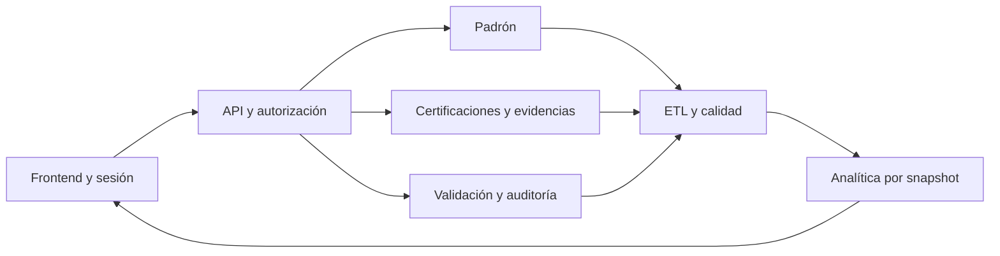
```mermaid
flowchart LR
    F[Frontend y sesión] --> API[API y autorización]
    API --> P[Padrón]
    API --> C[Certificaciones y evidencias]
    API --> V[Validación y auditoría]
    P --> ETL[ETL y calidad]
    C --> ETL
    V --> ETL
    ETL --> A[Analítica por snapshot]
    A --> F
```

#### 5.2.2. Diagrama de Casos de Uso

El modelo contiene **15 casos de uso**. Conserva los ocho identificadores iniciales y descompone consultas y operaciones de evidencia en casos con resultados verificables. CU-09 a CU-15 complementan los flujos principales; no agregan roles ni integraciones ajenas al alcance.

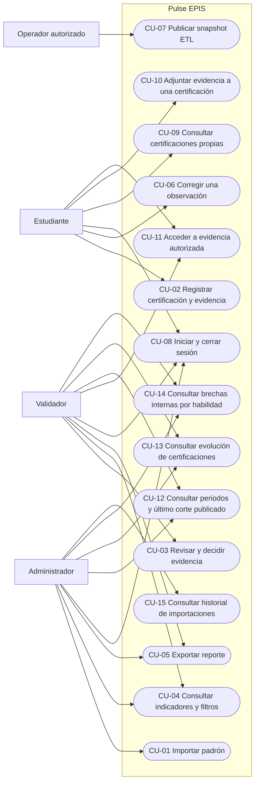
```mermaid
flowchart LR
    A[Administrador]
    E[Estudiante]
    V[Validador]
    O[Operador autorizado]
    subgraph SISTEMA[Pulse EPIS]
    C01(["CU-01 Importar padrón"])
    C02(["CU-02 Registrar certificación y evidencia"])
    C03(["CU-03 Revisar y decidir evidencia"])
    C04(["CU-04 Consultar indicadores y filtros"])
    C05(["CU-05 Exportar reporte"])
    C06(["CU-06 Corregir una observación"])
    C07(["CU-07 Publicar snapshot ETL"])
    C08(["CU-08 Iniciar y cerrar sesión"])
    C09(["CU-09 Consultar certificaciones propias"])
    C10(["CU-10 Adjuntar evidencia a una certificación"])
    C11(["CU-11 Acceder a evidencia autorizada"])
    C12(["CU-12 Consultar periodos y último corte publicado"])
    C13(["CU-13 Consultar evolución de certificaciones"])
    C14(["CU-14 Consultar brechas internas por habilidad"])
    C15(["CU-15 Consultar historial de importaciones"])
    end
    A --> C01
    E --> C02
    V --> C03
    A --> C04
    V --> C04
    A --> C05
    V --> C05
    E --> C06
    O --> C07
    A --> C08
    E --> C08
    V --> C08
    E --> C09
    E --> C10
    E --> C11
    V --> C11
    A --> C12
    V --> C12
    A --> C13
    V --> C13
    A --> C14
    V --> C14
    A --> C15
```

| Caso de uso | Actor principal | Escenario |
|---|---|---|
| CU-01 — Importar padrón | Administrador | [Escenario](#cu-01--importar-padrón--secuencia) |
| CU-02 — Registrar certificación y evidencia | Estudiante | [Escenario](#cu-02--registrar-certificación-y-evidencia--secuencia) |
| CU-03 — Revisar y decidir evidencia | Validador | [Escenario](#cu-03--revisar-y-decidir-evidencia--secuencia) |
| CU-04 — Consultar indicadores y filtros | Usuario con ANALYTICS_READ | [Escenario](#cu-04--consultar-indicadores-y-filtros--secuencia) |
| CU-05 — Exportar reporte | Usuario autorizado | [Escenario](#cu-05--exportar-reporte--secuencia) |
| CU-06 — Corregir una observación | Estudiante titular | [Escenario](#cu-06--corregir-una-observación--secuencia) |
| CU-07 — Publicar snapshot ETL | Operador de infraestructura | [Escenario](#cu-07--publicar-snapshot-etl--secuencia) |
| CU-08 — Iniciar y cerrar sesión | Usuario provisionado | [Escenario](#cu-08--iniciar-y-cerrar-sesión--secuencia) |
| CU-09 — Consultar certificaciones propias | Estudiante | [Escenario](#cu-09--consultar-certificaciones-propias--secuencia) |
| CU-10 — Adjuntar evidencia a una certificación | Estudiante | [Escenario](#cu-10--adjuntar-evidencia-a-una-certificación--secuencia) |
| CU-11 — Acceder a evidencia autorizada | Estudiante titular o validador | [Escenario](#cu-11--acceder-a-evidencia-autorizada--secuencia) |
| CU-12 — Consultar periodos y último corte publicado | Usuario con ANALYTICS_READ | [Escenario](#cu-12--consultar-periodos-y-último-corte-publicado--secuencia) |
| CU-13 — Consultar evolución de certificaciones | Usuario con ANALYTICS_READ | [Escenario](#cu-13--consultar-evolución-de-certificaciones--secuencia) |
| CU-14 — Consultar brechas internas por habilidad | Usuario con ANALYTICS_READ | [Escenario](#cu-14--consultar-brechas-internas-por-habilidad--secuencia) |
| CU-15 — Consultar historial de importaciones | Administrador | [Escenario](#cu-15--consultar-historial-de-importaciones--secuencia) |

Las consultas de evolución y brechas comparten el contrato analítico overview, aunque representan objetivos de usuario distintos. La exportación CSV ocurre en el navegador; la corrección de observaciones se verifica por API mientras su interfaz permanece pendiente.

#### 5.2.3. Escenarios de Caso de Uso (Narrativa)

##### CU-01 Importar padrón

| Atributo | Descripción |
|---|---|
| Caso de Uso | CU-01 Importar padrón |
| Objetivo | completar importar padrón con autorización y trazabilidad. |
| Actor principal | ADMIN con PADRON_MANAGE. |
| Requisitos relacionados | RF-02, RF-03, RF-06, RF-16. |
| Precondiciones | Existe sesión y periodo en academic_periods; fuente autorizada en UTF-8 con las siete columnas. |
| Disparador | Responsable envía CSV para un periodo. |
| Flujo principal | 1. Seleccionar periodo y archivo en la pantalla de padrón, o enviar POST /api/v1/padron/imports.<br>2. API verifica sesión, permiso, tamaño, cabecera y correspondencia del periodo.<br>3. Se normalizan filas, correo, escuela, estado y código; se calcula HMAC y hash de contenido.<br>4. Si todas las filas son válidas, se aplica la transacción y se registra APPLIED.<br>5. Respuesta informa aceptadas, rechazadas e idempotencia; ADMIN revisa el historial. |
| Flujos alternativos | - A1 Archivo ya aplicado: retorna el mismo reporte con idempotent=true, sin volver a crear alumnos.<br>- A2 Periodo nuevo no ofrecido por la UI: preparar el periodo por el procedimiento administrativo; no fabricar un snapshot. |
| Excepciones y errores | - E1 Una fila inválida: REJECTED, causas genéricas por fila y cero cambios parciales.<br>- E2 Sin sesión o permiso: 401/403. Periodo inexistente, formato o límite inválido: error contractual, sin aplicar el lote. |
| Postcondiciones | Población y matrícula quedan conciliadas únicamente si el lote se aplica; reporte de errores y hash quedan disponibles. |
| Reglas y restricciones | Atomicidad e idempotencia; no conservar el CSV original ni código en claro. |
| Verificación | backend/tests/test_roster.py y test_database_migrations.py. |

[Análisis de objetos](#cu-01--importar-padrón--objetos) · [Diagrama de secuencia](#cu-01--importar-padrón--secuencia)

##### CU-02 Registrar certificación y evidencia

| Atributo | Descripción |
|---|---|
| Caso de Uso | CU-02 Registrar certificación y evidencia |
| Objetivo | completar registrar certificación y evidencia con autorización y trazabilidad. |
| Actor principal | STUDENT titular. |
| Requisitos relacionados | RF-04, RF-06, RF-13. |
| Precondiciones | Sesión vinculada a un estudiante autorizado; emisor, nombre y fechas válidos. |
| Disparador | Estudiante elige Nueva certificación. |
| Flujo principal | 1. Completar nombre, emisor, emisión, expiración opcional y URL; seleccionar archivo si corresponde.<br>2. POST /certifications valida permiso y titular, sin aceptar estado del cliente.<br>3. API crea registro PENDING con auditoría.<br>4. Si hay archivo, frontend envía una segunda solicitud multipart al endpoint de evidencia.<br>5. Archivo se valida y guarda con clave aleatoria y SHA-256; el portal recarga la lista. |
| Flujos alternativos | - A1 Evidencia por URL: se conserva como fuente según contrato; no descarga ni verifica automáticamente al emisor.<br>- A2 API permite asociar habilidades; el formulario actual envía skills vacío y no ofrece edición de habilidades. |
| Excepciones y errores | - E1 Fecha inválida o campos faltantes: 422, sin nueva credencial válida.<br>- E2 Registro repetido: 409 DUPLICATE_RECORD. Archivo no admitido o grande: 422/413.<br>- E3 Si falla el adjunto después de crear el registro, la certificación PENDING permanece; no hay transacción única entre ambos HTTP. Adjuntar al registro existente por API y evitar volver a crear el mismo registro. |
| Postcondiciones | Existe certificación PENDING; solo si el adjunto tuvo éxito existe evidencia de archivo asociada. |
| Reglas y restricciones | Solo propietario; evidencia fuera de ruta pública; no participa en KPI antes de aprobación y ETL. |
| Verificación | backend/tests/test_certifications.py. |

[Análisis de objetos](#cu-02--registrar-certificación-y-evidencia--objetos) · [Diagrama de secuencia](#cu-02--registrar-certificación-y-evidencia--secuencia)

##### CU-03 Revisar y decidir evidencia

| Atributo | Descripción |
|---|---|
| Caso de Uso | CU-03 Revisar y decidir evidencia |
| Objetivo | completar revisar y decidir evidencia con autorización y trazabilidad. |
| Actor principal | VALIDATOR con CERTIFICATION_VALIDATE. |
| Requisitos relacionados | RF-05, RF-13, RF-14. |
| Precondiciones | Certificación PENDING o RESUBMITTED y evidencia accesible; sesión de validador. |
| Disparador | Validador abre la bandeja. |
| Flujo principal | 1. GET /validations carga registros al corte solicitado.<br>2. Solicitar enlace temporal para la evidencia y comprobar titularidad, emisor, fechas y consistencia.<br>3. Enviar START_REVIEW para pasar a UNDER_REVIEW.<br>4. Decidir APPROVE, OBSERVE o REJECT; las dos últimas acciones exigen comentario.<br>5. API confirma transición y agrega decisión, historial y auditoría en la misma transacción. |
| Flujos alternativos | - A1 OBSERVE pide corrección conservando el comentario y las decisiones anteriores.<br>- A2 Token de evidencia expirado: pedir un nuevo enlace como usuario autorizado. |
| Excepciones y errores | - E1 Aprobar directamente desde PENDING o decidir sobre estado final: error de transición; no modifica estado.<br>- E2 Observación/rechazo sin comentario: validación falla. ADMIN y STUDENT sin permiso reciben 403. |
| Postcondiciones | Estado persistido, decisión e historial consistentes; un snapshot ya publicado no cambia hasta una nueva corrida ETL. |
| Reglas y restricciones | No autovalidación; EXPIRED es derivado; historial sin endpoint de modificación. |
| Verificación | backend/tests/test_validation.py. |

[Análisis de objetos](#cu-03--revisar-y-decidir-evidencia--objetos) · [Diagrama de secuencia](#cu-03--revisar-y-decidir-evidencia--secuencia)

##### CU-04 Consultar indicadores y filtros

| Atributo | Descripción |
|---|---|
| Caso de Uso | CU-04 Consultar indicadores y filtros |
| Objetivo | completar consultar indicadores y filtros con autorización y trazabilidad. |
| Actor principal | ADMIN o VALIDATOR con ANALYTICS_READ. |
| Requisitos relacionados | RF-08, RF-09, RF-10, RF-11, RF-14. |
| Precondiciones | Sesión autorizada y snapshot publicado para periodo/corte. |
| Disparador | Usuario abre una vista analítica habilitada. |
| Flujo principal | 1. Frontend carga /indicators/periods y selecciona periodo.<br>2. Usuario aplica corte, cohorte, ciclo, emisor o nivel.<br>3. Frontend solicita /indicators/overview con filtros y cookie.<br>4. Servicio utiliza hechos al corte y población ACTIVE; emisor/nivel restringen credenciales, sin reducir indebidamente el denominador.<br>5. UI muestra KPIs, desgloses y evolución por corte; brecha por habilidad representa cobertura interna. |
| Flujos alternativos | - A1 Sin corte solicitado: toma el último publicado para el periodo.<br>- A2 Población cero: cobertura 0 según contrato actual, con contexto de población en el reporte. |
| Excepciones y errores | - E1 Sin snapshot: SNAPSHOT_NOT_FOUND; mostrar estado vacío/error y revisar ETL.<br>- E2 Servicio no disponible: ANALYTICS_UNAVAILABLE; no rellenar con cifras demostrativas.<br>- E3 STUDENT o visitante no autorizado: 403/401; no hay endpoint público. |
| Postcondiciones | Lectura agregada sin cambiar operación ni exponer identificadores nominales. |
| Reglas y restricciones | Varias habilidades no duplican el KPI de credenciales; ventana de expiración 90 días. |
| Verificación | backend/tests/test_analytics.py y dashboard-app/tests/e2e. |

[Análisis de objetos](#cu-04--consultar-indicadores-y-filtros--objetos) · [Diagrama de secuencia](#cu-04--consultar-indicadores-y-filtros--secuencia)

##### CU-05 Exportar reporte

| Atributo | Descripción |
|---|---|
| Caso de Uso | CU-05 Exportar reporte |
| Objetivo | completar exportar reporte con autorización y trazabilidad. |
| Actor principal | Usuario autorizado en vista con ExportButton. |
| Requisitos relacionados | RF-12, RF-18. |
| Precondiciones | Datos agregados cargados y al menos una fila exportable. |
| Disparador | Usuario selecciona Exportar Reporte. |
| Flujo principal | 1. UI toma las filas visibles cargadas desde API.<br>2. Construye CSV UTF-8 con BOM, cabecera y metadatos de fuente/corte configurados en esa pantalla.<br>3. Escapa comillas, separadores y saltos de línea.<br>4. Navegador descarga el archivo; no crea una solicitud de exportación en backend. |
| Flujos alternativos | - A1 Con cero filas, botón deshabilitado.<br>- A2 PDF operativo y paquete de acreditación: escenario objetivo, todavía sin implementación; debe incorporar filtros, fórmulas, calidad, fuentes y autorización. |
| Excepciones y errores | - E1 Si la consulta falla, no exportar datos anteriores como un corte nuevo.<br>- E2 No todas las pantallas adjuntan todos los filtros o metodología; no presentar el CSV actual como paquete oficial completo. |
| Postcondiciones | CSV local con datos disponibles; no se genera un PDF operativo ni acta institucional. |
| Reglas y restricciones | Exportar solo filas autorizadas; información nominal excluida de la analítica actual. |
| Verificación | dashboard-app/src/shared/ui/ExportButton.tsx y validación manual del archivo. |

[Análisis de objetos](#cu-05--exportar-reporte--objetos) · [Diagrama de secuencia](#cu-05--exportar-reporte--secuencia)

##### CU-06 Corregir una observación

| Atributo | Descripción |
|---|---|
| Caso de Uso | CU-06 Corregir una observación |
| Objetivo | completar corregir una observación con autorización y trazabilidad. |
| Actor principal | STUDENT titular. |
| Requisitos relacionados | RF-17, RF-13. |
| Precondiciones | Certificación propia OBSERVED; sesión válida. La UI de corrección aún está pendiente. |
| Disparador | Estudiante recibe observación y prepara corrección por API. |
| Flujo principal | 1. Consultar registro y comentario autorizado.<br>2. Enviar PATCH /certifications/{id} con campos corregibles; la evidencia adicional se adjunta mediante una solicitud separada.<br>3. Backend verifica titularidad y estado y valida los campos.<br>4. Corrección cambia OBSERVED a RESUBMITTED; conserva decisiones e historial.<br>5. Validador debe ejecutar START_REVIEW antes de una nueva decisión. |
| Flujos alternativos | - A1 Registros PENDING y RESUBMITTED permiten correcciones conforme al contrato.<br>- A2 La edición desde portal requiere completar la interfaz; actualmente el procedimiento se verifica por API. |
| Excepciones y errores | - E1 Estado no corregible: error, sin alterar la aprobación o rechazo.<br>- E2 Registro ajeno: no revelar datos; duplicado o formato inválido: error contractual. |
| Postcondiciones | Nueva versión del contenido con trazabilidad; observación previa no se elimina. |
| Reglas y restricciones | Historial append-only; solo propietario y estados abiertos. |
| Verificación | backend/tests/test_certifications.py y test_validation.py. |

[Análisis de objetos](#cu-06--corregir-una-observación--objetos) · [Diagrama de secuencia](#cu-06--corregir-una-observación--secuencia)

##### CU-07 Publicar snapshot ETL

| Atributo | Descripción |
|---|---|
| Caso de Uso | CU-07 Publicar snapshot ETL |
| Objetivo | completar publicar snapshot etl con autorización y trazabilidad. |
| Actor principal | Operador autorizado de la infraestructura. |
| Requisitos relacionados | RF-07, RF-08, RF-16. |
| Precondiciones | Base migrada con periodo, matrícula y certificaciones; acceso operativo autorizado a CLI o workflow. |
| Disparador | Operador fija periodo y fecha de corte. |
| Flujo principal | 1. Ejecutar python -m backend.scripts_etl.main con period-code y cutoff-date.<br>2. Extraer datos operacionales autorizados y calcular hash determinista.<br>3. Normalizar emisores, niveles y habilidades; evaluar fechas, estados, duplicados y completitud.<br>4. Si el lote es válido, reemplazar hechos del periodo/corte dentro de una transacción.<br>5. Conservar EtlRun y consultar API para comprobar corte y población. |
| Flujos alternativos | - A1 Misma fuente, periodo y corte: retorna corrida existente.<br>- A2 Cambios de fuente generan nuevo hash y permiten recalcular el corte con trazabilidad. |
| Excepciones y errores | - E1 Registros inválidos: ETL deja rechazos y preserva el último snapshot publicado.<br>- E2 Periodo inexistente o base no disponible: falla controlada sin publicar conteos. |
| Postcondiciones | Snapshot consistente publicado o corrida rechazada con causas; no hay interfaz web de ejecución ETL actual. |
| Reglas y restricciones | El operador CLI no es un cuarto rol de usuario web; exige permisos de infraestructura. |
| Verificación | backend/tests/test_etl.py y test_analytics.py. |

[Análisis de objetos](#cu-07--publicar-snapshot-etl--objetos) · [Diagrama de secuencia](#cu-07--publicar-snapshot-etl--secuencia)

##### CU-08 Iniciar y cerrar sesión

| Atributo | Descripción |
|---|---|
| Caso de Uso | CU-08 Iniciar y cerrar sesión |
| Objetivo | completar iniciar y cerrar sesión con autorización y trazabilidad. |
| Actor principal | ADMIN VALIDATOR o STUDENT provisionado. |
| Requisitos relacionados | RF-01, RF-11. |
| Precondiciones | Proveedor configurado y cuenta habilitada; STUDENT vinculado al padrón. |
| Disparador | Usuario inicia acceso al portal. |
| Flujo principal | 1. Frontend consulta configuración de autenticación.<br>2. En development/test permite login local; en ambientes externos usa Google OIDC con identidad básica.<br>3. Backend valida credenciales/proveedor, usuario provisionado y pertenencia; deriva rol desde política server-side.<br>4. Emite cookie de sesión y frontend consulta /auth/me.<br>5. Al cerrar sesión, backend limpia la sesión del navegador y UI restringe las páginas. |
| Flujos alternativos | - A1 Sesión expirada requiere autenticación nueva.<br>- A2 Cuenta Google del dominio permitido sin provisión no obtiene acceso por el dominio únicamente. |
| Excepciones y errores | - E1 Credenciales inválidas o cuenta deshabilitada: denegar sesión.<br>- E2 Proveedor local en staging/production: configuración rechazada.<br>- E3 OIDC sin configurar: no simular login institucional exitoso. |
| Postcondiciones | Sesión válida con permisos del servidor, o rechazo sin acceso privilegiado. |
| Reglas y restricciones | Cliente no selecciona rol; no solicitar Gmail ni almacenar contraseñas externas. |
| Verificación | backend/tests/test_auth.py y flujos E2E de roles. |

[Análisis de objetos](#cu-08--iniciar-y-cerrar-sesión--objetos) · [Diagrama de secuencia](#cu-08--iniciar-y-cerrar-sesión--secuencia)

##### CU-09 Consultar certificaciones propias

| Atributo | Descripción |
|---|---|
| Caso de Uso | CU-09 Consultar certificaciones propias |
| Objetivo | consultar certificaciones propias con alcance autorizado y resultado verificable. |
| Actor principal | STUDENT titular. |
| Requisitos relacionados | RF-04, RF-11, RF-13. |
| Precondiciones | Sesión habilitada y estudiante vinculado al padrón. |
| Disparador | El estudiante abre Mis certificaciones. |
| Flujo principal | 1. El portal solicita GET /api/v1/certifications con la sesión.<br>2. El backend deriva el estudiante desde el usuario y restringe la consulta a sus registros.<br>3. Devuelve la lista de credenciales propias con estado y metadatos permitidos.<br>4. Al elegir una credencial, GET /api/v1/certifications/{id} verifica titularidad antes de entregar el detalle.<br>5. El estudiante consulta estado, evidencia declarada y decisiones disponibles. |
| Flujos alternativos | Si no existen credenciales, la lista se presenta vacía sin generar registros. La descarga de evidencia continúa en CU-11. |
| Excepciones y errores | Sin sesión o permiso se deniega acceso. Un identificador ajeno no debe revelar el expediente. Una falla del servicio se comunica sin mostrar datos de otro usuario. |
| Postcondiciones | Consulta de solo lectura; los registros conservan su estado y el estudiante obtiene únicamente información propia. |
| Reglas y restricciones | Titularidad obligatoria; la consulta no concede lectura analítica ni capacidad de validar. |
| Verificación | backend/tests/test_certifications.py. |

[Análisis de objetos](#cu-09--consultar-certificaciones-propias--objetos) · [Diagrama de secuencia](#cu-09--consultar-certificaciones-propias--secuencia)

##### CU-10 Adjuntar evidencia a una certificación

| Atributo | Descripción |
|---|---|
| Caso de Uso | CU-10 Adjuntar evidencia a una certificación |
| Objetivo | adjuntar evidencia a una certificación con alcance autorizado y resultado verificable. |
| Actor principal | STUDENT titular. |
| Requisitos relacionados | RF-04, RF-06, RF-13. |
| Precondiciones | Credencial propia existente y permiso de escritura; fuente o archivo conforme al contrato. |
| Disparador | El estudiante incorpora sustento a un expediente registrado. |
| Flujo principal | 1. Selecciona archivo admitido o indica una URL de evidencia.<br>2. Envía POST /api/v1/certifications/{id}/evidence con la fuente correspondiente.<br>3. El servicio verifica identidad, titularidad y condiciones del expediente.<br>4. Para archivo, controla tamaño, tipo y duplicidad, calcula SHA-256 y utiliza una clave privada de almacenamiento.<br>5. Registra Evidence y auditoría, y devuelve metadatos del adjunto confirmado. |
| Flujos alternativos | Una URL se registra como fuente declarada, sin verificar automáticamente al emisor. Si falló el archivo durante CU-02, se adjunta al registro existente sin crear otra credencial. |
| Excepciones y errores | Archivo demasiado grande o no admitido: rechazo contractual. Archivo duplicado: error sin nueva asociación. Falla de almacenamiento: el portal no muestra el adjunto como confirmado. |
| Postcondiciones | Evidencia asociada solo cuando la operación concluye; no se aprueba la credencial ni se actualiza automáticamente el corte. |
| Reglas y restricciones | Fuente privada y acceso restringido; registro y adjunto no forman una única transacción HTTP. |
| Verificación | backend/tests/test_certifications.py. |

[Análisis de objetos](#cu-10--adjuntar-evidencia-a-una-certificación--objetos) · [Diagrama de secuencia](#cu-10--adjuntar-evidencia-a-una-certificación--secuencia)

##### CU-11 Acceder a evidencia autorizada

| Atributo | Descripción |
|---|---|
| Caso de Uso | CU-11 Acceder a evidencia autorizada |
| Objetivo | acceder a evidencia autorizada con alcance autorizado y resultado verificable. |
| Actor principal | STUDENT titular o VALIDATOR con permiso de validación. |
| Requisitos relacionados | RF-04, RF-05, RF-11. |
| Precondiciones | Evidencia accesible según autorización y condiciones de conservación. |
| Disparador | El actor solicita abrir la evidencia de un expediente. |
| Flujo principal | 1. Solicita un enlace de acceso mediante el endpoint autorizado para su actor.<br>2. El backend verifica titularidad o permiso de revisión y la relación de la evidencia con la credencial.<br>3. Emite un enlace con token firmado de duración limitada.<br>4. El cliente solicita la descarga; el servicio comprueba firma, vigencia y alcance del token.<br>5. Entrega el archivo privado o redirige a la URL declarada según el tipo de evidencia. |
| Flujos alternativos | Un token vencido requiere solicitar otro enlace con autorización vigente. Una evidencia de tipo URL redirige a su fuente; no implica que Pulse EPIS almacene una copia. |
| Excepciones y errores | Token inválido, alterado o vencido: no entregar archivo. Evidencia no encontrada o no accesible: error contractual. Una solicitud inicial sin permiso no obtiene enlace. |
| Postcondiciones | Acceso temporal al sustento, sin modificar estado, evidencia ni decisión. |
| Reglas y restricciones | El enlace es temporal y debe tratarse como información restringida; no se convierte en una URL pública permanente. |
| Verificación | backend/tests/test_certifications.py y backend/tests/test_validation.py. |

[Análisis de objetos](#cu-11--acceder-a-evidencia-autorizada--objetos) · [Diagrama de secuencia](#cu-11--acceder-a-evidencia-autorizada--secuencia)

##### CU-12 Consultar periodos y último corte publicado

| Atributo | Descripción |
|---|---|
| Caso de Uso | CU-12 Consultar periodos y último corte publicado |
| Objetivo | consultar periodos y último corte publicado con alcance autorizado y resultado verificable. |
| Actor principal | ADMIN o VALIDATOR con ANALYTICS_READ. |
| Requisitos relacionados | RF-08, RF-09, RF-11. |
| Precondiciones | Sesión autorizada y servicio analítico configurado. |
| Disparador | El usuario abre el selector de periodo del tablero. |
| Flujo principal | 1. El frontend solicita GET /api/v1/indicators/periods.<br>2. La API verifica permiso de lectura analítica.<br>3. El servicio consulta periodos asociados a hechos publicados.<br>4. Devuelve identificación del periodo y su latest_cutoff_date.<br>5. El usuario selecciona un periodo y utiliza el último corte como contexto inicial de CU-04. |
| Flujos alternativos | Sin publicaciones disponibles, el selector muestra un estado vacío. Una consulta posterior puede solicitar un corte explícito conforme al contrato de indicadores. |
| Excepciones y errores | Sin autorización se deniega la consulta. Servicio no disponible: informar error sin inventar periodos o fechas. |
| Postcondiciones | Contexto seleccionado sin crear periodos, ejecutar ETL ni modificar datos. |
| Reglas y restricciones | El endpoint lista periodos publicados y su último corte; no enumera todas las fechas históricas. |
| Verificación | backend/tests/test_analytics.py. |

[Análisis de objetos](#cu-12--consultar-periodos-y-último-corte-publicado--objetos) · [Diagrama de secuencia](#cu-12--consultar-periodos-y-último-corte-publicado--secuencia)

##### CU-13 Consultar evolución de certificaciones

| Atributo | Descripción |
|---|---|
| Caso de Uso | CU-13 Consultar evolución de certificaciones |
| Objetivo | consultar evolución de certificaciones con alcance autorizado y resultado verificable. |
| Actor principal | ADMIN o VALIDATOR con ANALYTICS_READ. |
| Requisitos relacionados | RF-08, RF-09, RF-10, RF-11. |
| Precondiciones | Contexto autorizado y cortes publicados del periodo. |
| Disparador | El usuario consulta el comportamiento de las certificaciones a través del tiempo. |
| Flujo principal | 1. Selecciona periodo y filtros en la vista de evolución.<br>2. El frontend solicita /api/v1/indicators/overview; no utiliza un endpoint independiente de evolución.<br>3. El servicio recupera hechos de cortes del mismo periodo y aplica el contexto de filtros.<br>4. Construye la serie con conteos distintos para evitar duplicación por habilidades.<br>5. La interfaz muestra evolución con fechas y contexto del periodo. |
| Flujos alternativos | Con un solo corte, la serie contiene únicamente la observación disponible. Sin publicaciones, se comunica la ausencia de datos. |
| Excepciones y errores | Falla de consulta: no completar con cifras de demostración. Filtros o corte inválidos: error según contrato. |
| Postcondiciones | Serie consultada sin alterar hechos ni registros operativos. |
| Reglas y restricciones | Evolución limitada al mismo periodo; la comparación entre periodos permanece pendiente. Los cortes reemplazables y dimensiones mutables limitan la reproducción histórica completa. |
| Verificación | backend/tests/test_analytics.py y flujos analíticos E2E. |

[Análisis de objetos](#cu-13--consultar-evolución-de-certificaciones--objetos) · [Diagrama de secuencia](#cu-13--consultar-evolución-de-certificaciones--secuencia)

##### CU-14 Consultar brechas internas por habilidad

| Atributo | Descripción |
|---|---|
| Caso de Uso | CU-14 Consultar brechas internas por habilidad |
| Objetivo | consultar brechas internas por habilidad con alcance autorizado y resultado verificable. |
| Actor principal | ADMIN o VALIDATOR con ANALYTICS_READ. |
| Requisitos relacionados | RF-08, RF-09, RF-11. |
| Precondiciones | Periodo y corte publicados, con población y habilidades procesadas. |
| Disparador | El usuario revisa la distribución y brecha de certificaciones por habilidad. |
| Flujo principal | 1. Selecciona periodo, corte y filtros de la población.<br>2. Solicita /api/v1/indicators/overview y recibe el bloque skill_gaps.<br>3. El servicio determina población activa del contexto.<br>4. Cuenta estudiantes distintos con certificación elegible para cada habilidad.<br>5. Calcula la brecha interna respecto de la población y muestra los resultados agregados. |
| Flujos alternativos | Sin certificaciones para una habilidad, la brecha refleja la población sin esa certificación registrada, según las reglas del conjunto publicado. Población cero se interpreta junto con el denominador. |
| Excepciones y errores | Sin snapshot o con servicio no disponible se informa error; no sustituir la brecha por datos externos supuestos. Sin permiso, acceso denegado. |
| Postcondiciones | Resultado agregado sin expediente nominal y sin modificación de datos. |
| Reglas y restricciones | La brecha interna no representa demanda laboral ni ausencia demostrada de competencia. RF-15 requiere fuente y metodología externas y no se considera cumplido por este caso. |
| Verificación | backend/tests/test_analytics.py. |

[Análisis de objetos](#cu-14--consultar-brechas-internas-por-habilidad--objetos) · [Diagrama de secuencia](#cu-14--consultar-brechas-internas-por-habilidad--secuencia)

##### CU-15 Consultar historial de importaciones

| Atributo | Descripción |
|---|---|
| Caso de Uso | CU-15 Consultar historial de importaciones |
| Objetivo | consultar historial de importaciones con alcance autorizado y resultado verificable. |
| Actor principal | ADMIN con PADRON_MANAGE. |
| Requisitos relacionados | RF-02, RF-03, RF-06. |
| Precondiciones | Sesión habilitada y periodo existente. |
| Disparador | El responsable revisa importaciones anteriores del padrón. |
| Flujo principal | 1. Selecciona el periodo y solicita GET /api/v1/padron/imports con period_code.<br>2. La API comprueba PADRON_MANAGE.<br>3. El servicio verifica el periodo y recupera registros RosterImport.<br>4. Incorpora estados, fechas, conteos y rechazos asociados.<br>5. El responsable consulta las causas y concilia el resultado con su fuente autorizada. |
| Flujos alternativos | Un periodo sin cargas devuelve historial vacío. Una carga rechazada puede revisarse antes de corregir la fuente y ejecutar nuevamente CU-01. |
| Excepciones y errores | Periodo inexistente: NOT_FOUND. Sin permiso: denegación. Servicio no disponible: informar error sin aparentar una importación aplicada. |
| Postcondiciones | Historial consultado, sin repetir la carga ni modificar población. |
| Reglas y restricciones | No devolver CSV original ni código universitario en claro; las causas deben evitar exposición innecesaria de datos personales. |
| Verificación | backend/tests/test_roster.py. |

[Análisis de objetos](#cu-15--consultar-historial-de-importaciones--objetos) · [Diagrama de secuencia](#cu-15--consultar-historial-de-importaciones--secuencia)

### 5.3. Modelo Lógico

El modelo organiza los objetos que intervienen en cada operación. Se distinguen **actores**, objetos de **frontera** (`boundary`: pantalla, cliente o interfaz externa), de **control** (`control`: coordinación y reglas) y de **entidad** (`entity`: información del dominio). Las flechas numeradas expresan colaboraciones del caso, no un despliegue de servidores. Los nombres funcionales de control representan servicios y componentes del repositorio; no implican clases adicionales que deban existir con el mismo nombre.

El [modelo de datos](../proyecto/05-Modelo-de-datos.md) conserva las relaciones persistentes. Los diagramas de objetos siguientes explican la participación de esos datos y controles en cada caso de uso; los diagramas de secuencia muestran orden, respuestas y alternativas. Los escenarios de 5.2.3 precisan precondiciones, errores y postcondiciones.

#### 5.3.1. Análisis de objetos

##### CU-01 — Importar padrón — Objetos

**Figura 6. Análisis de objetos de CU-01.**

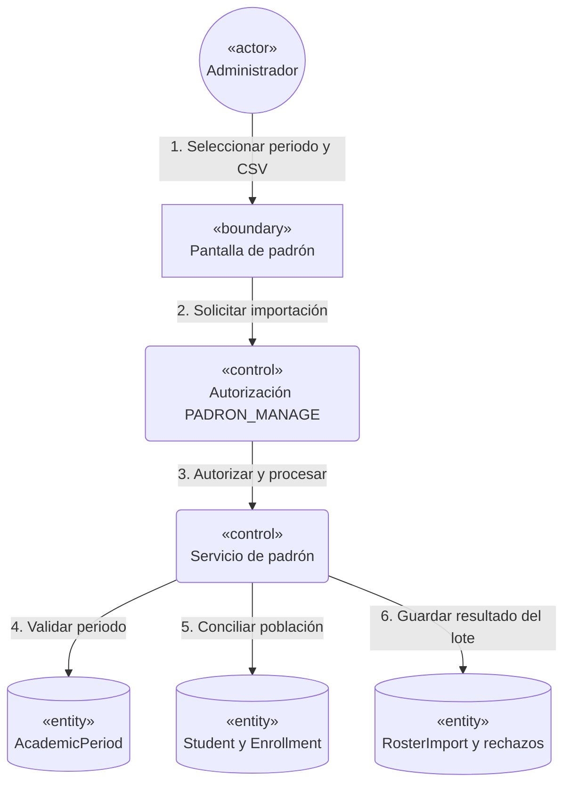
```mermaid
flowchart TB
    U(("«actor»<br/>Administrador"))
    B["«boundary»<br/>Pantalla de padrón"]
    A("«control»<br/>Autorización PADRON_MANAGE")
    S("«control»<br/>Servicio de padrón")
    P[("«entity»<br/>AcademicPeriod")]
    E[("«entity»<br/>Student y Enrollment")]
    R[("«entity»<br/>RosterImport y rechazos")]
    U -->|"1. Seleccionar periodo y CSV"| B
    B -->|"2. Solicitar importación"| A
    A -->|"3. Autorizar y procesar"| S
    S -->|"4. Validar periodo"| P
    S -->|"5. Conciliar población"| E
    S -->|"6. Guardar resultado del lote"| R
```

*Fuente: Elaboración propia.*

El servicio normaliza filas y obtiene la clave analítica antes de aplicar el lote. Student y Enrollment representan población y matrícula; RosterImport conserva resultado y hash. Una carga inválida registra causas y no aplica parcialmente la población.

[Escenario del caso](#cu-01--importar-padrón--secuencia) · [Diagrama de secuencia](#cu-01--importar-padrón--secuencia) · [Fuente editable](../recursos/diagramas/fd03/cu-01-objetos.mmd)

##### CU-02 — Registrar certificación y evidencia — Objetos

**Figura 7. Análisis de objetos de CU-02.**

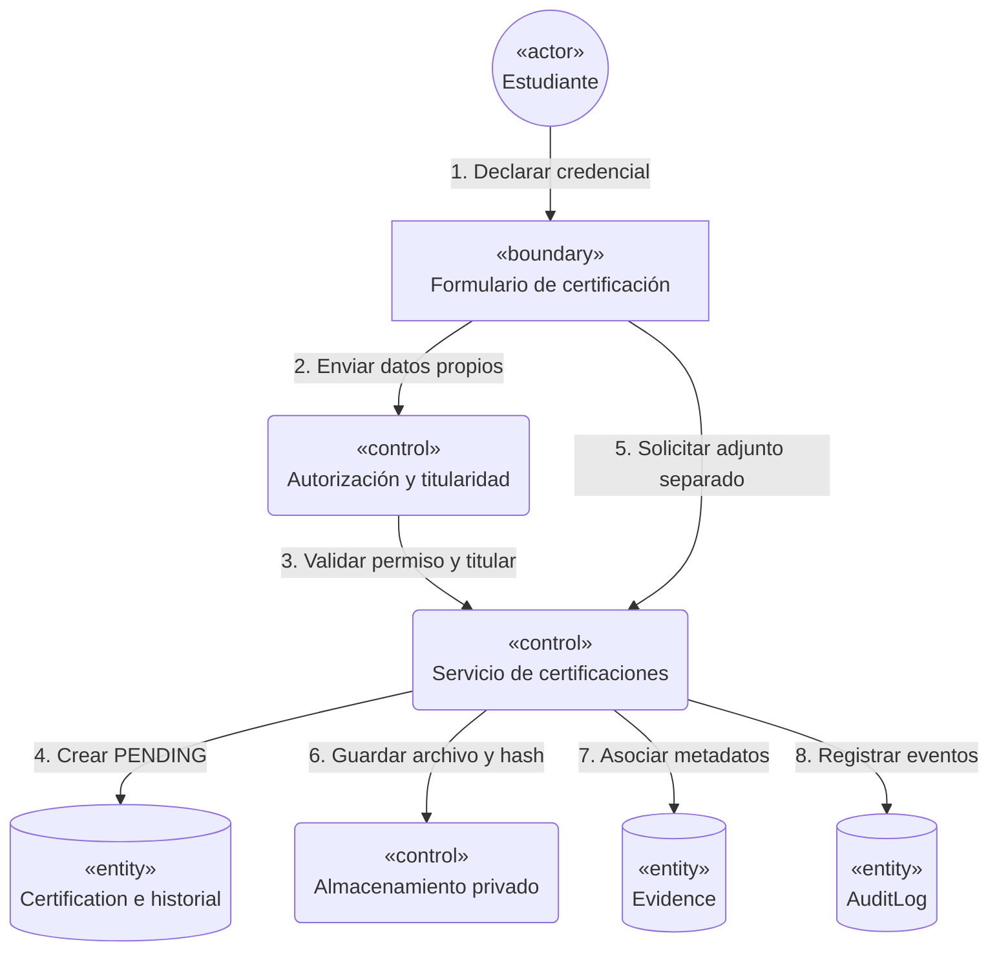
```mermaid
flowchart TB
    U(("«actor»<br/>Estudiante"))
    B["«boundary»<br/>Formulario de certificación"]
    A("«control»<br/>Autorización y titularidad")
    S("«control»<br/>Servicio de certificaciones")
    C[("«entity»<br/>Certification e historial")]
    E[("«entity»<br/>Evidence")]
    F("«control»<br/>Almacenamiento privado")
    L[("«entity»<br/>AuditLog")]
    U -->|"1. Declarar credencial"| B
    B -->|"2. Enviar datos propios"| A
    A -->|"3. Validar permiso y titular"| S
    S -->|"4. Crear PENDING"| C
    B -->|"5. Solicitar adjunto separado"| S
    S -->|"6. Guardar archivo y hash"| F
    S -->|"7. Asociar metadatos"| E
    S -->|"8. Registrar eventos"| L
```

*Fuente: Elaboración propia.*

El registro y el adjunto son solicitudes separadas. Certification mantiene el expediente; Evidence describe la fuente y el archivo privado. El almacenamiento no valida la autenticidad del emisor y una falla del adjunto no elimina automáticamente la credencial creada.

[Escenario del caso](#cu-02--registrar-certificación-y-evidencia--secuencia) · [Diagrama de secuencia](#cu-02--registrar-certificación-y-evidencia--secuencia) · [Fuente editable](../recursos/diagramas/fd03/cu-02-objetos.mmd)

##### CU-03 — Revisar y decidir evidencia — Objetos

**Figura 8. Análisis de objetos de CU-03.**

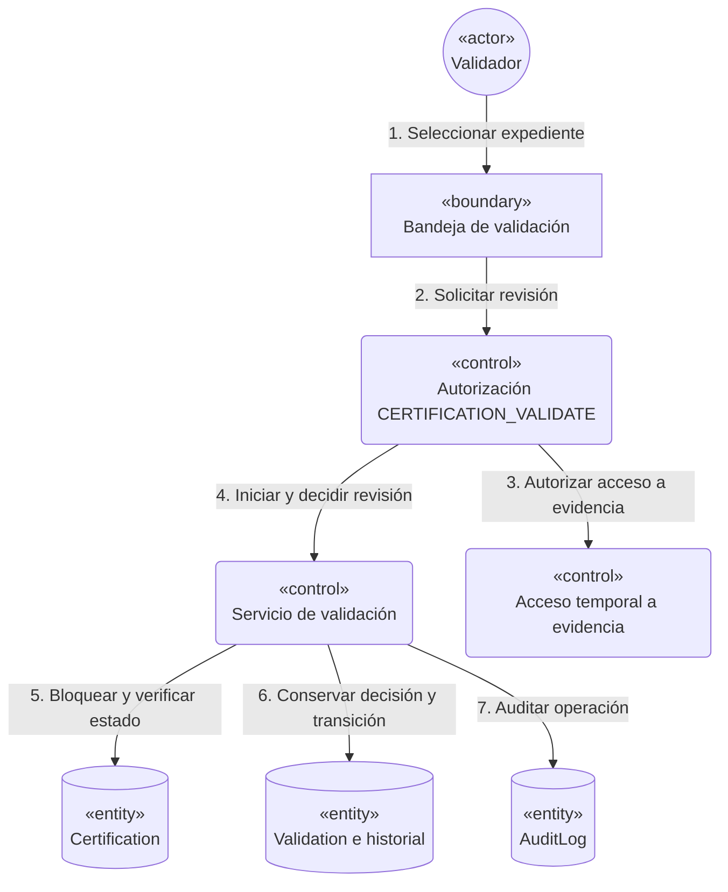
```mermaid
flowchart TB
    U(("«actor»<br/>Validador"))
    B["«boundary»<br/>Bandeja de validación"]
    A("«control»<br/>Autorización CERTIFICATION_VALIDATE")
    S("«control»<br/>Servicio de validación")
    F("«control»<br/>Acceso temporal a evidencia")
    C[("«entity»<br/>Certification")]
    V[("«entity»<br/>Validation e historial")]
    L[("«entity»<br/>AuditLog")]
    U -->|"1. Seleccionar expediente"| B
    B -->|"2. Solicitar revisión"| A
    A -->|"3. Autorizar acceso a evidencia"| F
    A -->|"4. Iniciar y decidir revisión"| S
    S -->|"5. Bloquear y verificar estado"| C
    S -->|"6. Conservar decisión y transición"| V
    S -->|"7. Auditar operación"| L
```

*Fuente: Elaboración propia.*

El validador examina el sustento antes de decidir. El servicio exige UNDER_REVIEW y comentario para observar o rechazar; Certification, Validation, el historial y la auditoría se actualizan de forma consistente. Un enlace temporal permite acceso restringido al archivo.

[Escenario del caso](#cu-03--revisar-y-decidir-evidencia--secuencia) · [Diagrama de secuencia](#cu-03--revisar-y-decidir-evidencia--secuencia) · [Fuente editable](../recursos/diagramas/fd03/cu-03-objetos.mmd)

##### CU-04 — Consultar indicadores y filtros — Objetos

**Figura 9. Análisis de objetos de CU-04.**

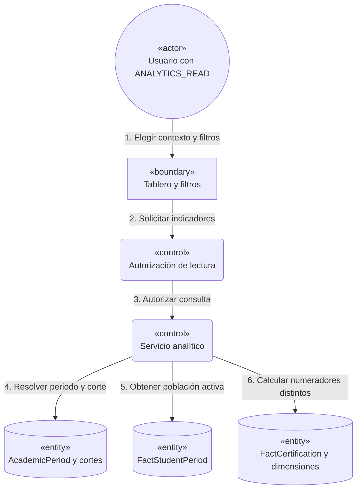
```mermaid
flowchart TB
    U(("«actor»<br/>Usuario con ANALYTICS_READ"))
    B["«boundary»<br/>Tablero y filtros"]
    A("«control»<br/>Autorización de lectura")
    S("«control»<br/>Servicio analítico")
    P[("«entity»<br/>AcademicPeriod y cortes")]
    F[("«entity»<br/>FactStudentPeriod")]
    C[("«entity»<br/>FactCertification y dimensiones")]
    U -->|"1. Elegir contexto y filtros"| B
    B -->|"2. Solicitar indicadores"| A
    A -->|"3. Autorizar consulta"| S
    S -->|"4. Resolver periodo y corte"| P
    S -->|"5. Obtener población activa"| F
    S -->|"6. Calcular numeradores distintos"| C
```

*Fuente: Elaboración propia.*

La población académica proporciona el denominador y las certificaciones elegibles el numerador. Emisor y nivel restringen credenciales sin reducir indebidamente la población. Algunas dimensiones permanecen en tablas operacionales; los hechos no garantizan por sí solos un histórico totalmente inmutable.

[Escenario del caso](#cu-04--consultar-indicadores-y-filtros--secuencia) · [Diagrama de secuencia](#cu-04--consultar-indicadores-y-filtros--secuencia) · [Fuente editable](../recursos/diagramas/fd03/cu-04-objetos.mmd)

##### CU-05 — Exportar reporte — Objetos

**Figura 10. Análisis de objetos de CU-05.**

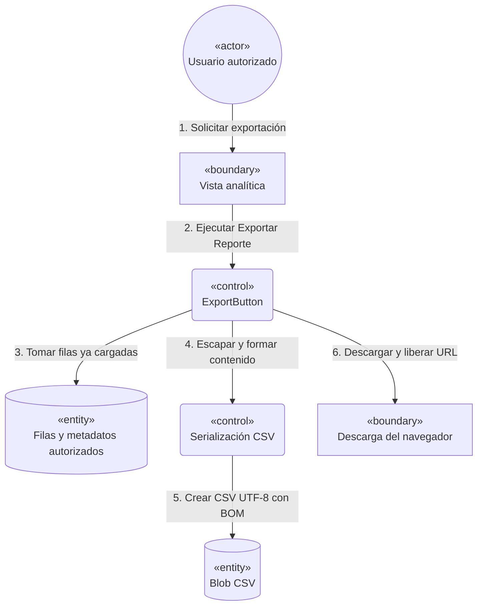
```mermaid
flowchart TB
    U(("«actor»<br/>Usuario autorizado"))
    B["«boundary»<br/>Vista analítica"]
    X("«control»<br/>ExportButton")
    R[("«entity»<br/>Filas y metadatos autorizados")]
    C("«control»<br/>Serialización CSV")
    F[("«entity»<br/>Blob CSV")]
    N["«boundary»<br/>Descarga del navegador"]
    U -->|"1. Solicitar exportación"| B
    B -->|"2. Ejecutar Exportar Reporte"| X
    X -->|"3. Tomar filas ya cargadas"| R
    X -->|"4. Escapar y formar contenido"| C
    C -->|"5. Crear CSV UTF-8 con BOM"| F
    X -->|"6. Descargar y liberar URL"| N
```

*Fuente: Elaboración propia.*

La exportación actual ocurre en el navegador a partir de datos autorizados previamente consultados. No interviene un servicio backend de generación de reportes. El archivo CSV y sus metadatos no equivalen al PDF operativo ni al paquete institucional de acreditación, que siguen pendientes.

[Escenario del caso](#cu-05--exportar-reporte--secuencia) · [Diagrama de secuencia](#cu-05--exportar-reporte--secuencia) · [Fuente editable](../recursos/diagramas/fd03/cu-05-objetos.mmd)

##### CU-06 — Corregir una observación — Objetos

**Figura 11. Análisis de objetos de CU-06.**

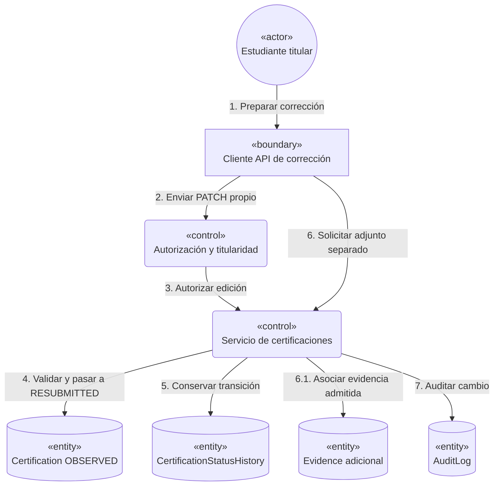
```mermaid
flowchart TB
    U(("«actor»<br/>Estudiante titular"))
    B["«boundary»<br/>Cliente API de corrección"]
    A("«control»<br/>Autorización y titularidad")
    S("«control»<br/>Servicio de certificaciones")
    C[("«entity»<br/>Certification OBSERVED")]
    H[("«entity»<br/>CertificationStatusHistory")]
    E[("«entity»<br/>Evidence adicional")]
    L[("«entity»<br/>AuditLog")]
    U -->|"1. Preparar corrección"| B
    B -->|"2. Enviar PATCH propio"| A
    A -->|"3. Autorizar edición"| S
    S -->|"4. Validar y pasar a RESUBMITTED"| C
    S -->|"5. Conservar transición"| H
    B -->|"6. Solicitar adjunto separado"| S
    S -->|"6.1. Asociar evidencia admitida"| E
    S -->|"7. Auditar cambio"| L
```

*Fuente: Elaboración propia.*

La frontera actual es un cliente de API porque la interfaz de corrección está pendiente. El cambio del expediente observado conserva decisiones anteriores y exige nueva revisión. El adjunto adicional se realiza mediante el endpoint de evidencia, no como archivo incluido automáticamente en PATCH.

[Escenario del caso](#cu-06--corregir-una-observación--secuencia) · [Diagrama de secuencia](#cu-06--corregir-una-observación--secuencia) · [Fuente editable](../recursos/diagramas/fd03/cu-06-objetos.mmd)

##### CU-07 — Publicar snapshot ETL — Objetos

**Figura 12. Análisis de objetos de CU-07.**

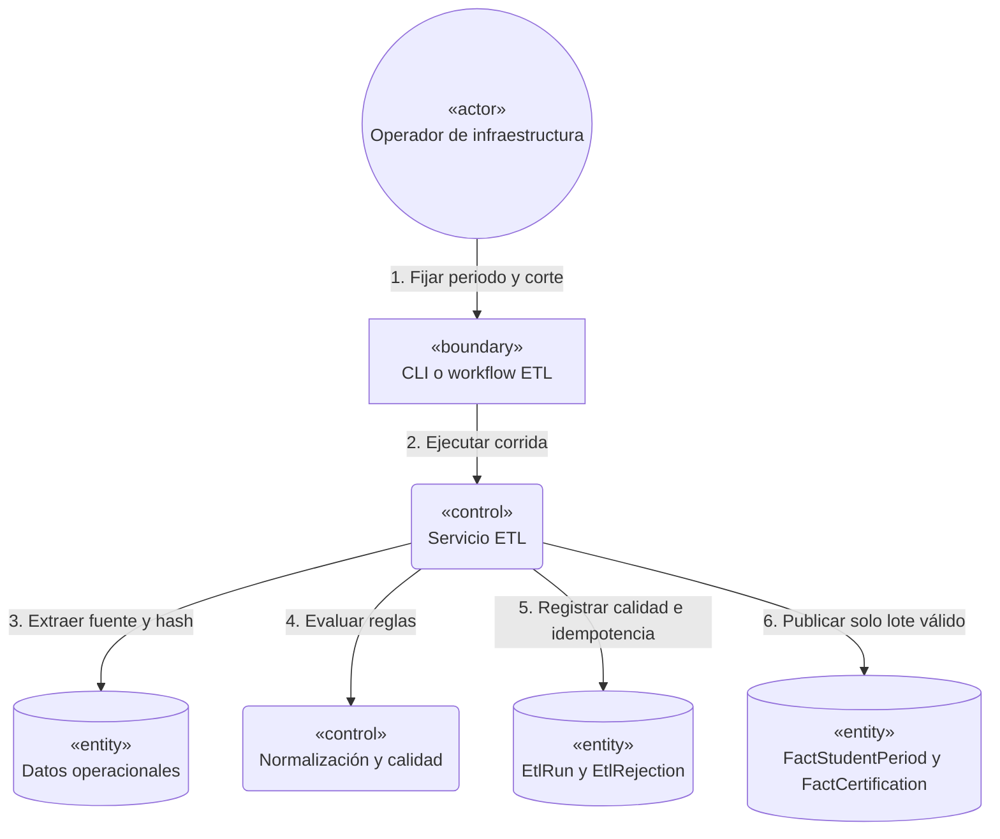
```mermaid
flowchart TB
    U(("«actor»<br/>Operador de infraestructura"))
    B["«boundary»<br/>CLI o workflow ETL"]
    S("«control»<br/>Servicio ETL")
    O[("«entity»<br/>Datos operacionales")]
    Q("«control»<br/>Normalización y calidad")
    R[("«entity»<br/>EtlRun y EtlRejection")]
    F[("«entity»<br/>FactStudentPeriod y FactCertification")]
    U -->|"1. Fijar periodo y corte"| B
    B -->|"2. Ejecutar corrida"| S
    S -->|"3. Extraer fuente y hash"| O
    S -->|"4. Evaluar reglas"| Q
    S -->|"5. Registrar calidad e idempotencia"| R
    S -->|"6. Publicar solo lote válido"| F
```

*Fuente: Elaboración propia.*

El operador actúa con permisos de infraestructura, no con un cuarto rol del portal. La corrida identifica fuente y calidad; los hechos se reemplazan en una transacción para el periodo y corte. Los rechazos impiden publicar un lote inválido y permiten investigar causas.

[Escenario del caso](#cu-07--publicar-snapshot-etl--secuencia) · [Diagrama de secuencia](#cu-07--publicar-snapshot-etl--secuencia) · [Fuente editable](../recursos/diagramas/fd03/cu-07-objetos.mmd)

##### CU-08 — Iniciar y cerrar sesión — Objetos

**Figura 13. Análisis de objetos de CU-08.**

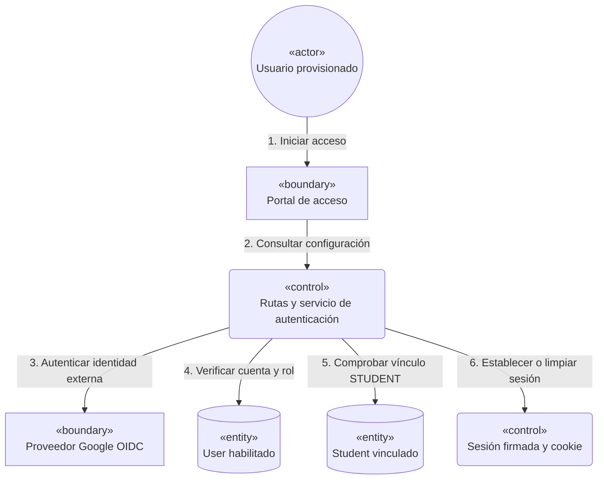
```mermaid
flowchart TB
    U(("«actor»<br/>Usuario provisionado"))
    B["«boundary»<br/>Portal de acceso"]
    A("«control»<br/>Rutas y servicio de autenticación")
    G["«boundary»<br/>Proveedor Google OIDC"]
    U1[("«entity»<br/>User habilitado")]
    S[("«entity»<br/>Student vinculado")]
    C("«control»<br/>Sesión firmada y cookie")
    U -->|"1. Iniciar acceso"| B
    B -->|"2. Consultar configuración"| A
    A -->|"3. Autenticar identidad externa"| G
    A -->|"4. Verificar cuenta y rol"| U1
    A -->|"5. Comprobar vínculo STUDENT"| S
    A -->|"6. Establecer o limpiar sesión"| C
```

*Fuente: Elaboración propia.*

Google OIDC verifica identidad externa y User determina habilitación y permisos. El dominio permitido no sustituye la provisión de la cuenta; Student debe estar vinculado para el acceso estudiantil. El cierre limpia la sesión del navegador; el acceso local solo se admite en desarrollo y pruebas.

[Escenario del caso](#cu-08--iniciar-y-cerrar-sesión--secuencia) · [Diagrama de secuencia](#cu-08--iniciar-y-cerrar-sesión--secuencia) · [Fuente editable](../recursos/diagramas/fd03/cu-08-objetos.mmd)

##### CU-09 — Consultar certificaciones propias — Objetos

**Figura 14. Análisis de objetos de CU-09.**

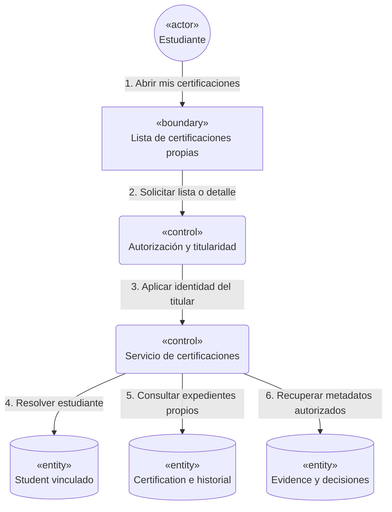
```mermaid
flowchart TB
    U(("«actor»<br/>Estudiante"))
    B["«boundary»<br/>Lista de certificaciones propias"]
    A("«control»<br/>Autorización y titularidad")
    S("«control»<br/>Servicio de certificaciones")
    U1[("«entity»<br/>Student vinculado")]
    C[("«entity»<br/>Certification e historial")]
    E[("«entity»<br/>Evidence y decisiones")]
    U -->|"1. Abrir mis certificaciones"| B
    B -->|"2. Solicitar lista o detalle"| A
    A -->|"3. Aplicar identidad del titular"| S
    S -->|"4. Resolver estudiante"| U1
    S -->|"5. Consultar expedientes propios"| C
    S -->|"6. Recuperar metadatos autorizados"| E
```

*Fuente: Elaboración propia.*

El alcance de la consulta deriva del estudiante de la sesión. La lista y el detalle permiten conocer estado y observaciones, sin exponer los registros de otros estudiantes. Los metadatos de una evidencia no sustituyen la autorización de descarga.

[Escenario del caso](#cu-09--consultar-certificaciones-propias--secuencia) · [Diagrama de secuencia](#cu-09--consultar-certificaciones-propias--secuencia) · [Fuente editable](../recursos/diagramas/fd03/cu-09-objetos.mmd)

##### CU-10 — Adjuntar evidencia a una certificación — Objetos

**Figura 15. Análisis de objetos de CU-10.**

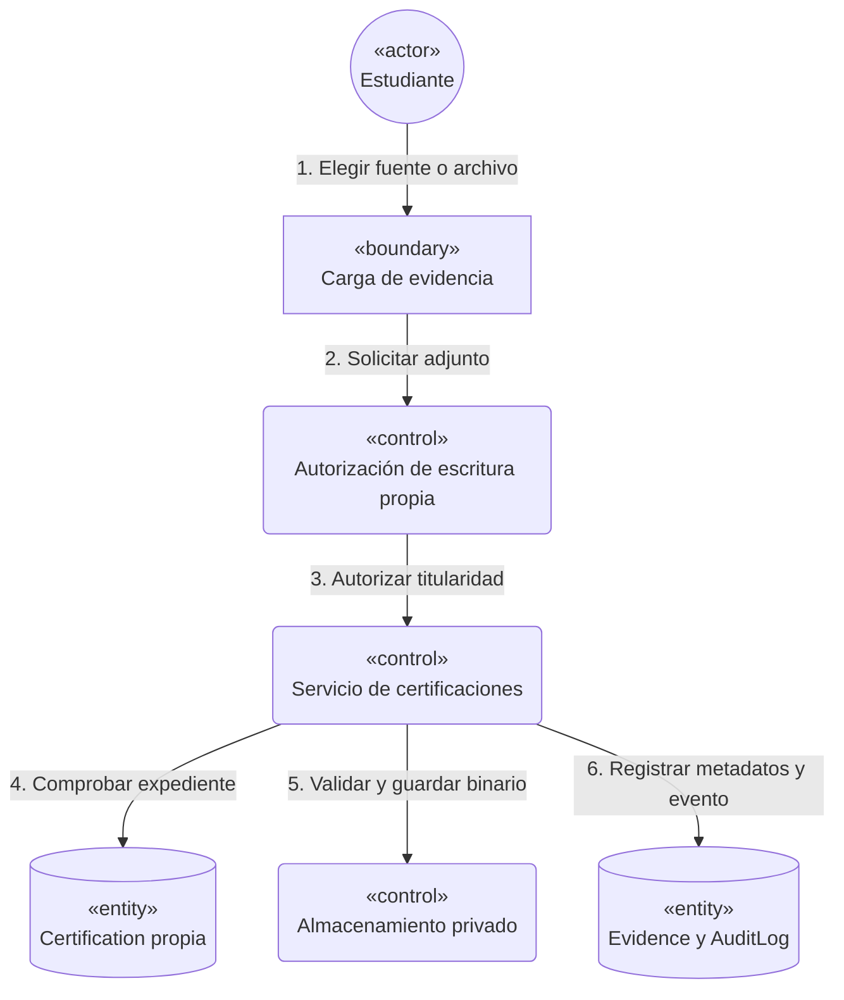
```mermaid
flowchart TB
    U(("«actor»<br/>Estudiante"))
    B["«boundary»<br/>Carga de evidencia"]
    A("«control»<br/>Autorización de escritura propia")
    S("«control»<br/>Servicio de certificaciones")
    C[("«entity»<br/>Certification propia")]
    F("«control»<br/>Almacenamiento privado")
    E[("«entity»<br/>Evidence y AuditLog")]
    U -->|"1. Elegir fuente o archivo"| B
    B -->|"2. Solicitar adjunto"| A
    A -->|"3. Autorizar titularidad"| S
    S -->|"4. Comprobar expediente"| C
    S -->|"5. Validar y guardar binario"| F
    S -->|"6. Registrar metadatos y evento"| E
```

*Fuente: Elaboración propia.*

Este caso puede ejecutarse después del registro o como recuperación de un adjunto fallido. La evidencia por URL conserva una fuente declarada; el archivo utiliza almacenamiento privado y hash. El adjunto no concede aprobación ni cambia por sí solo un corte analítico.

[Escenario del caso](#cu-10--adjuntar-evidencia-a-una-certificación--secuencia) · [Diagrama de secuencia](#cu-10--adjuntar-evidencia-a-una-certificación--secuencia) · [Fuente editable](../recursos/diagramas/fd03/cu-10-objetos.mmd)

##### CU-11 — Acceder a evidencia autorizada — Objetos

**Figura 16. Análisis de objetos de CU-11.**

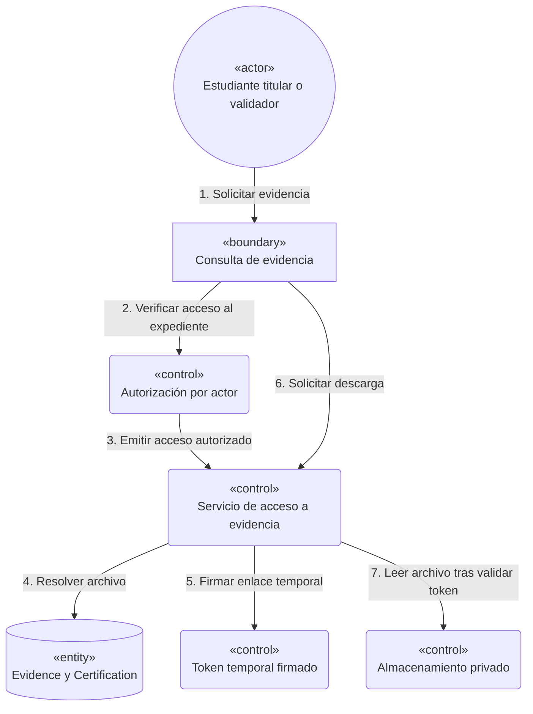
```mermaid
flowchart TB
    U(("«actor»<br/>Estudiante titular o validador"))
    B["«boundary»<br/>Consulta de evidencia"]
    A("«control»<br/>Autorización por actor")
    S("«control»<br/>Servicio de acceso a evidencia")
    E[("«entity»<br/>Evidence y Certification")]
    T("«control»<br/>Token temporal firmado")
    F("«control»<br/>Almacenamiento privado")
    U -->|"1. Solicitar evidencia"| B
    B -->|"2. Verificar acceso al expediente"| A
    A -->|"3. Emitir acceso autorizado"| S
    S -->|"4. Resolver archivo"| E
    S -->|"5. Firmar enlace temporal"| T
    B -->|"6. Solicitar descarga"| S
    S -->|"7. Leer archivo tras validar token"| F
```

*Fuente: Elaboración propia.*

El acceso diferencia al titular del validador según permisos. El enlace temporal debe verificarse antes de entregar el archivo; un identificador conocido o un token vencido no concede acceso. No se publica una ruta permanente de los archivos privados.

[Escenario del caso](#cu-11--acceder-a-evidencia-autorizada--secuencia) · [Diagrama de secuencia](#cu-11--acceder-a-evidencia-autorizada--secuencia) · [Fuente editable](../recursos/diagramas/fd03/cu-11-objetos.mmd)

##### CU-12 — Consultar periodos y último corte publicado — Objetos

**Figura 17. Análisis de objetos de CU-12.**

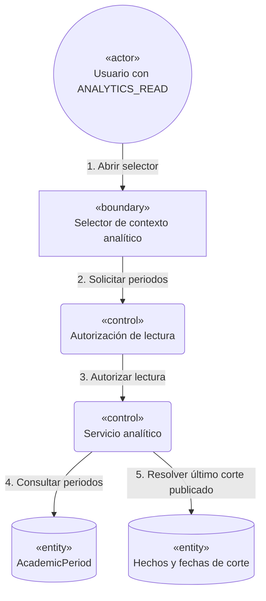
```mermaid
flowchart TB
    U(("«actor»<br/>Usuario con ANALYTICS_READ"))
    B["«boundary»<br/>Selector de contexto analítico"]
    A("«control»<br/>Autorización de lectura")
    S("«control»<br/>Servicio analítico")
    P[("«entity»<br/>AcademicPeriod")]
    F[("«entity»<br/>Hechos y fechas de corte")]
    U -->|"1. Abrir selector"| B
    B -->|"2. Solicitar periodos"| A
    A -->|"3. Autorizar lectura"| S
    S -->|"4. Consultar periodos"| P
    S -->|"5. Resolver último corte publicado"| F
```

*Fuente: Elaboración propia.*

La consulta permite seleccionar un periodo publicado y conocer su último corte antes de interpretar indicadores. El endpoint de periodos no enumera todos los cortes históricos ni crea periodos o ejecuta ETL.

[Escenario del caso](#cu-12--consultar-periodos-y-último-corte-publicado--secuencia) · [Diagrama de secuencia](#cu-12--consultar-periodos-y-último-corte-publicado--secuencia) · [Fuente editable](../recursos/diagramas/fd03/cu-12-objetos.mmd)

##### CU-13 — Consultar evolución de certificaciones — Objetos

**Figura 18. Análisis de objetos de CU-13.**

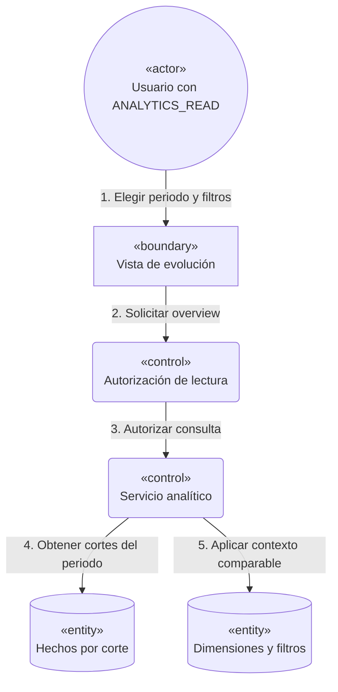
```mermaid
flowchart TB
    U(("«actor»<br/>Usuario con ANALYTICS_READ"))
    B["«boundary»<br/>Vista de evolución"]
    A("«control»<br/>Autorización de lectura")
    S("«control»<br/>Servicio analítico")
    F[("«entity»<br/>Hechos por corte")]
    D[("«entity»<br/>Dimensiones y filtros")]
    U -->|"1. Elegir periodo y filtros"| B
    B -->|"2. Solicitar overview"| A
    A -->|"3. Autorizar consulta"| S
    S -->|"4. Obtener cortes del periodo"| F
    S -->|"5. Aplicar contexto comparable"| D
```

*Fuente: Elaboración propia.*

La serie representa cortes publicados del mismo periodo. Se obtiene del contrato overview, sin inventar un endpoint de evolución. La comparación entre periodos y la reproducción íntegra de publicaciones reemplazadas requieren desarrollo o política adicional.

[Escenario del caso](#cu-13--consultar-evolución-de-certificaciones--secuencia) · [Diagrama de secuencia](#cu-13--consultar-evolución-de-certificaciones--secuencia) · [Fuente editable](../recursos/diagramas/fd03/cu-13-objetos.mmd)

##### CU-14 — Consultar brechas internas por habilidad — Objetos

**Figura 19. Análisis de objetos de CU-14.**

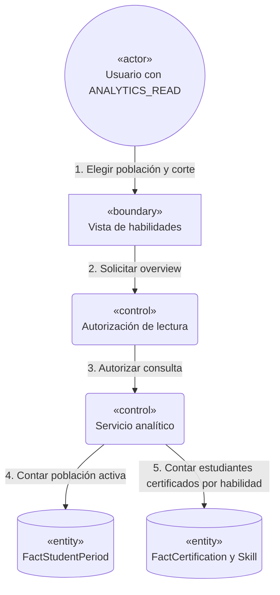
```mermaid
flowchart TB
    U(("«actor»<br/>Usuario con ANALYTICS_READ"))
    B["«boundary»<br/>Vista de habilidades"]
    A("«control»<br/>Autorización de lectura")
    S("«control»<br/>Servicio analítico")
    P[("«entity»<br/>FactStudentPeriod")]
    C[("«entity»<br/>FactCertification y Skill")]
    U -->|"1. Elegir población y corte"| B
    B -->|"2. Solicitar overview"| A
    A -->|"3. Autorizar consulta"| S
    S -->|"4. Contar población activa"| P
    S -->|"5. Contar estudiantes certificados por habilidad"| C
```

*Fuente: Elaboración propia.*

La brecha interna corresponde a población activa menos estudiantes certificados por habilidad. No representa demanda del mercado laboral ni prueba ausencia de competencia; refleja falta de certificación registrada bajo las reglas del corte.

[Escenario del caso](#cu-14--consultar-brechas-internas-por-habilidad--secuencia) · [Diagrama de secuencia](#cu-14--consultar-brechas-internas-por-habilidad--secuencia) · [Fuente editable](../recursos/diagramas/fd03/cu-14-objetos.mmd)

##### CU-15 — Consultar historial de importaciones — Objetos

**Figura 20. Análisis de objetos de CU-15.**

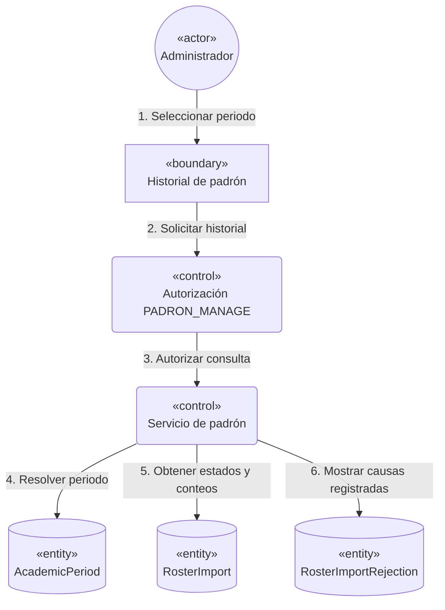
```mermaid
flowchart TB
    U(("«actor»<br/>Administrador"))
    B["«boundary»<br/>Historial de padrón"]
    A("«control»<br/>Autorización PADRON_MANAGE")
    S("«control»<br/>Servicio de padrón")
    P[("«entity»<br/>AcademicPeriod")]
    R[("«entity»<br/>RosterImport")]
    E[("«entity»<br/>RosterImportRejection")]
    U -->|"1. Seleccionar periodo"| B
    B -->|"2. Solicitar historial"| A
    A -->|"3. Autorizar consulta"| S
    S -->|"4. Resolver periodo"| P
    S -->|"5. Obtener estados y conteos"| R
    S -->|"6. Mostrar causas registradas"| E
```

*Fuente: Elaboración propia.*

La consulta permite revisar estado, fecha, conteos y causas de cargas previas, sin reaplicar el lote ni devolver el CSV original. El reporte técnico debe conciliarse con la fuente académica autorizada cuando se acepta la población institucional.

[Escenario del caso](#cu-15--consultar-historial-de-importaciones--secuencia) · [Diagrama de secuencia](#cu-15--consultar-historial-de-importaciones--secuencia) · [Fuente editable](../recursos/diagramas/fd03/cu-15-objetos.mmd)

#### 5.3.2. Diagrama de Secuencia

Cada secuencia corresponde al caso y a sus objetos de análisis. Se muestran solicitudes, controles, persistencia y respuestas principales; las excepciones adicionales se mantienen en el escenario enlazado. Las rutas se interpretan con el prefijo `/api/v1` aunque una figura utilice su forma abreviada. Las capacidades pendientes no se representan como flujos disponibles del portal.

##### CU-01 — Importar padrón — Secuencia

**Figura 21. Diagrama de secuencia de CU-01.**

```mermaid
sequenceDiagram
 actor U as Administrador
 participant P as Pantalla de padrón
 participant A as API y autorización
 participant S as Servicio de padrón
 participant D as PostgreSQL
 U->>P: Seleccionar periodo y CSV
 P->>A: POST /padron/imports con sesión
 A->>A: Verificar PADRON_MANAGE y límites
 A->>S: Importar fuente autorizada
 S->>D: Consultar periodo y carga por hash
 alt Carga aplicada anteriormente
  D-->>S: Reporte existente
  S-->>A: Resultado idempotente
 else Fuente nueva
  S->>S: Normalizar, calcular HMAC y validar filas
  alt Filas inválidas
   S->>D: Registrar REJECTED y causas
   Note over S,D: No aplicar población parcial
  else Lote válido
   S->>D: Aplicar estudiantes, matrículas y APPLIED en transacción
  end
  S-->>A: Reporte del lote
 end
 A-->>P: Resultado autorizado
 P-->>U: Totales, estado y causas
```

*Fuente: Elaboración propia.*

[Escenario del caso](#cu-01--importar-padrón--secuencia) · [Análisis de objetos](#cu-01--importar-padrón--objetos) · [Fuente editable](../recursos/diagramas/fd03/cu-01-secuencia.mmd)

##### CU-02 — Registrar certificación y evidencia — Secuencia

**Figura 22. Diagrama de secuencia de CU-02.**

```mermaid
sequenceDiagram
 actor U as Estudiante
 participant P as Formulario
 participant A as API y autorización
 participant S as Servicio de certificaciones
 participant D as PostgreSQL
 participant F as Almacenamiento privado
 U->>P: Completar credencial propia
 P->>A: POST /certifications
 A->>S: Registrar con identidad autorizada
 S->>S: Validar titularidad, campos y duplicados
 S->>D: Crear PENDING, historial y auditoría
 D-->>S: Registro confirmado
 S-->>A: Identificador
 A-->>P: Credencial creada
 opt Archivo seleccionado
  P->>A: Solicitud multipart de evidencia
  A->>S: Adjuntar al identificador creado
  S->>S: Validar tipo, tamaño y titularidad
  alt Archivo válido
   S->>F: Guardar con clave privada y SHA-256
   S->>D: Asociar Evidence y auditoría
   A-->>P: Adjunto confirmado
  else Adjunto rechazado
   A-->>P: Error del archivo
   Note over P,D: La credencial creada permanece PENDING
  end
 end
 P-->>U: Estado de registro y adjunto
```

*Fuente: Elaboración propia.*

[Escenario del caso](#cu-02--registrar-certificación-y-evidencia--secuencia) · [Análisis de objetos](#cu-02--registrar-certificación-y-evidencia--objetos) · [Fuente editable](../recursos/diagramas/fd03/cu-02-secuencia.mmd)

##### CU-03 — Revisar y decidir evidencia — Secuencia

**Figura 23. Diagrama de secuencia de CU-03.**

```mermaid
sequenceDiagram
 actor U as Validador
 participant P as Bandeja
 participant A as API y autorización
 participant E as Acceso a evidencia
 participant S as Servicio de validación
 participant D as PostgreSQL
 U->>P: Abrir expediente
 P->>A: Consultar con CERTIFICATION_VALIDATE
 A->>E: Solicitar acceso temporal autorizado
 E-->>P: Enlace temporal
 U->>P: Examinar evidencia
 P->>A: START_REVIEW
 A->>S: Iniciar revisión
 S->>D: Bloquear y verificar PENDING o RESUBMITTED
 S->>D: Persistir UNDER_REVIEW e historial
 A-->>P: Revisión iniciada
 U->>P: Aprobar, observar o rechazar
 P->>A: Decisión y comentario
 A->>S: Aplicar transición
 S->>D: Bloquear credencial y verificar estado
 alt Decisión y comentario válidos
  S->>D: Estado, Validation, historial y auditoría en transacción
  A-->>P: Decisión confirmada
 else Transición o comentario inválidos
  A-->>P: Error sin cambio confirmado
 end
 P-->>U: Resultado de revisión
```

*Fuente: Elaboración propia.*

[Escenario del caso](#cu-03--revisar-y-decidir-evidencia--secuencia) · [Análisis de objetos](#cu-03--revisar-y-decidir-evidencia--objetos) · [Fuente editable](../recursos/diagramas/fd03/cu-03-secuencia.mmd)

##### CU-04 — Consultar indicadores y filtros — Secuencia

**Figura 24. Diagrama de secuencia de CU-04.**

```mermaid
sequenceDiagram
 actor U as Usuario autorizado
 participant P as Tablero y filtros
 participant A as API y autorización
 participant S as Servicio analítico
 participant D as PostgreSQL
 U->>P: Elegir periodo, corte y filtros
 P->>A: GET /indicators/overview con sesión
 A->>A: Verificar ANALYTICS_READ
 A->>S: Consultar contexto autorizado
 S->>D: Resolver corte y hechos publicados
 alt Sin corte publicado
  S-->>A: SNAPSHOT_NOT_FOUND
  A-->>P: Estado de ausencia de datos
 else Corte disponible
  D-->>S: Población, credenciales y dimensiones
  S->>S: Aplicar filtros y conteos distintos
  Note over S: Emisor y nivel no reducen el denominador activo
  S-->>A: KPIs y desgloses agregados
  A-->>P: Resultado sin identificadores nominales
  P-->>U: Indicadores y contexto seleccionado
 end
```

*Fuente: Elaboración propia.*

[Escenario del caso](#cu-04--consultar-indicadores-y-filtros--secuencia) · [Análisis de objetos](#cu-04--consultar-indicadores-y-filtros--objetos) · [Fuente editable](../recursos/diagramas/fd03/cu-04-secuencia.mmd)

##### CU-05 — Exportar reporte — Secuencia

**Figura 25. Diagrama de secuencia de CU-05.**

```mermaid
sequenceDiagram
 actor U as Usuario autorizado
 participant P as Vista analítica
 participant X as ExportButton
 participant C as Serialización CSV
 participant N as Navegador
 Note over P,X: Los datos autorizados ya fueron consultados
 U->>P: Seleccionar Exportar Reporte
 P->>X: Filas y metadatos de la vista
 alt Sin filas
  X-->>P: Botón deshabilitado
 else Filas disponibles
  X->>C: Construir cabecera y escapar valores
  C-->>X: Contenido CSV UTF-8 con BOM
  X->>N: Crear Blob y URL temporal
  X->>N: Activar descarga
  N-->>U: Archivo CSV
  X->>N: Liberar URL temporal
 end
 Note over X,N: Sin solicitud backend de generación de PDF
```

*Fuente: Elaboración propia.*

[Escenario del caso](#cu-05--exportar-reporte--secuencia) · [Análisis de objetos](#cu-05--exportar-reporte--objetos) · [Fuente editable](../recursos/diagramas/fd03/cu-05-secuencia.mmd)

##### CU-06 — Corregir una observación — Secuencia

**Figura 26. Diagrama de secuencia de CU-06.**

```mermaid
sequenceDiagram
 actor U as Estudiante titular
 participant P as Cliente API
 participant A as API y autorización
 participant S as Servicio de certificaciones
 participant D as PostgreSQL
 U->>P: Consultar observación propia y preparar datos
 P->>A: PATCH /certifications/{id}
 A->>S: Editar con identidad del titular
 S->>D: Consultar credencial y estado
 S->>S: Verificar titularidad y campos corregibles
 alt OBSERVED y corrección válida
  S->>D: Cambiar contenido y estado a RESUBMITTED
  S->>D: Conservar historial y auditoría en transacción
  A-->>P: Corrección confirmada
  opt Evidencia adicional
   P->>A: Solicitud separada al endpoint de evidencia
   A->>S: Adjuntar con controles de titularidad
   S-->>P: Resultado del adjunto
  end
 else Estado, titularidad o datos inválidos
  A-->>P: Error sin modificación autorizada
 end
 P-->>U: Estado actualizado o error
 Note over P,D: La interfaz de corrección está pendiente
 Note over S,D: La nueva decisión requiere START_REVIEW del validador
```

*Fuente: Elaboración propia.*

[Escenario del caso](#cu-06--corregir-una-observación--secuencia) · [Análisis de objetos](#cu-06--corregir-una-observación--objetos) · [Fuente editable](../recursos/diagramas/fd03/cu-06-secuencia.mmd)

##### CU-07 — Publicar snapshot ETL — Secuencia

**Figura 27. Diagrama de secuencia de CU-07.**

```mermaid
sequenceDiagram
 actor U as Operador autorizado
 participant C as CLI o workflow
 participant S as Servicio ETL
 participant Q as Normalización y calidad
 participant D as PostgreSQL
 U->>C: Fijar periodo y fecha de corte
 C->>S: Ejecutar corrida
 S->>D: Extraer fuente operacional
 S->>S: Calcular hash determinista
 S->>D: Buscar corrida por periodo, corte y hash
 alt Corrida existente
  D-->>S: Resultado previamente registrado
  S-->>C: Respuesta idempotente
 else Fuente nueva
  S->>Q: Normalizar y evaluar registros
  Q-->>S: Resultado de calidad
  alt Registros inválidos
   S->>D: Guardar corrida y rechazos
   Note over S,D: Preservar último corte publicado
  else Lote válido
   S->>D: Reemplazar hechos del periodo y corte en transacción
   S->>D: Guardar resultado de corrida
  end
  S-->>C: Estado y conteos
 end
 C-->>U: Reporte de ejecución
 Note over U,C: Autorización de infraestructura, sin nuevo rol web
```

*Fuente: Elaboración propia.*

[Escenario del caso](#cu-07--publicar-snapshot-etl--secuencia) · [Análisis de objetos](#cu-07--publicar-snapshot-etl--objetos) · [Fuente editable](../recursos/diagramas/fd03/cu-07-secuencia.mmd)

##### CU-08 — Iniciar y cerrar sesión — Secuencia

**Figura 28. Diagrama de secuencia de CU-08.**

```mermaid
sequenceDiagram
 actor U as Usuario provisionado
 participant P as Portal
 participant A as API de autenticación
 participant G as Google OIDC
 participant D as PostgreSQL
 U->>P: Iniciar acceso
 P->>A: Consultar configuración
 alt Acceso OIDC configurado
  P->>A: Iniciar login Google
  A-->>P: Redirección al proveedor
  P->>G: Autenticar identidad externa
  G-->>A: Callback autorizado
  A->>A: Validar protocolo e identidad
 else Desarrollo o pruebas con proveedor local
  P->>A: Credenciales locales
  A->>A: Verificar proveedor permitido y contraseña
 end
 A->>D: Consultar cuenta habilitada y vínculo STUDENT
 alt Cuenta autorizada
  A-->>P: Cookie de sesión firmada
  P->>A: GET /auth/me
  A-->>P: Identidad y permisos del servidor
 else Cuenta no autorizada
  A-->>P: Denegación sin sesión privilegiada
 end
 U->>P: Cerrar sesión
 P->>A: POST /auth/logout
 A->>A: Limpiar sesión
 A-->>P: Respuesta de cierre
 P-->>U: Portal restringido
```

*Fuente: Elaboración propia.*

[Escenario del caso](#cu-08--iniciar-y-cerrar-sesión--secuencia) · [Análisis de objetos](#cu-08--iniciar-y-cerrar-sesión--objetos) · [Fuente editable](../recursos/diagramas/fd03/cu-08-secuencia.mmd)

##### CU-09 — Consultar certificaciones propias — Secuencia

**Figura 29. Diagrama de secuencia de CU-09.**

```mermaid
sequenceDiagram
 actor U as Estudiante
 participant P as Mis certificaciones
 participant A as API y autorización
 participant S as Servicio de certificaciones
 participant D as PostgreSQL
 U->>P: Consultar registros propios
 P->>A: GET /certifications con sesión
 A->>S: Listar según usuario autorizado
 S->>D: Resolver Student y credenciales propias
 D-->>S: Expedientes del titular
 S-->>A: Lista autorizada
 A-->>P: Estados y datos propios
 opt Consulta de un detalle
  P->>A: GET /certifications/{id}
  A->>S: Consultar con titularidad
  alt Pertenece al estudiante
   S->>D: Recuperar evidencia, historial y decisiones
   A-->>P: Detalle autorizado
  else Registro ajeno
   A-->>P: Denegar sin revelar expediente
  end
 end
 P-->>U: Lista, detalle o estado vacío
```

*Fuente: Elaboración propia.*

[Escenario del caso](#cu-09--consultar-certificaciones-propias--secuencia) · [Análisis de objetos](#cu-09--consultar-certificaciones-propias--objetos) · [Fuente editable](../recursos/diagramas/fd03/cu-09-secuencia.mmd)

##### CU-10 — Adjuntar evidencia a una certificación — Secuencia

**Figura 30. Diagrama de secuencia de CU-10.**

```mermaid
sequenceDiagram
 actor U as Estudiante
 participant P as Carga de evidencia
 participant A as API y autorización
 participant S as Servicio de certificaciones
 participant D as PostgreSQL
 participant F as Almacenamiento privado
 U->>P: Elegir archivo o URL
 P->>A: POST de evidencia al expediente existente
 A->>S: Adjuntar con permiso de escritura propia
 S->>D: Comprobar titularidad de Certification
 alt Archivo
  S->>S: Verificar tamaño, tipo y duplicado por hash
  S->>F: Guardar con clave privada
  F-->>S: Datos del objeto y SHA-256
 else Fuente por URL
  S->>S: Validar y conservar URL declarada
 end
 S->>D: Guardar Evidence y auditoría
 A-->>P: Metadatos del adjunto o error contractual
 P-->>U: Confirmación o corrección requerida
 Note over S,D: El adjunto no aprueba la credencial
```

*Fuente: Elaboración propia.*

[Escenario del caso](#cu-10--adjuntar-evidencia-a-una-certificación--secuencia) · [Análisis de objetos](#cu-10--adjuntar-evidencia-a-una-certificación--objetos) · [Fuente editable](../recursos/diagramas/fd03/cu-10-secuencia.mmd)

##### CU-11 — Acceder a evidencia autorizada — Secuencia

**Figura 31. Diagrama de secuencia de CU-11.**

```mermaid
sequenceDiagram
 actor U as Titular o validador
 participant P as Consulta de evidencia
 participant A as API y autorización
 participant S as Servicio de evidencia
 participant D as PostgreSQL
 participant F as Almacenamiento privado
 U->>P: Solicitar archivo
 P->>A: Solicitar acceso temporal
 A->>S: Autorizar según titularidad o permiso de validación
 S->>D: Consultar evidencia y expediente
 S->>S: Firmar token de acceso de duración limitada
 A-->>P: Enlace temporal
 P->>A: Solicitar descarga con token
 A->>S: Verificar firma, vigencia y alcance del token
 alt Token vigente y autorizado
  S->>F: Leer objeto privado
  F-->>A: Archivo
  A-->>P: Respuesta de descarga
  P-->>U: Evidencia accesible
 else Token vencido, alterado o sin acceso
  A-->>P: Error sin archivo
 end
```

*Fuente: Elaboración propia.*

[Escenario del caso](#cu-11--acceder-a-evidencia-autorizada--secuencia) · [Análisis de objetos](#cu-11--acceder-a-evidencia-autorizada--objetos) · [Fuente editable](../recursos/diagramas/fd03/cu-11-secuencia.mmd)

##### CU-12 — Consultar periodos y último corte publicado — Secuencia

**Figura 32. Diagrama de secuencia de CU-12.**

```mermaid
sequenceDiagram
 actor U as Usuario autorizado
 participant P as Selector analítico
 participant A as API y autorización
 participant S as Servicio analítico
 participant D as PostgreSQL
 U->>P: Abrir selección de contexto
 P->>A: GET /indicators/periods
 A->>A: Verificar ANALYTICS_READ
 A->>S: Obtener periodos y último corte publicado
 S->>D: Consultar AcademicPeriod y hechos publicados
 D-->>S: Contextos disponibles
 S-->>A: Periodos y último corte
 A-->>P: Lista autorizada
 alt Existen contextos publicados
  U->>P: Elegir periodo publicado
  P-->>U: Contexto seleccionado
 else No existe publicación disponible
  P-->>U: Estado vacío sin generar cifras
 end
```

*Fuente: Elaboración propia.*

[Escenario del caso](#cu-12--consultar-periodos-y-último-corte-publicado--secuencia) · [Análisis de objetos](#cu-12--consultar-periodos-y-último-corte-publicado--objetos) · [Fuente editable](../recursos/diagramas/fd03/cu-12-secuencia.mmd)

##### CU-13 — Consultar evolución de certificaciones — Secuencia

**Figura 33. Diagrama de secuencia de CU-13.**

```mermaid
sequenceDiagram
 actor U as Usuario autorizado
 participant P as Vista de evolución
 participant A as API y autorización
 participant S as Servicio analítico
 participant D as PostgreSQL
 U->>P: Seleccionar periodo y filtros
 P->>A: GET /indicators/overview
 A->>A: Verificar ANALYTICS_READ
 A->>S: Solicitar contexto analítico
 S->>D: Obtener hechos de cortes del periodo
 D-->>S: Población y credenciales por corte
 S->>S: Construir evolución con conteos distintos
 S-->>A: Serie dentro del periodo
 A-->>P: Evolución y contexto
 P-->>U: Gráfico o ausencia de serie
 Note over S,P: Comparación entre periodos pendiente
```

*Fuente: Elaboración propia.*

[Escenario del caso](#cu-13--consultar-evolución-de-certificaciones--secuencia) · [Análisis de objetos](#cu-13--consultar-evolución-de-certificaciones--objetos) · [Fuente editable](../recursos/diagramas/fd03/cu-13-secuencia.mmd)

##### CU-14 — Consultar brechas internas por habilidad — Secuencia

**Figura 34. Diagrama de secuencia de CU-14.**

```mermaid
sequenceDiagram
 actor U as Usuario autorizado
 participant P as Vista de habilidades
 participant A as API y autorización
 participant S as Servicio analítico
 participant D as PostgreSQL
 U->>P: Elegir periodo, corte y filtros
 P->>A: GET /indicators/overview
 A->>A: Verificar ANALYTICS_READ
 A->>S: Consultar habilidades del contexto
 S->>D: Obtener población activa y hechos por habilidad
 D-->>S: Población y estudiantes certificados
 S->>S: Calcular cobertura y brecha interna por habilidad
 S-->>A: skill_gaps y contexto
 A-->>P: Resultados agregados
 P-->>U: Distribución de habilidades y brechas
 Note over S,P: Sin fuente de demanda laboral externa
```

*Fuente: Elaboración propia.*

[Escenario del caso](#cu-14--consultar-brechas-internas-por-habilidad--secuencia) · [Análisis de objetos](#cu-14--consultar-brechas-internas-por-habilidad--objetos) · [Fuente editable](../recursos/diagramas/fd03/cu-14-secuencia.mmd)

##### CU-15 — Consultar historial de importaciones — Secuencia

**Figura 35. Diagrama de secuencia de CU-15.**

```mermaid
sequenceDiagram
 actor U as Administrador
 participant P as Historial de padrón
 participant A as API y autorización
 participant S as Servicio de padrón
 participant D as PostgreSQL
 U->>P: Seleccionar periodo
 P->>A: GET /padron/imports con periodo
 A->>A: Verificar PADRON_MANAGE
 A->>S: Consultar historial
 S->>D: Verificar periodo
 alt Periodo existente
  S->>D: Obtener cargas y rechazos asociados
  D-->>S: Estados, conteos, fechas y causas
  S-->>A: Historial autorizado
  A-->>P: Reportes o lista vacía
 else Periodo inexistente
  A-->>P: Error contractual
 end
 P-->>U: Historial del periodo
 Note over S,D: Lectura sin reaplicar lotes
```

*Fuente: Elaboración propia.*

[Escenario del caso](#cu-15--consultar-historial-de-importaciones--secuencia) · [Análisis de objetos](#cu-15--consultar-historial-de-importaciones--objetos) · [Fuente editable](../recursos/diagramas/fd03/cu-15-secuencia.mmd)

#### 5.3.3. Diagrama de Clases

El modelo de clases resume las entidades del dominio y sus asociaciones principales. Se omiten atributos secundarios para facilitar la lectura; el esquema físico y las restricciones se presentan en FD04 y el modelo de datos. Las operaciones de autorización y transición se implementan en servicios, por lo que no se inventan métodos dentro de los modelos de persistencia.

```mermaid
classDiagram
 class User {
  UUID id
  Role role
  bool is_active
 }
 class Student {
  UUID id
  string student_key
  UUID user_id
 }
 class AcademicPeriod {
  UUID id
 }
 class Enrollment {
  UUID student_id
  UUID period_id
 }
 class Issuer {
  UUID id
  string name
 }
 class Certification {
  UUID id
  UUID student_id
  UUID issuer_id
  string credential_name
  date issued_on
  CertificationStatus status
 }
 class Skill {
  UUID id
  string name
 }
 class CertificationSkill {
  UUID certification_id
  UUID skill_id
 }
 class Evidence {
  UUID id
  string object_key
  string sha256
 }
 class Validation {
  UUID id
  UUID validator_user_id
 }
 class CertificationStatusHistory {
  UUID id
 }
 User "0..1" -- "0..1" Student : vincula
 Student "1" -- "0..*" Enrollment : integra
 AcademicPeriod "1" -- "0..*" Enrollment : delimita
 Student "1" -- "0..*" Certification : declara
 Issuer "1" -- "0..*" Certification : identifica emisor
 Certification "1" -- "0..*" CertificationSkill : relaciona
 Skill "1" -- "0..*" CertificationSkill : clasifica
 Certification "1" -- "0..*" Evidence : sustenta
 Certification "1" -- "0..*" Validation : recibe
 User "1" -- "0..*" Validation : decide
 Certification "1" -- "0..*" CertificationStatusHistory : conserva estados
```

La relación entre usuario y estudiante es opcional y única: una cuenta puede ser administrativa y un estudiante puede existir en el padrón antes de habilitar su acceso. Una credencial admite varias habilidades; esa multiplicidad no debe duplicar el conteo de certificaciones o estudiantes en los indicadores.
