# Documento de Arquitectura de Software

**Proyecto:** Pulse EPIS Dashboard de certificaciones tecnológicas verificadas de estudiantes de la EPIS 
**Institución:** Universidad Privada de Tacna Facultad de Ingeniería Escuela Profesional de Ingeniería de Sistemas 
**Curso:** Inteligencia de Negocios 
**Integrantes:** Kiara Holly Zapana Murillo (2023077087) y Vincenzo Rafael Lllanos Niño (2023076796) 
**Código:** FD04 
**Versión:** 3.1 
**Fecha:** 02/10/2026 
**Base técnica:** main cf7ab75 y documentación del PR 51 a618c3e

## Control de versiones

| Versión | Fecha | Autores | Motivo |
|---|---|---|---|
| 2.x | Septiembre 2026 | Kiara Zapana y Vincenzo Lllanos | Desarrollo de las fuentes del proyecto |
| 3.0 | 01/10/2026 | Vincenzo Lllanos | Generación académica FD01 a FD04 en PR 51 |
| 3.1 | 02/10/2026 | Equipo del proyecto | Organización documental y actualización contra el código |

Revisión y aprobación académica: sin acta registrada. La versión del documento no certifica una aprobación ni un despliegue institucional.

## 1 Introducción

### 1.1 Propósito

Describir decisiones, restricciones, interfaces y arquitectura de Pulse EPIS bajo vistas de casos de uso, lógica, implementación, procesos y despliegue. Los diagramas C4 complementan estas vistas; las alternativas objetivo se identifican para no confundirlas con servicios activos.

La arquitectura convierte el prototipo Next.js y Python en una plataforma segura, trazable y desplegable para consolidar certificaciones de estudiantes de la EPIS. Se separan operación, evidencias, analítica y publicación para reducir el riesgo de mezclar datos nominales con indicadores agregados.

| Área | Estado actual del repositorio | Arquitectura objetivo |
|---|---|---|
| Frontend | Next.js, TypeScript, Recharts, AuthBoundary/RoleGate y consumo de API | Next.js conectado a una API con contratos versionados |
| Backend | FastAPI con health checks, OpenAPI, OIDC/RBAC y sesión local de desarrollo | FastAPI modular con OpenAPI, validación y autorización |
| Datos | ETL reproducible y esquema PostgreSQL versionado | PostgreSQL operacional, staging y modelo analítico |
| Evidencias | Persistencia privada, hash, URLs temporales y validación | Objetos privados, hash, URLs temporales y retención |
| Identidad | Google OIDC, login local de desarrollo, sesiones firmadas y RBAC | OIDC institucional, sesiones seguras y RBAC/scopes |
| Operación | Compose local, CI y workflows de despliegue; la infraestructura requiere host y secretos | Desarrollo, staging y producción reproducibles |
| Resiliencia | Workflows de backup, monitoreo y rollback definidos; pruebas operativas pendientes | RPO/RTO definidos, alertas, restauración y rollback |

El prototipo no se presentará como producción. Las decisiones de este documento son el contrato técnico para los issues de construcción; cada componente pendiente conserva su issue de implementación y criterio de salida.

### 1.2 Alcance incluido

- Padrón autorizado por periodo, `student_key` y conciliación.
- Registro y validación de certificaciones y evidencias.
- API de indicadores, filtros, estados, calidad y reportes.
- Vistas nominales restringidas y publicación agregada.
- ETL idempotente, auditoría, respaldos y observabilidad.
- Despliegue reproducible con contenedores y promoción entre ambientes.

### 1.3 Fuera de alcance

No se hará scraping de LinkedIn ni búsqueda de identidades en perfiles públicos, no se reemplazará el sistema académico, no se almacenarán contraseñas de terceros y no se publicarán nombres, códigos, correos o rankings nominales sin autorización institucional explícita.

### 1.4 Definiciones siglas y abreviaturas

| Sigla | Significado |
|---|---|
| SAD | Documento de arquitectura de software |
| C4 | Contexto, contenedores, componentes y código |
| ADR | Registro de decisión arquitectónica |
| OIDC/RBAC | Identidad federada y permisos por rol |
| ETL | Extracción, transformación y carga |
| RPO/RTO | Objetivos de pérdida tolerable de datos y tiempo de recuperación |

### 1.5 Organización del documento

El apartado 2 contiene objetivos, decisiones y restricciones. El apartado 3 desarrolla las cinco vistas y contratos. El apartado 4 define escenarios de calidad; el apartado 5 cubre operación y recuperación. La planificación y referencias cierran el documento.

## 2 Objetivos y restricciones arquitectónicas

### 2.1 Priorización de requerimientos

RF-01 a RF-05, RF-08 y RF-11 protegen identidad, población, evidencia y conteo. RNF-03, RNF-04 y RNF-10 son bloqueantes para usar datos reales. Rendimiento, disponibilidad, recuperación y accesibilidad exigen medición en un ambiente acordado. La matriz completa se mantiene en [FD03](FD03-Especificacion-Requerimientos.md).

### 2.2 Decisiones arquitectónicas

| ID | Decisión | Elección | Razón y consecuencia |
|---|---|---|---|
| ADR-001 | Forma de despliegue | Monolito modular y ETL CLI/programado | Reduce complejidad para el volumen inicial; el worker dedicado y los microservicios se difieren hasta que una métrica los justifique |
| ADR-002 | Frontend | Next.js y TypeScript | Reutiliza el prototipo; el cliente no será una frontera de seguridad |
| ADR-003 | API | FastAPI y Pydantic | Contratos tipados, validación explícita y afinidad con el ETL Python |
| ADR-004 | Persistencia | PostgreSQL con migraciones versionadas | Integridad transaccional, consultas por corte y trazabilidad |
| ADR-005 | Evidencias | Almacenamiento de objetos privado | Evita guardar PDFs en la base; permite hash, retención y URLs temporales |
| ADR-006 | Identidad | OIDC institucional | Centraliza altas, bajas y autenticación; la aplicación autoriza con claims/scopes |
| ADR-007 | Analítica | Hechos, dimensiones y vistas materializadas | KPIs rápidos y reproducibles sin copiar PII innecesaria |
| ADR-008 | Integración | Lotes idempotentes por hash y fecha de corte | Reintentos seguros y errores aislados sin publicar datos parciales |
| ADR-009 | Publicación | Agregados con umbrales de grupo | Reduce el riesgo de reidentificación en vistas públicas |

Las decisiones ADR son revisables mediante una nueva versión del documento. Cambiar de proveedor, finalidad, población o frontera de datos exige actualizar el ADR afectado y la matriz de riesgos de FD01.

### 2.3 Restricciones y estado de implementación

Se reutilizan Next.js, FastAPI, PostgreSQL y almacenamiento privado local de evidencia. Compose no contiene un servicio de worker dedicado ni S3; son alternativas de evolución. La identidad institucional depende de credenciales OIDC y cuentas provisionadas. El cifrado por campo, respaldo cifrado externo, purga automática y métricas operativas completas no se presentan como implementados.

## 3 Representación de la arquitectura del sistema

### 3.1 Vista de casos de uso

CU-01 a CU-08 cubren padrón, registro, revisión, analítica, CSV, corrección, ETL y sesión. Los escenarios de éxito, alternativas y fallas se mantienen en el SRS. La exportación PDF institucional y demanda externa son escenarios objetivo pendientes.

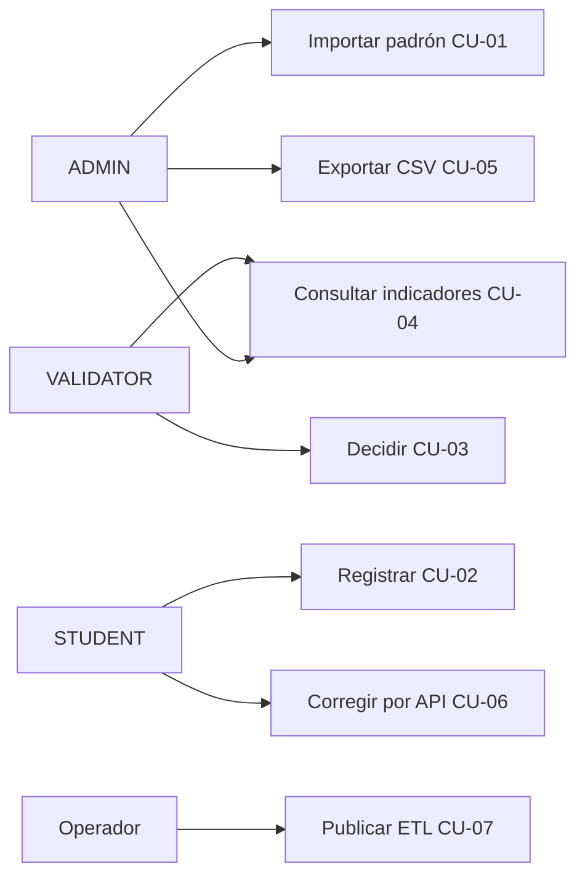

### 3.2 Vista lógica

#### 3.2.1 Contexto y subsistemas

El siguiente diagrama está escrito como código Mermaid y representa el sistema, sus actores y sus dependencias externas. Las líneas discontinuas indican una entrada que debe estar autorizada y documentada antes de incorporarse a los indicadores.

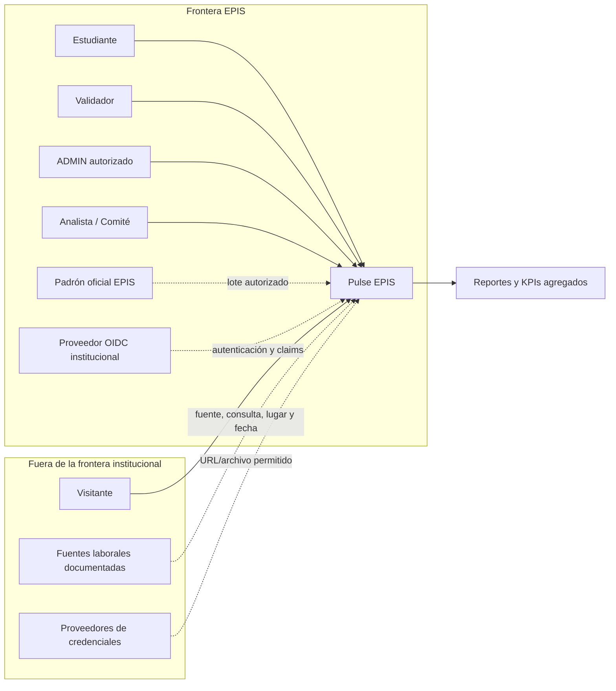

Reglas del contexto:

1. El padrón EPIS es la autoridad del denominador; el portal público no identifica personas.
2. Las certificaciones entran a los KPIs solo después de validación, deduplicación y verificación de corte.
3. OIDC autentica, pero Pulse EPIS decide autorización, alcance de datos y auditoría.
4. Las fuentes externas entregan evidencia o señales documentadas; no reciben el padrón nominal.

#### 3.2.2 Modelo de clases y base de datos

El modelo físico completo se documenta en [Modelo de datos](../proyecto/05-Modelo-de-datos.md) y tiene 18 tablas en `backend/app/db/models.py`. Incluye identidad, padrón, evidencias, decisión, auditoría, corrida ETL y hechos. `student_key` es HMAC, y `users.email` es un campo restringido; no se declara cifrado por campo inexistente.

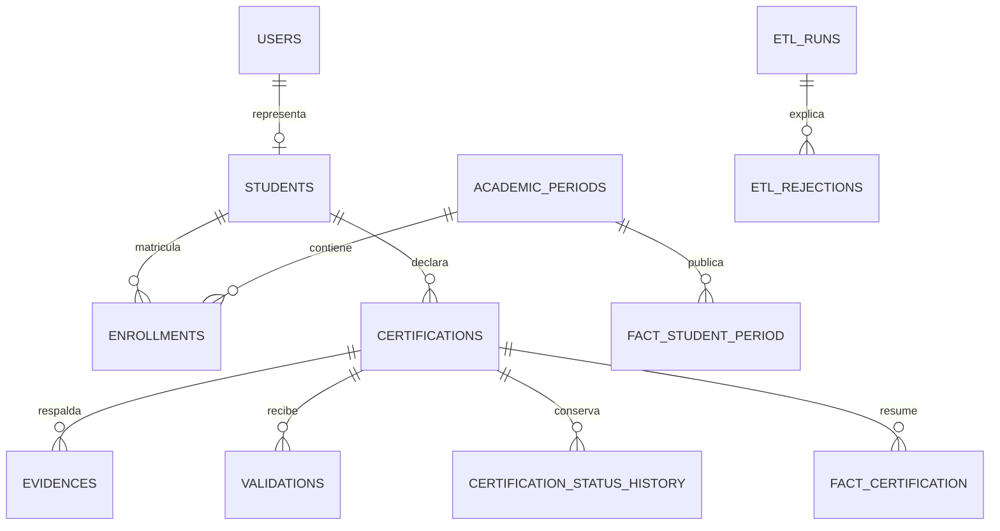

El diagrama de clases del SRS identifica objetos del dominio; el ER anterior representa persistencia. El siguiente diagrama muestra una instancia sintética para diferenciar objetos de clases.

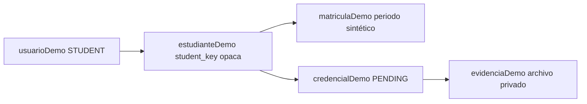

#### 3.2.3 Secuencia y colaboración

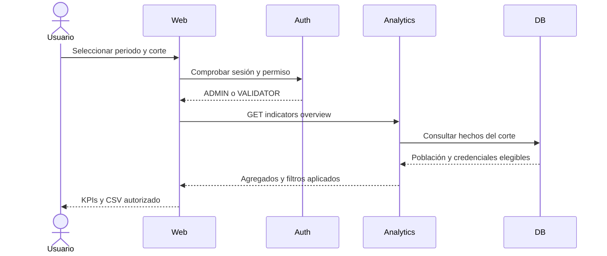

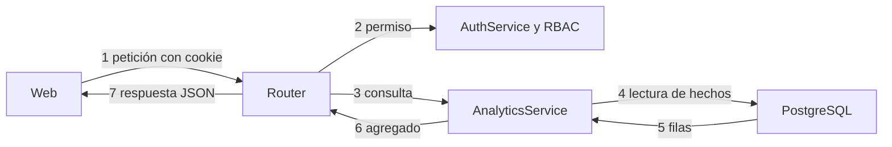

#### 3.2.4 Datos idempotencia y contratos

##### 3.2.4.1 Modelo operacional y analítico

El esquema operacional conserva la trazabilidad de la captura y decisión. El esquema analítico se construye desde cierres versionados y no debe ser la fuente de identidad.

| Entidad o hecho | Campos principales | Regla de protección |
|---|---|---|
| `Student` | `id`, `student_key`, HMAC de código y correo operacional restringido, estado | Código/correo restringidos |
| `Enrollment` | estudiante, periodo, ciclo, cohorte, escuela, plan y estado | El padrón define el denominador y conserva el contexto por periodo |
| `Certification` | estudiante, credencial, emisor, nivel, emisión, expiración y estado | Solo estados aprobados entran al KPI |
| `Evidence` | certificación, tipo, URL, `object_key`, hash, tipo/tamaño y retención | Archivo privado y URL temporal firmada |
| `Validation` | certificación, validador, decisión, comentario y fecha | Inmutable; nuevas decisiones agregan historial |
| `CertificationStatusHistory` | certificación, actor, estado anterior/nuevo, comentario y corte | Append-only para reconstruir transiciones |
| `Issuer` / `Skill` | nombres canónicos, alias y categorías | Catálogos versionados |
| `MarketDemand` | habilidad, fuente, consulta, ubicación, periodo y conteo | Nunca contiene identidades estudiantiles |
| `AuditLog` | principal, rol, scope, acción, entidad, antes, después y fecha | Sin documentos, códigos o correos |
| `EtlRun` | fuente, hash, inicio, fin, estado, filas y errores | Idempotencia por lote y corte |
| `fact_student_period` | estudiante seudonimizado, periodo, estado | Denominador por cierre |
| `fact_certification` | certificación, estado, proveedor, nivel y corte | Hecho reproducible |
| `fact_market_demand` | habilidad, fuente, ubicación, periodo y valor normalizado | Procedencia obligatoria |

No se copiarán nombres, correos ni códigos sin cifrar al esquema analítico. Los reportes públicos aplicarán umbrales mínimos de grupo y conservarán fecha de corte, filtros y metodología.

##### 3.2.4.2 Idempotencia y consistencia

1. Cada lote recibe un `batch_id`, hash del archivo, fuente, periodo y fecha de corte.
2. La misma combinación de hash, fuente y periodo no se aplica dos veces.
3. La validación ocurre en staging; un lote con errores bloqueantes no se publica parcialmente.
4. Las promociones a tablas operacionales y hechos se realizan en transacción.
5. Los cierres publicados son inmutables; una corrección crea una nueva versión y conserva la anterior.

| Método y ruta | Propósito | Autorización | Entrada principal | Salida |
|---|---|---|---|---|
| `POST /api/v1/padron/imports` | Importar padrón | `ADMIN` + `PADRON_MANAGE` | CSV y periodo | `import_id`, totales y rechazos |
| `GET /api/v1/padron/imports?period_code=...` | Consultar historial de cargas | `ADMIN` + `PADRON_MANAGE` | Código de periodo | Estado, filas, causas y timestamps |
| `POST /api/v1/certifications` | Registrar credencial | `STUDENT` + `CERTIFICATION_WRITE_OWN` | Emisor, nombre, fechas y URL/archivo | ID y estado `PENDING` |
| `GET /api/v1/certifications` | Listar registros propios | `STUDENT` + `CERTIFICATION_READ_OWN` | Sesión institucional | Certificaciones sin datos de terceros |
| `PATCH /api/v1/certifications/{id}` | Corregir registro observado | `STUDENT` propietario | Campos corregibles y habilidades | Estado `RESUBMITTED` y decisión previa preservada |
| `POST /api/v1/certifications/{id}/evidence` | Adjuntar evidencia | `STUDENT` propietario | Archivo o URL permitida | Hash, metadatos y retención |
| `POST /api/v1/certifications/{id}/evidence/{evidence_id}/access` | Emitir acceso temporal | `STUDENT` propietario | Evidencia propia | URL firmada con expiración |
| `GET /api/v1/certifications/evidence/{evidence_id}/download` | Descargar o redirigir | Token firmado | Token temporal | Archivo privado o URL externa |
| `GET /api/v1/validations` | Consultar bandeja al corte | `VALIDATOR` + `CERTIFICATION_VALIDATE` | Fecha de corte opcional | Registros sin PII nominal |
| `POST /api/v1/validations/{id}` | Registrar transición | `VALIDATOR` + `CERTIFICATION_VALIDATE` | Acción, comentario y evidencia | Estado e historial |
| `GET /api/v1/validations/{id}/history` | Consultar historial | `VALIDATOR` + `CERTIFICATION_VALIDATE` | Identificador de certificación | Transiciones append-only |
| `GET /api/v1/indicators/overview` | Consultar KPIs y desgloses | `ANALYTICS_READ` | Periodo, corte y filtros | Agregados y filtros aplicados |
| `GET /api/v1/indicators/periods` | Periodos publicados | `ANALYTICS_READ` | Sesión | Periodos con último corte |
| `GET /api/v1/indicators/dictionary` | Diccionario vigente | `ANALYTICS_READ` | Sesión | Fórmulas, fuente y notas |
| Paquete de acreditación objetivo | Reporte institucional aún sin endpoint | Permiso por definir | Corte, filtros y evidencia | Capacidad pendiente |

La API usa esquemas validados, identificadores opacos, límites de archivo y autorización. La paginación general es un objetivo pendiente, y no hay scopes arbitrarios asignables a una cuenta en el RBAC actual. Los códigos de error y el formato de respuesta se mantienen alineados con [FD03](FD03-Especificacion-Requerimientos.md).

Los contratos objetivo anteriores se complementan con [API y contratos](../proyecto/15-API-y-contratos.md): la API corriente usa nombres snake_case, errores planos y listados sin paginación general. El esquema de respuesta vigente se extrae de Pydantic, y el esquema histórico de dashboard se conserva como propuesta.

### 3.3 Vista de implementación

#### 3.3.1 Arquitectura software de paquetes

El diagrama siguiente distingue servicios actuales y el módulo de reportes objetivo. Object Storage representa la abstracción de evidencia; su adaptador actual es filesystem privado, no un servicio S3 activo.

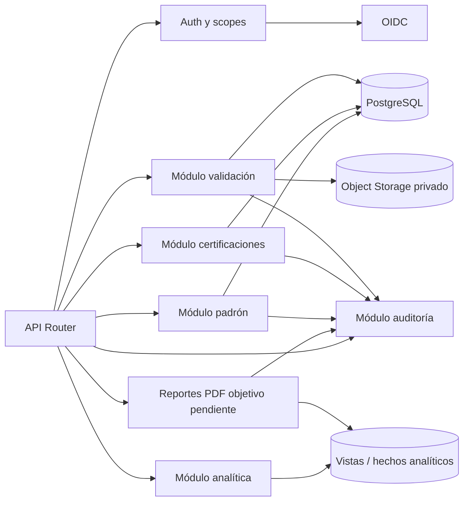

| Componente | Responsabilidad | Entradas | Salidas y errores críticos |
|---|---|---|---|
| Auth y scopes | Validar sesión, rol y scopes; denegar por defecto | Token OIDC | `401 UNAUTHENTICATED`, `403 FORBIDDEN` |
| Módulo padrón | Cargar, conciliar y cerrar el universo por periodo | CSV/lote autorizado | Resultado de lote, `422 VALIDATION_ERROR`, `409 PERIOD_CLOSED` |
| Módulo certificaciones | Registrar credenciales y evidencias | Formulario, URL o archivo | `PENDING`, `409 DUPLICATE_RECORD`, `413 FILE_TOO_LARGE` |
| Módulo validación | Registrar decisiones y transiciones | Evidencia y decisión del validador | Historial, `422 EVIDENCE_UNSUPPORTED` |
| Módulo analítica | Aplicar fórmulas, filtros y fecha de corte | Hechos y dimensiones | KPIs, calidad y `N/D` cuando no hay comparación |
| Reportes objetivo | Construir paquete/PDF autorizado aún pendiente | KPIs, filtros y fuentes | Actualmente solo CSV en navegador |
| Módulo auditoría | Registrar quién, qué, cuándo y sobre qué entidad | Evento de dominio | `AuditLog` inmutable para el alcance definido |

Los servicios implementados pertenecen al mismo backend; reportes PDF y endpoints administrativos completos de auditoría permanecen pendientes. Si el volumen o la frecuencia lo exige, el worker y la analítica podrán separarse sin cambiar los contratos públicos.

#### 3.3.2 Arquitectura del sistema y contenedores objetivo

El siguiente diseño C4 conserva la alternativa objetivo de separar ETL y almacenamiento de objetos. La composición actual se explica después del diagrama.

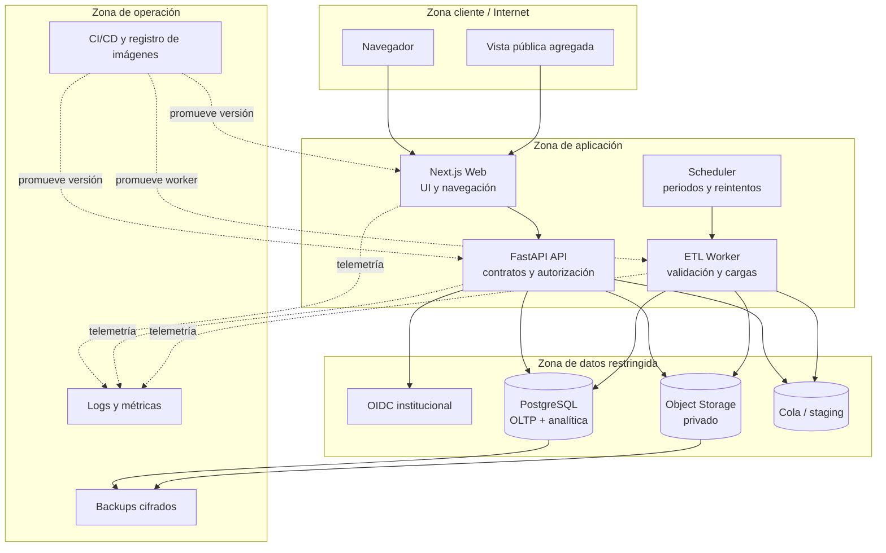

| Contenedor | Responsabilidad | Interfaz principal | Datos que puede manejar |
|---|---|---|---|
| Next.js Web | Renderizar paneles, formularios y vistas públicas | HTTPS hacia API | No confía en el cliente para autorización; evita PII innecesaria |
| FastAPI API | Autenticar sesión, autorizar, validar entradas y exponer casos de uso | REST/JSON y descarga controlada | Nominales solo según scope |
| ETL Worker | Importar, normalizar, deduplicar y cargar por lote | Cola/staging y PostgreSQL | Padrón y evidencias durante ventanas restringidas |
| Scheduler | Lanzar cierres, reintentos y tareas de calidad | Cola / jobs | Metadatos de ejecución, no credenciales |
| PostgreSQL | Persistencia operacional, auditoría y consultas analíticas | SQL privado | Padrón, certificaciones, decisiones y hechos |
| Object Storage | Guardar PDFs y archivos originales | API de objetos con URLs temporales | Evidencias cifradas y privadas |
| OIDC institucional | Autenticar y entregar claims | OIDC/OAuth 2.0 | Identidad mínima, nunca evidencia |
| Logs y métricas | Observabilidad y alertas | Exportador interno | IDs técnicos, sin códigos/correos/documentos |
| CI/CD | Construir, probar y promover artefactos | GitHub Actions/registro | Código y artefactos, nunca datos productivos |

#### 3.3.3 Composición implementada

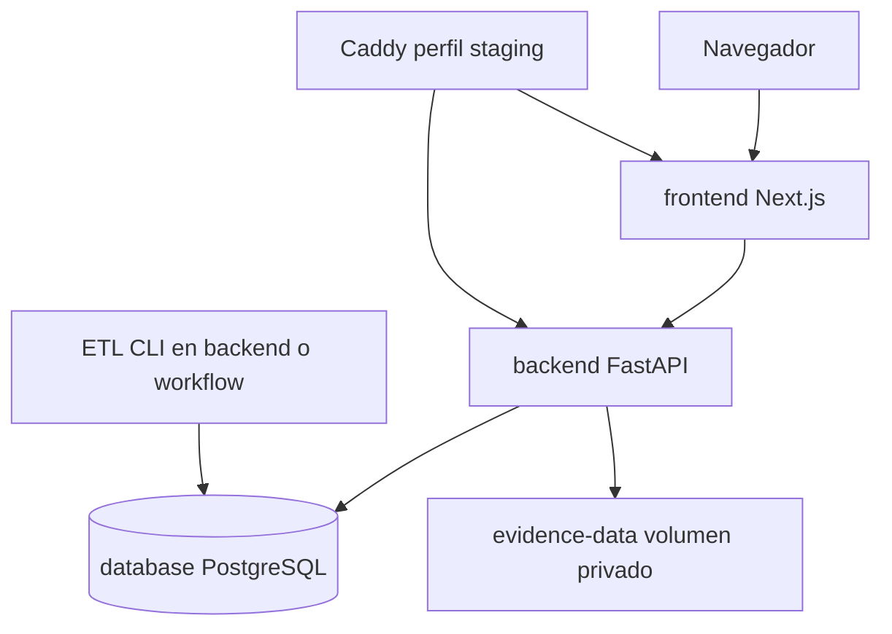

Código: `dashboard-app/src/features` contiene sesión y analítica; `backend/app/api/routes` expone operaciones; auth, roster, certifications, validation, analytics y etl contienen servicios; `backend/app/db` conserva modelos y sesiones. El ETL se ejecuta por CLI/workflow, y el adaptador de evidencia actual usa filesystem privado.

### 3.4 Vista de procesos

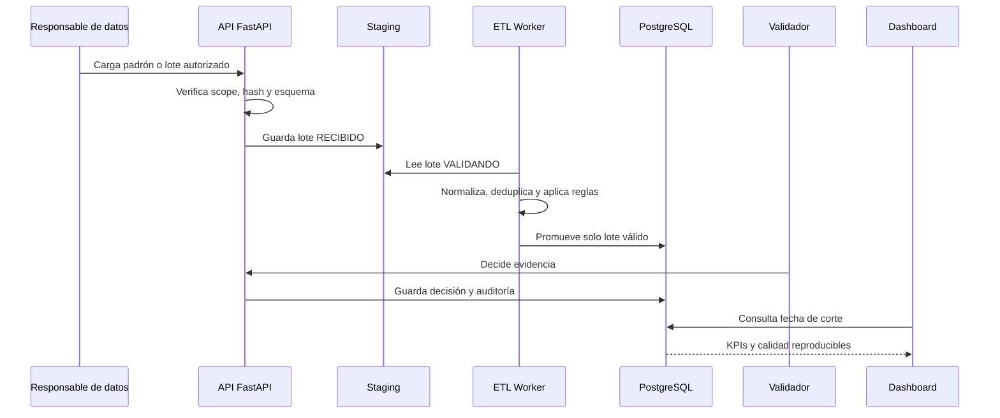

Los archivos externos se reciben únicamente por un canal autorizado. El worker no consulta identidades desde perfiles públicos. Una fuente de insignias puede entregar una URL o credencial verificable, pero no recibe el padrón completo.

En la implementación actual no existe cola distribuida dedicada: el operador o workflow invoca el comando ETL. La publicación es transaccional. El registro de certificación y el adjunto de archivo son dos solicitudes, por lo que el fallo del adjunto no elimina automáticamente la credencial PENDING.

### 3.5 Vista de despliegue

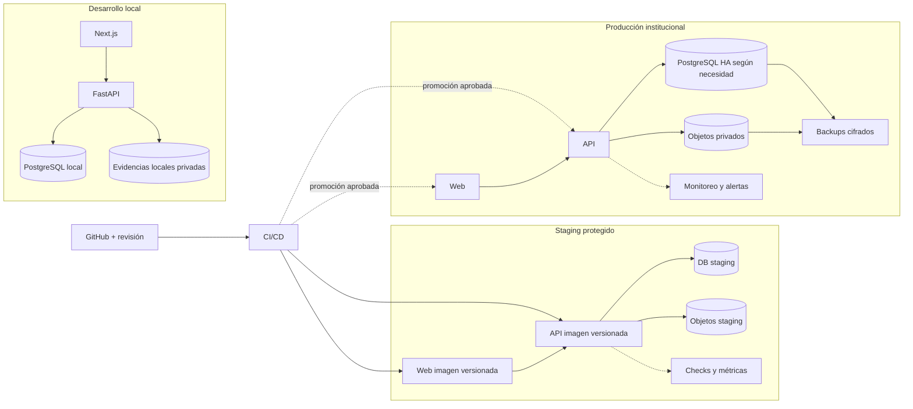

| Ambiente | Propósito | Datos permitidos | Promoción |
|---|---|---|---|
| Desarrollo | Construcción y pruebas rápidas | Sintéticos únicamente | Rama/PR y checks locales |
| Staging | Validar migraciones, contratos, seguridad y rendimiento | Sintéticos o anonimizados | CI exitoso y revisión |
| Producción | Piloto o servicio institucional | Datos autorizados reales | Aprobación, backup verificado y rollback preparado |

La arquitectura objetivo requiere contenedores, un entorno PostgreSQL operativo, almacenamiento privado, CI/CD y monitoreo. El repositorio ya contiene el esquema, la migración inicial de [#10 base de datos](https://github.com/Kiara1616/pulse-epis/issues/10), el flujo privado de [#13 evidencias](https://github.com/Kiara1616/pulse-epis/issues/13), la máquina de validación de [#14](https://github.com/Kiara1616/pulse-epis/issues/14), Compose y workflows de despliegue. La ejecución de staging o producción todavía depende de un host, DNS, secretos y configuración de GitHub Environments fuera del repositorio.

La vista de despliegue anterior describe ambientes objetivo. El archivo `compose.yaml` declara database, backend, frontend y Caddy con perfil staging. PostgreSQL no publica puerto al host; frontend y API publican en loopback. Staging y producción usan el mismo perfil de proxy, con archivos de entorno distintos y secretos de GitHub Environments.

## 4 Atributos de calidad del software

Los escenarios se vinculan con RNF del SRS. Sus valores son objetivos de aceptación; un workflow o una prueba sintética no los convierte en un SLA institucional alcanzado.

| Escenario | Fuente y estímulo | Entorno y artefacto | Respuesta y medida |
|---|---|---|---|
| Funcionalidad | STUDENT registra y VALIDATOR decide | Sesiones válidas y expediente | Estado correcto, historial y evidencia; RF-04/RF-05 |
| Usabilidad | Usuario corrige campo inválido | Formulario y navegación por teclado | Error identificable y flujo completado; RNF-05 |
| Confiabilidad | Falla durante publicación ETL | Transacción de hechos | Rollback y conservación del último snapshot; RNF-10 |
| Rendimiento | Consultas simultáneas de indicadores | Dataset y host dimensionados | p95 menor a 2 s medido; RNF-01 |
| Mantenibilidad | Cambia ruta o contrato de API | PR y pipeline CI | Prueba/validador detecta regresión y documentos regenerados; RNF-06 |
| Escalabilidad | Crecen credenciales y cortes | Base, índices y volumen de evidencia | Medir almacenamiento/latencia y ajustar capacidad antes de agotar recursos |
| Seguridad | Se intenta consultar expediente ajeno | API con sesión STUDENT | Denegar acceso, cero datos ajenos y cero modificación; RNF-03 |
| Portabilidad | Se inicia mismo commit en host limpio | Compose y secretos externos | Servicios healthy y migraciones aplicadas; RNF-09 |
| Recuperación | Se pierde conjunto base/evidencias | Copias y ambiente de ensayo | Restauración coherente con RPO 24 h y RTO 4 h como objetivos; RNF-07 |

### 4.1 Pruebas de arquitectura

| Nivel | Prueba | Criterio de salida | Estado actual |
|---|---|---|---|
| Diagramas | Mermaid en revisión y render de cada vista | Contexto, contenedores, componentes y despliegue sin referencias huérfanas | Generación Mermaid automatizada y validación de artefactos en CI |
| Contratos | OpenAPI/JSON Schema y respuestas de error | Cliente y API validan el mismo contrato | Esquema de AnalyticsOverview contrastado con Pydantic y OpenAPI exportado; API analítica implementada |
| Seguridad | RBAC horizontal/vertical y acceso a objetos | `STUDENT` no ve terceros, `VALIDATOR` no administra y visitante solo ve agregados | Backend base de #11 y permisos de certificación/validación de #13/#14; analítica pública pendiente |
| Datos | Lotes, deduplicación, fórmulas y cortes | Resultados idempotentes y reproducibles | ETL e indicadores implementados; pruebas sintéticas de cortes y fórmulas disponibles |
| Integración | API, PostgreSQL, storage y worker | Flujo completo con errores controlados | Parcial: registro, evidencia y validación de #13/#14; storage productivo y worker pendientes en #19 |
| Rendimiento | p95, lotes y consultas materializadas | Cumple metas de FD03 | Pendiente |
| Recuperación | Backup, restore y rollback | RPO/RTO verificados en staging | Ensayo operativo pendiente |

## 5 Seguridad operación y recuperación

### 5.1 Fronteras de confianza

#### 5.1.1 Fronteras

| Frontera | Activos que cruza | Amenaza principal | Control obligatorio |
|---|---|---|---|
| B1 navegador ↔ aplicación | Sesión, filtros y respuestas | Manipulación del cliente o XSS | HTTPS, cookies seguras, CSP y no confiar en roles del frontend |
| B2 aplicación ↔ OIDC | Tokens y claims | Token robado o claim excesivo | OIDC validado, expiración, audience/issuer y rotación |
| B3 API ↔ datos | Padrón, decisiones y KPIs | Acceso horizontal/vertical | RBAC/scopes en servidor, consultas parametrizadas y auditoría |
| B4 API ↔ evidencias | PDFs y URLs | Descarga no autorizada | Bucket privado, cifrado, hash y URLs firmadas temporales |
| B5 externos ↔ ingestión | CSV, URL y señales laborales | Fuente falsa o payload malicioso | Validación de esquema, límites, antivirus y revisión humana |
| B6 CI/CD ↔ ambientes | Imágenes, migraciones y secretos | Despliegue de código no revisado | Branch protection, revisión, secretos fuera del repo y promoción aprobada |

#### 5.1.2 Autorización

El MVP implementa `ADMIN`, `VALIDATOR` y `STUDENT`. `PADRON_MANAGE` permite administrar el padrón dentro de `ADMIN`; `ANALYTICS_READ` permite leer indicadores sin administrar ni validar. La vista pública para visitantes es un objetivo pendiente. La autorización se verifica en cada endpoint y el frontend usa AuthBoundary/RoleGate con la sesión del servidor.

#### 5.1.3 Privacidad

- El `student_key` no contiene código ni correo.
- Padrón, evidencias y decisiones nominales quedan fuera de las vistas públicas.
- Logs, trazas y métricas no contienen documentos, códigos o correos.
- La retención y eliminación se configuran por finalidad y periodo.
- Los grupos pequeños se suprimen o agregan para reducir reidentificación.
- Las exportaciones incluyen solo los campos permitidos por el scope solicitado.

### 5.2 Respaldo monitoreo y rollback

#### 5.2.1 Objetivos de recuperación

| Activo | Backup | RPO objetivo | RTO objetivo | Prueba de restauración |
|---|---|---:|---:|---|
| PostgreSQL | Diario completo + WAL según infraestructura | 24 h en MVP | 4 h en piloto | Trimestral y antes de migraciones mayores |
| Evidencias | Versionado/copia diaria de objetos | 24 h | 4 h en piloto | Muestra mensual de descarga y hash |
| Configuración/secrets | Secret manager y exportación controlada | 24 h | 4 h | Semestral, sin exponer valores |
| Imágenes y migraciones | Registro inmutable y repositorio Git | 0 h frente a commit | 1 h para volver a imagen previa | Cada release |

Los RPO/RTO son objetivos iniciales; el responsable institucional debe confirmarlos antes de producción. Las copias deben cifrarse, tener acceso restringido, conservar retención definida y estar separadas del ambiente principal.

#### 5.2.2 Monitoreo y alertas

| Señal | Umbral inicial | Acción |
|---|---|---|
| Salud de API | 3 fallos consecutivos o p95 > 2 s | Alertar soporte y retirar instancia no saludable |
| Errores 5xx | > 2% durante 5 min | Abrir incidente, revisar logs y evaluar rollback |
| Lotes ETL | Estado `RECHAZADO` o retraso sobre ventana | No publicar KPI y notificar a responsable de datos |
| Base de datos | Conexiones, espacio o réplica sobre umbral | Escalar capacidad o pausar cargas |
| Storage | Fallo de firma, espacio o hash inconsistente | Bloquear descarga/promoción y revisar evidencia |
| Seguridad | Intentos 401/403 anómalos | Revisar auditoría, revocar sesión o bloquear origen |
| Backups | Falta de ejecución o restore fallido | Incidente crítico; no promover cambios destructivos |

Cada alerta debe incluir servicio, ambiente, timestamp, `request_id`/`batch_id`, severidad, responsable y enlace al runbook. Nunca debe incluir PII.

#### 5.2.3 Estrategia de rollback

1. Detectar el incidente y congelar importaciones o publicaciones afectadas.
2. Identificar la última versión saludable de imagen, migración y contrato.
3. Si el problema es de aplicación, volver a la imagen anterior manteniendo migraciones compatibles.
4. Si el problema es de datos, restaurar a un ambiente aislado, validar integridad y promover solo después de aprobación.
5. Verificar health checks, RBAC, consultas KPI, evidencia y auditoría.
6. Comunicar el alcance, preservar logs y registrar causa raíz.

Las migraciones destructivas no se ejecutan en la misma promoción que el código que las requiere. Se prefiere expand/contract: agregar columnas compatibles, desplegar código, migrar datos y retirar lo antiguo después de una ventana de seguridad.

El workflow actual comprime un pg_dump de la base y conserva 30 días en el host. No incluye el volumen de evidencias ni demuestra cifrado/offsite. Rollback restaura una versión de aplicación y no equivale a restaurar base ni binarios. La guía [Despliegue y recuperación](../proyecto/16-Despliegue-y-recuperacion.md) distingue el procedimiento disponible de los controles pendientes.

## 6 Evolución y estructura documental

La secuencia recomendada mantiene la aplicación demostrativa ejecutable mientras se incorpora el backend:

1. Proteger `main`, activar CI y mantener datos sintéticos en desarrollo.
2. Crear PostgreSQL, migraciones y contratos de datos.
3. Inicializar FastAPI con health check, configuración por entorno y OpenAPI.
4. Consolidar en todos los flujos del frontend la sesión real y los permisos OIDC/RBAC de #11, retirando cualquier selector de rol demostrativo residual.
5. Implementar certificaciones, evidencias, validación y auditoría sobre el padrón de #12 (registro privado en #13 y máquina de estados en #14).
6. Convertir el ETL en worker idempotente con staging y controles de calidad.
7. Llevar KPIs, filtros, brechas y fecha de corte al backend.
8. Conectar Next.js a la API y retirar JSON duplicados de producción.
9. Validar Compose, desplegar staging, probar restauración y ejecutar un rollback controlado.
10. Ejecutar el piloto, conciliar indicadores y decidir la publicación institucional.

La fuente académica se conserva en docs/academico, los manuales de mantenimiento en docs/proyecto y contratos/plantillas en docs/recursos. Un generador produce ambos conjuntos sin omitir diagramas ni depender de archivos PDF versionados. La guía técnica no queda encerrada únicamente en FD04.

## 7 Conclusiones y referencias

El sistema implementa un monolito modular con frontend conectado, base migrable, evidencia privada, validación y ETL. La operación institucional requiere configuración externa, autorización y ensayos documentados. Los escenarios de calidad definen criterios medibles y responsables, sin declarar un SLA ya probado.

- [SRS y casos de uso](FD03-Especificacion-Requerimientos.md).
- [Arquitectura técnica](../proyecto/11-Arquitectura-tecnica.md).
- [Modelo de datos](../proyecto/05-Modelo-de-datos.md).
- [Configuración y seguridad](../proyecto/13-Autenticacion-y-seguridad.md).
- [Despliegue y recuperación](../proyecto/16-Despliegue-y-recuperacion.md).
