

  

  <strong>UNIVERSIDAD PRIVADA DE TACNA</strong> 
  <strong>FACULTAD DE INGENIERÍA</strong> 
  <strong>Escuela Profesional de Ingeniería de Sistemas</strong>

  <strong>Pulse EPIS: plataforma de inteligencia de negocios para la gestión y análisis de certificaciones tecnológicas verificadas de estudiantes de la EPIS</strong>

  Curso: Inteligencia de Negocios 
  Docente: Patrick Cuadros Quiroga

  Integrantes: 
  <strong>Zapana Murillo, Kiara Holly (2023077087)</strong> 
  <strong>Lllanos Niño, Vincenzo Rafael (2023076796)</strong>

  <strong>Tacna – Perú</strong> 
  <strong><em>2026</em></strong>

---

  <strong>Pulse EPIS</strong> 
  Plataforma de inteligencia de negocios para la gestión y análisis de certificaciones tecnológicas verificadas

# Documento de Arquitectura de Software

Código FD04 Versión <em>3.4</em>

**CONTROL DE VERSIONES**

| Versión | Hecha por | Revisada por | Aprobada por | Fecha | Motivo |
|---|---|---|---|---|---|
| 2.x | KHZM / VRLN | — | — | Septiembre 2026 | Elaboración de la arquitectura inicial |
| 3.0 | VRLN | — | — | 01/10/2026 | Elaboración del documento académico |
| 3.1 | KHZM / VRLN | — | — | 02/10/2026 | Organización y revisión de las vistas |
| 3.3 | KHZM / VRLN | — | — | 06/10/2026 | Actualización de presentación y contenido |
| 3.4 | — | — | — | 09/10/2026 | Adecuación de estructura SAD, diagramas y atributos de calidad |

**ÍNDICE GENERAL**

- [1. INTRODUCCIÓN](#1-introducción)
  - [1.1. Propósito](#11-propósito)
  - [1.2. Alcance](#12-alcance)
  - [1.3. Definición, siglas y abreviaturas](#13-definición-siglas-y-abreviaturas)
  - [1.4. Organización del documento](#14-organización-del-documento)
- [2. OBJETIVOS Y RESTRICCIONES ARQUITECTÓNICAS](#2-objetivos-y-restricciones-arquitectónicas)
  - [2.1. Priorización de requerimientos](#21-priorización-de-requerimientos)
    - [2.1.1. Requerimientos Funcionales](#211-requerimientos-funcionales)
    - [2.1.2. Requerimientos No Funcionales – Atributos de Calidad](#212-requerimientos-no-funcionales--atributos-de-calidad)
  - [2.2. Restricciones](#22-restricciones)
- [3. REPRESENTACIÓN DE LA ARQUITECTURA DEL SISTEMA](#3-representación-de-la-arquitectura-del-sistema)
  - [3.1. Vista de Caso de uso](#31-vista-de-caso-de-uso)
    - [3.1.1. Diagramas de Casos de Uso](#311-diagramas-de-casos-de-uso)
  - [3.2. Vista Lógica](#32-vista-lógica)
    - [3.2.1. Diagrama de Subsistemas](#321-diagrama-de-subsistemas)
    - [3.2.2. Diagrama de Secuencia](#322-diagrama-de-secuencia)
    - [3.2.3. Diagrama de Colaboración](#323-diagrama-de-colaboración)
    - [3.2.4. Diagrama de Objetos](#324-diagrama-de-objetos)
    - [3.2.5. Diagrama de Clases](#325-diagrama-de-clases)
    - [3.2.6. Diagrama de Base de datos](#326-diagrama-de-base-de-datos)
  - [3.3. Vista de Implementación](#33-vista-de-implementación)
    - [3.3.1. Diagrama de arquitectura software (paquetes)](#331-diagrama-de-arquitectura-software-paquetes)
    - [3.3.2. Diagrama de arquitectura del sistema](#332-diagrama-de-arquitectura-del-sistema)
  - [3.4. Vista de procesos](#34-vista-de-procesos)
    - [3.4.1. Diagrama de Procesos del sistema](#341-diagrama-de-procesos-del-sistema)
  - [3.5. Vista de Despliegue](#35-vista-de-despliegue)
    - [3.5.1. Diagrama de despliegue](#351-diagrama-de-despliegue)
- [4. ATRIBUTOS DE CALIDAD DEL SOFTWARE](#4-atributos-de-calidad-del-software)
  - [4.1. Escenario de Funcionalidad](#41-escenario-de-funcionalidad)
  - [4.2. Escenario de Usabilidad](#42-escenario-de-usabilidad)
  - [4.3. Escenario de confiabilidad](#43-escenario-de-confiabilidad)
  - [4.4. Escenario de rendimiento](#44-escenario-de-rendimiento)
  - [4.5. Escenario de mantenibilidad](#45-escenario-de-mantenibilidad)
  - [4.6. Otros Escenarios](#46-otros-escenarios)
    - [4.6.1. Escalabilidad](#461-escalabilidad)
    - [4.6.2. Seguridad (OWASP Top 10)](#462-seguridad-owasp-top-10)
    - [4.6.3. Portabilidad](#463-portabilidad)

## 1. INTRODUCCIÓN

Pulse EPIS integra la gestión de certificaciones tecnológicas verificadas con su análisis institucional. La información académica autorizada determina la población; las credenciales y sus evidencias aportan registros; la revisión humana establece su admisión y el ETL produce hechos para indicadores. Esta arquitectura permite que la Escuela Profesional de Ingeniería de Sistemas de la Universidad Privada de Tacna consulte cobertura, vigencia y distribución de habilidades con una fuente explicable.

La separación entre expediente operativo y resultado analítico protege la información individual y evita calcular cobertura exclusivamente a partir de estudiantes que declaran certificados. Las decisiones arquitectónicas se orientan a integridad, permisos, continuidad y reproducibilidad. Los diagramas siguientes representan los componentes presentes en el repositorio; las ampliaciones se identifican expresamente para no confundir diseño futuro con capacidad disponible.

### 1.1. Propósito

El documento describe la estructura y las responsabilidades del software, la interacción entre servicios, el despliegue y la organización de los datos de Pulse EPIS. Sirve de guía para desarrollo, revisión técnica, pruebas y transferencia a responsables institucionales. Relaciona los requisitos del SRS con mecanismos arquitectónicos y escenarios de aceptación.

Además de explicar el funcionamiento normal, identifica límites que afectan al producto: evidencia almacenada fuera de la base, publicación que puede reemplazar un corte, falta de aislamiento multiescuela y funciones pendientes de interfaz. Estos límites permiten planificar evolución y operación sin atribuir al prototipo garantías que aún deben comprobarse.

### 1.2. Alcance

La arquitectura abarca portal Next.js, API FastAPI, autenticación, padrón, certificaciones, evidencia privada, validación, ETL, analítica, persistencia PostgreSQL y procedimientos de despliegue y respaldo. La primera unidad atendida es EPIS. El producto complementa matrícula y procesos de calidad; no emite certificados ni sustituye la evaluación académica.

| **Área** | **Alcance arquitectónico** |
|---|---|
| Presentación | Formularios, restricciones visuales, filtros y gráficos |
| Aplicación | Permisos efectivos, validación de solicitudes y reglas de dominio |
| Operación | Padrón, credenciales, evidencia y decisiones de revisión |
| Analítica | Publicación ETL por periodo y corte, indicadores y CSV |
| Datos | Tablas operativas, hechos, historial y metadatos de cargas |
| Infraestructura | Contenedores, configuración externa, persistencia y recuperación |

Demanda laboral externa, PDF operativo, vista pública, perfil analítico independiente, notificaciones y operación multiescuela requieren implementación adicional. No existen en Compose un worker distribuido, cola de mensajes ni servicio S3. Su eventual incorporación exige una necesidad medida y contratos definidos.

### 1.3. Definición, siglas y abreviaturas

| **Término / sigla** | **Definición** |
|---|---|
| SAD | Documento de Arquitectura de Software |
| SRS | Especificación de Requerimientos del Software |
| BI | Inteligencia de negocios para apoyar decisiones con datos |
| API REST | Contrato de comunicación HTTP entre portal y servicios |
| ETL | Extracción, transformación y carga hacia hechos analíticos |
| Snapshot | Hechos publicados para un periodo y fecha de corte |
| OIDC | OpenID Connect utilizado para autenticación con Google |
| RBAC | Autorización por roles y permisos |
| HMAC | Código autenticado mediante clave secreta; genera la identidad seudónima del padrón |
| ORM | Mapeo entre objetos de aplicación y tablas relacionales |
| Idempotencia | Repetición de una operación con la misma entrada sin duplicar su efecto |
| RPO / RTO | Objetivos de pérdida máxima de datos y tiempo de recuperación |
| OLTP | Datos transaccionales que soportan el registro y la revisión |
| Hecho analítico | Registro preparado para cálculo de indicadores |
| p95 | Tiempo que no supera el 95% de solicitudes de la muestra |

### 1.4. Organización del documento

El documento se organiza en cuatro apartados. La introducción define propósito, alcance y vocabulario. El segundo apartado prioriza los requisitos y establece las restricciones que orientan el diseño. El tercero desarrolla las vistas de casos de uso, lógica, implementación, procesos y despliegue. El cuarto presenta escenarios de calidad con respuestas y criterios verificables.

Las vistas se complementan: los casos de uso explican las necesidades de los actores; los subsistemas y clases muestran responsabilidades; los procesos describen la ejecución; y el despliegue identifica recursos y fronteras de acceso. La trazabilidad relaciona padrón, estudiante, credencial, evidencia, decisión y corte analítico. Las limitaciones de conservación histórica y crecimiento se explican en las vistas correspondientes.

Los documentos del proyecto utilizados para mantener consistencia son los siguientes:

| **Documento / recurso** | **Uso** |
|---|---|
| [FD01 — Factibilidad](FD01-Informe-Factibilidad.md) | Recursos y condiciones de operación |
| [FD02 — Visión](FD02-Informe-Vision.md) | Alcance, actores y prioridades |
| [FD03 — Requerimientos](FD03-Especificacion-Requerimientos.md) | RF, RNF y casos de uso |
| [Modelo de datos](../proyecto/05-Modelo-de-datos.md) | Entidades y organización relacional |
| [Diccionario de indicadores](../proyecto/09-Diccionario-indicadores.md) | Fórmulas y significado de los resultados |
| [API y contratos](../proyecto/15-API-y-contratos.md) | Interfaces entre componentes |
| Código de `backend/app`, `compose.yaml` y `deploy/operations.sh` | Comportamiento implementado y operación |

Los detalles físicos se contrastan con modelos y migraciones. Cuando un manual conserva una descripción anterior, se utiliza el código correspondiente para describir el comportamiento de esta versión del SAD.

## 2. OBJETIVOS Y RESTRICCIONES ARQUITECTÓNICAS

La arquitectura busca producir información de gestión sobre certificaciones tecnológicas verificadas de una población académica definida. La captura y revisión de credenciales alimentan ese propósito: la cobertura, las habilidades acreditadas, la vigencia y la evolución se interpretan con un periodo, una población y un corte identificables.

Se priorizan identidad, autorización, calidad de datos y publicación consistente antes de ampliar consultas o integración externa. Una interfaz operativa no basta para aceptar datos reales si no están resueltas las responsabilidades de validación y recuperación.

### 2.1. Priorización de requerimientos

La prioridad expresa el impacto de un requisito sobre la operación y la confiabilidad del análisis. Crítica corresponde a una condición indispensable de integridad, identidad o protección. Alta corresponde a una condición necesaria para operar o interpretar los indicadores; media corresponde a una ampliación relevante que no debe introducirse antes de asegurar el flujo principal. La prioridad no equivale a un estado de implementación. Los identificadores se conservan respecto del FD03.

#### 2.1.1. Requerimientos Funcionales

| **ID** | **Requerimiento** | **Prioridad** | **Respuesta arquitectónica / estado** |
|---|---|---|---|
| RF-01 | Autenticar y autorizar | test_auth y dependencias RBAC | OIDC, sesión y dependencias RBAC implementadas |
| RF-02 | Importar padrón | test_roster y pantalla padrón | Parser, servicio y lote transaccional; periodo inicial requiere preparación |
| RF-03 | Identidad analítica | HMAC y test_roster | HMAC estable y separación de identificadores |
| RF-04 | Credencial y evidencia propia | test_certifications y formulario | Servicio y almacenamiento privado; captura de habilidades en UI pendiente |
| RF-05 | Revisar y decidir | test_validation y bandeja | Bloqueo de fila, estados, decisión e historial |
| RF-06 | Duplicados | Pruebas de unicidad/idempotencia | Restricciones de unicidad y controles de carga y ETL |
| RF-07 | Normalización | test_etl y catálogos | Catálogos y reglas del ETL |
| RF-08 | KPI por corte | test_analytics y useAnalytics | Hechos publicados y servicio analítico |
| RF-09 | Filtros | test_analytics y filtros | Periodo, corte, cohorte, ciclo, emisor y nivel; área pendiente |
| RF-10 | Evolución | Evolución por cortes y pruebas | Cortes del mismo periodo; comparación entre periodos pendiente |
| RF-11 | Restringir datos | Pruebas de agregado y acceso | Permisos, titularidad y respuestas agregadas; vista pública pendiente |
| RF-12 | CSV y PDF | ExportButton CSV | CSV disponible; PDF operativo y metadatos completos pendientes |
| RF-13 | Auditoría | Auditoría e historial en pruebas | Eventos en operaciones cubiertas; UI general pendiente |
| RF-14 | Vigencia | Estados derivados y ventana 90 días | Estado efectivo al corte y ventana de 90 días; sin notificación automática |
| RF-15 | Demanda laboral | Sin integración laboral externa | Fuente y método aún pendientes; brecha interna no satisface este RF |
| RF-16 | ETL y calidad | test_etl y CLI | CLI y workflow; gestión web de corridas pendiente |
| RF-17 | Corregir observación | PATCH propio y test_validation | API propia y reenvío; interfaz pendiente |
| RF-18 | Paquete de acreditación | Sin paquete institucional | Pendiente; PDFs académicos no lo sustituyen |

#### 2.1.2. Requerimientos No Funcionales – Atributos de Calidad

| **ID** | **Atributo** | **Prioridad** | **Mecanismo / criterio** |
|---|---|---|---|
| RNF-01 | Rendimiento | Alta | p95 menor a 2 s, volumen y concurrencia definidos |
| RNF-02 | Disponibilidad | Media | 99,5% de ventana acordada y monitoreo verificable |
| RNF-03 | Seguridad | Alta | Denegación sin sesión, permiso o titularidad |
| RNF-04 | Privacidad | Alta | Agregados sin identificadores; evidencia con acceso temporal |
| RNF-05 | Usabilidad y accesibilidad | Media | Flujos claros y objetivo WCAG 2.1 AA, por evaluar |
| RNF-06 | Mantenibilidad | Media | Módulos, migraciones, contratos y controles de CI |
| RNF-07 | Recuperación | Alta | Base y evidencia; RPO 24 h, RTO 4 h y ensayo documentado |
| RNF-08 | Observabilidad | Media | Correlación de solicitudes y alertas sin datos nominales |
| RNF-09 | Portabilidad | Media | Contenedores, variables externas y despliegue reproducible |
| RNF-10 | Calidad de datos | Alta | Completitud ≥95%, duplicados <1% y publicación atómica |

Estas métricas son criterios del piloto, no resultados medidos de producción. La calidad del ETL debe interpretarse según sus conteos y reglas; el reporte técnico no sustituye la conciliación institucional de población y evidencia.

### 2.2. Restricciones

Las restricciones delimitan las decisiones posibles y deben revisarse cuando cambien el alcance, la infraestructura o la población. El sistema necesita conexión al servicio; no existe operación sin conexión ni sincronización diferida de expedientes.

| ID | Restricción | Consecuencia arquitectónica |
|---|---|---|
| RES-01 | Población institucional autorizada por periodo | El padrón define el denominador; los registros sintéticos no miden cobertura real. |
| RES-02 | Acceso por cuentas habilitadas y permisos | El dominio de correo por sí solo no concede acceso ni atribuciones. |
| RES-03 | Revisión humana de evidencia | No se presume autenticidad por adjuntar un archivo ni se consulta automáticamente a todos los emisores. |
| RES-04 | Protección de datos personales | Los expedientes son restringidos y las consultas de gestión deben minimizar datos identificables. |
| RES-05 | Tecnologías del repositorio | Portal Next.js/React/TypeScript; API Python/FastAPI; persistencia PostgreSQL con SQLAlchemy y Alembic. |
| RES-06 | Almacenamiento privado de evidencias | El disco y la base requieren respaldo y recuperación coordinados. |
| RES-07 | Recursos iniciales limitados | No se asume alta disponibilidad, autoscaling, cola ni un almacén analítico independiente. |
| RES-08 | Implementación progresiva | PDF operativo, paquete de acreditación, demanda laboral e interfaz de ciertos flujos requieren desarrollo adicional. |
| RES-09 | Historia analítica parcialmente mutable | Un corte reemplazable y dimensiones operacionales mutables no garantizan reproducir todas las publicaciones anteriores. |
| RES-10 | Despliegue condicionado al ambiente | Los archivos de configuración no demuestran la existencia de un servicio institucional activo. |

El alcance excluye emitir certificaciones de terceros, sustituir el sistema académico y publicar expedientes nominales sin autorización. La ampliación a otras escuelas requiere definir ámbitos de datos, administración y responsabilidades; no se logra únicamente agregando usuarios.

## 3. REPRESENTACIÓN DE LA ARQUITECTURA DEL SISTEMA

La representación combina vistas de uso, lógica, procesos, desarrollo y despliegue. Cada vista responde a una pregunta distinta: quién utiliza el sistema, qué responsabilidades contiene, cómo se ejecutan operaciones, cómo se organiza el código y dónde se alojan los recursos. Esta organización permite evaluar seguridad y datos a través del flujo completo.

### 3.1. Vista de Caso de uso

Los casos de uso conservan la identificación del FD03 y representan operaciones del producto. La ejecución de ETL corresponde a un operador autorizado de infraestructura, no a un nuevo rol seleccionable desde el portal. La Dirección consume reportes; no necesita administrar expedientes para acceder a información de gestión.

#### 3.1.1. Diagramas de Casos de Uso

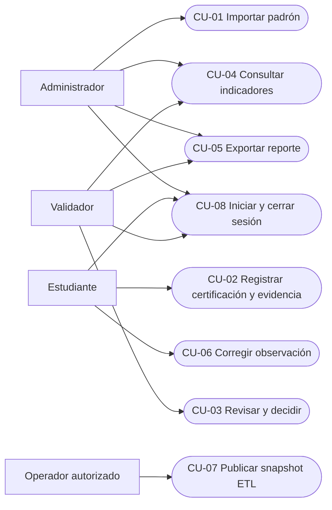

| **Caso de uso** | **Precondición** | **Resultado y límite** |
|---|---|---|
| CU-01 | Cuenta ADMIN, permiso y periodo preparado | Lote aplicado o rechazado con causas; repetición exacta sin duplicación |
| CU-02 | STUDENT vinculado al padrón | Credencial pendiente; adjunto se realiza por solicitud separada |
| CU-03 | VALIDATOR y credencial revisable | Decisión e historial; no permite aprobar directamente desde PENDING |
| CU-04 | Permiso ANALYTICS_READ y corte publicado | Agregados con filtros; no devuelve expedientes individuales |
| CU-05 | Vista analítica habilitada | CSV de datos disponibles; PDF y paquete completo pendientes |
| CU-06 | Expediente propio observado | API corrige y reenvía; interfaz pendiente |
| CU-07 | Base migrada, periodo y operador autorizado | Corrida y publicación válida o rechazo; no botón web general |
| CU-08 | Cuenta provisionada y proveedor configurado | Sesión, consulta de identidad y cierre |

Un rol restringe acciones y alcance de datos. `STUDENT` no dispone actualmente de lectura analítica y `ADMIN` no posee validación por defecto. La provisión de cuentas debe respetar esa separación, evitando conceder permisos de más para compensar una función de interfaz ausente.

### 3.2. Vista Lógica

| **Capa** | **Componentes** | **Responsabilidad** |
|---|---|---|
| Presentación | Next.js, React, TypeScript, Tailwind y Recharts | Formularios, estado de interfaz y visualización |
| Interfaces | Rutas FastAPI y esquemas Pydantic | Contratos HTTP, validación y errores |
| Servicios | Auth, roster, certifications, validation, evidence, ETL y analytics | Reglas, coordinación y autorización |
| Persistencia | SQLAlchemy, PostgreSQL y Alembic | Transacciones, integridad y evolución del esquema |
| Operación | Compose, scripts y workflows | Construcción, despliegue y continuidad |

La aplicación utiliza servicios por dominio, sin imponer un repositorio independiente a todas las operaciones. Los servicios trabajan con sesiones de base y aplican reglas antes de persistir. La analítica consume hechos publicados, aunque algunas consultas todavía relacionan esos hechos con tablas operacionales; la independencia del histórico es parcial.

#### 3.2.1. Diagrama de Subsistemas

Los subsistemas agrupan responsabilidades del backend modular. Comparten el esquema PostgreSQL, pero mantienen reglas y contratos diferenciados. La seguridad es transversal: no constituye una autorización concedida por el navegador.

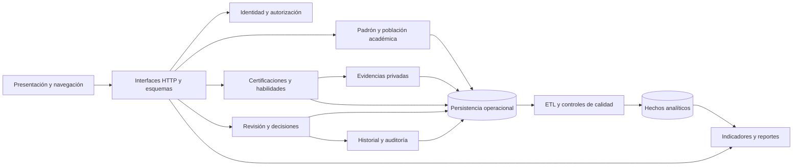

La separación permite revisar cambios de catálogos o validación sin mezclar su responsabilidad con la presentación de indicadores. La analítica utiliza hechos publicados y algunas relaciones con dimensiones operacionales; por ello, la separación lógica no implica independencia histórica completa.

#### 3.2.2. Diagrama de Secuencia

Las solicitudes del portal se ejecutan como operaciones HTTP de la API. La autorización precede al acceso al expediente. Las decisiones de validación utilizan una transacción y bloqueo de la credencial para impedir transiciones incompatibles. Registro y adjunto son solicitudes separadas: una falla del archivo puede dejar una credencial pendiente sin binario y debe comunicarse al usuario.

El ETL extrae información, normaliza y comprueba calidad antes de publicar. Si la fuente ya fue procesada para el mismo periodo y corte, devuelve la corrida existente. Si hay rechazos, registra el resultado sin reemplazar hechos; si es válida, publica dentro de una transacción. El estado rechazado se conserva para diagnóstico en lugar de ocultar errores mediante un indicador parcial.

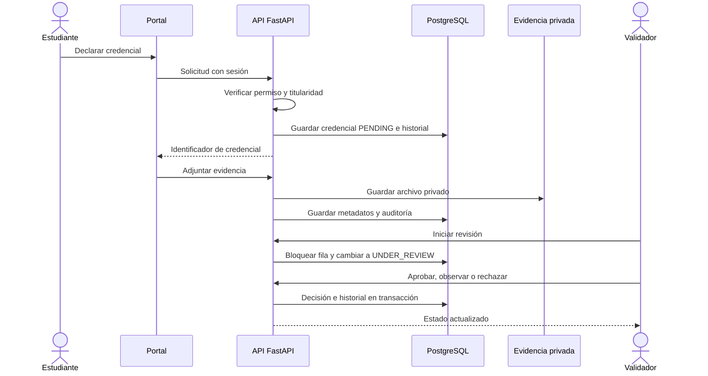

#### 3.2.3. Diagrama de Colaboración

El diagrama de colaboración representa los objetos participantes de una decisión de validación y numera sus mensajes. Complementa la secuencia anterior al mostrar quién coordina la operación y qué dependencias participan. Los nodos representan participantes de ejecución, no servidores independientes.

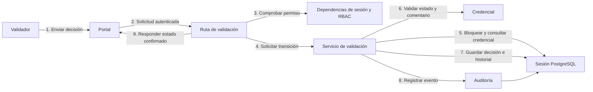

El servicio concentra las reglas de transición. La persistencia de decisión e historial se completa dentro de la transacción; si falla, el sistema no debe mostrar una aprobación como confirmada. El bloqueo de fila impide que dos revisiones concurrentes produzcan transiciones incompatibles sobre la misma credencial.

#### 3.2.4. Diagrama de Objetos

La siguiente instantánea ilustra un expediente y sus relaciones después de una aprobación. Los identificadores son simbólicos y no pertenecen a personas reales. Se emplean objetos concretos para distinguir la instancia del estudiante, su matrícula y la credencial de las clases que los representan.

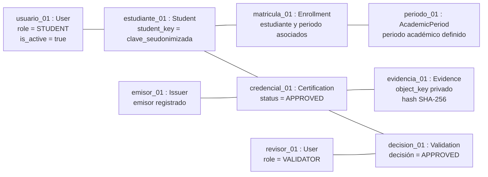

Una aprobación identifica una decisión realizada por un usuario autorizado y una evidencia asociada. No representa emisión de un certificado por Pulse EPIS. La matrícula define la pertenencia a una población académica, mientras que el ETL determina cómo la credencial se incorpora a un corte analítico.

#### 3.2.5. Diagrama de Clases

El modelo de clases resume las entidades del dominio y sus asociaciones principales. Se omiten atributos secundarios para facilitar la lectura; el esquema físico y las restricciones se presentan en el siguiente apartado. Las operaciones de autorización y transición se implementan en servicios, por lo que no se inventan métodos dentro de los modelos de persistencia.

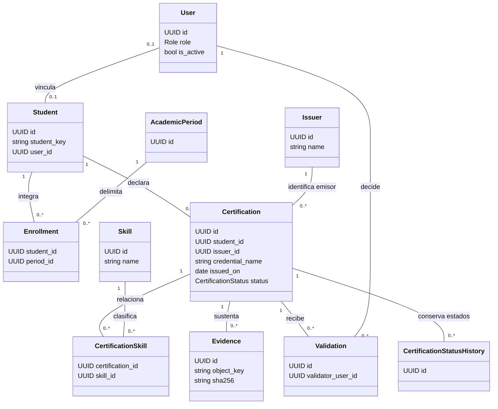

La relación entre usuario y estudiante es opcional y única: una cuenta puede ser administrativa y un estudiante puede existir en el padrón antes de habilitar su acceso. Una credencial admite varias habilidades; esa multiplicidad no debe duplicar el conteo de certificaciones o estudiantes en los indicadores.

#### 3.2.6. Diagrama de Base de datos

PostgreSQL conserva dieciocho tablas que relacionan identidad, matrícula, credenciales, revisión, cargas, auditoría y hechos. La evidencia binaria reside fuera de la base; `evidences` conserva su ubicación, tamaño, tipo y hash. Una recuperación correcta debe restablecer tanto metadatos como archivos.

El esquema operacional y el analítico comparten instancia. Se separan por responsabilidad y granularidad, no por un data warehouse externo. Las respuestas analíticas son agregadas y omiten códigos, correos y `student_key` aunque la vinculación interna utilice esta clave.

Para mantener legibilidad, la misma vista se divide en identidad, expediente y publicación. Los nombres corresponden a tablas implementadas; las relaciones de actor admiten ausencia del usuario cuando la FK utiliza `SET NULL`.

**Identidad y población**

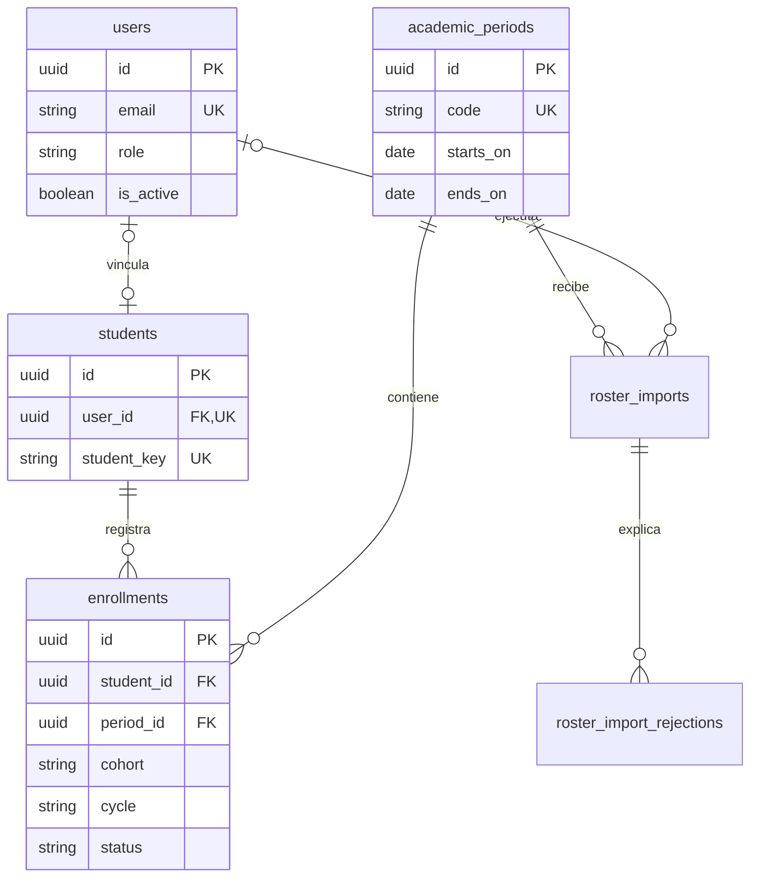

**Credenciales y revisión**

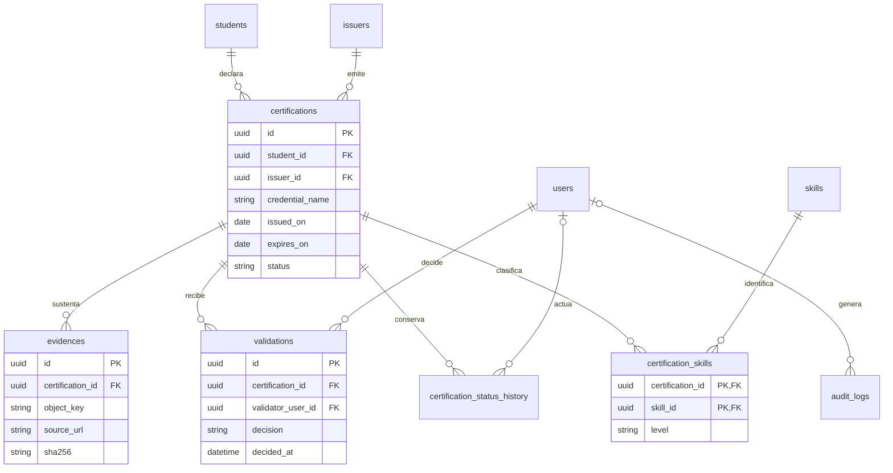

**Publicación y hechos analíticos**

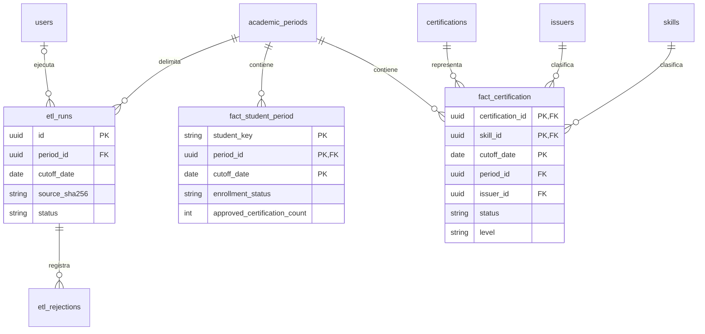

`fact_student_period.student_key` permite vincular lógicamente con el estudiante, pero no declara una FK hacia `students`. Los hechos tampoco tienen FK hacia `etl_runs`; la asociación actual se realiza por periodo y corte. No debe dibujarse un vínculo físico inexistente para aparentar linaje completo.

| **Grupo** | **Tablas** | **Función** |
|---|---|---|
| Identidad | `users`, `students` | Cuenta, rol y clave seudónima |
| Población | `academic_periods`, `enrollments` | Matrícula y población por periodo |
| Carga | `roster_imports`, `roster_import_rejections` | Fuente y causas del lote |
| Credencial | `issuers`, `skills`, `certifications`, `certification_skills` | Emisor, habilidad y logro |
| Evidencia y decisión | `evidences`, `validations`, `certification_status_history` | Sustento y transiciones |
| Auditoría | `audit_logs` | Actor, acción, entidad y cambios |
| ETL | `etl_runs`, `etl_rejections` | Calidad e identificación de corrida |
| Hechos | `fact_student_period`, `fact_certification` | Población y certificaciones al corte |

La matrícula impide repetir estudiante y periodo. La credencial restringe repetición por estudiante, emisor, nombre y emisión, y por identificador externo del emisor. Las fechas impiden vencimiento anterior a emisión. La tabla de evidencia exige URL u objeto y limita repetición de hash dentro de la credencial. Estas restricciones complementan las reglas del servicio, sin demostrar por sí solas autenticidad.

`fact_student_period` utiliza como PK clave de estudiante, periodo y corte. `fact_certification` utiliza credencial, habilidad y corte; `period_id` es FK pero no integra esa PK. Esa diferencia debe revisarse si la evolución exige representar la misma credencial y habilidad en varios periodos con la misma fecha de corte. El esquema actual no incorpora esa multiplicidad como una garantía.

Una credencial con varias habilidades aparece en varios hechos, pero se cuenta una sola vez en el KPI de certificaciones mediante identificadores distintos. La cobertura también cuenta estudiantes distintos. Los filtros de cohorte y ciclo afectan población; emisor y nivel restringen credenciales sin cambiar el denominador activo elegido.

La fecha de corte no vuelve inmutable toda la información. Los hechos del mismo corte pueden reemplazarse y algunas dimensiones siguen en tablas mutables. Para reportes históricos plenamente reproducibles se requiere definir versión de publicación, contexto metodológico y conservación de atributos necesarios. El linaje disponible cubre decisiones y corridas, con esas limitaciones explícitas.

### 3.3. Vista de Implementación

La implementación mantiene portal y backend en el mismo repositorio, con dependencias y construcción propias. El backend organiza módulos por dominio y expone contratos HTTP; el frontend consume esos contratos y controla el estado de presentación. La infraestructura y las migraciones completan la entrega. Esta división permite evolucionar módulos sin exigir convertirlos en servicios distribuidos.

#### 3.3.1. Diagrama de arquitectura software (paquetes)

| **Ubicación** | **Contenido** |
|---|---|
| `dashboard-app/src/app` | Páginas y composición del portal |
| `dashboard-app/src/features/access` | Sesión y restricciones visuales |
| `dashboard-app/src/features/analytics` | Consulta y filtros analíticos |
| `backend/app/api/routes` | Endpoints por dominio |
| `backend/app/auth`, `roster`, `certifications`, `validation` | Servicios operativos |
| `backend/app/evidence`, `etl`, `analytics` | Archivos, transformación y consulta |
| `backend/app/db`, `backend/migrations` | Modelos y migraciones |
| `backend/tests` y pruebas frontend | Verificación de contratos y flujos |
| `deploy` y `.github/workflows` | Infraestructura y automatización |

Los contratos y las pruebas permiten modificar módulos con control del impacto. El cambio de una fórmula debe actualizar diccionario, API, pruebas y documentación. Las migraciones acompañan modificaciones de esquema y deben evaluarse por compatibilidad antes del despliegue.

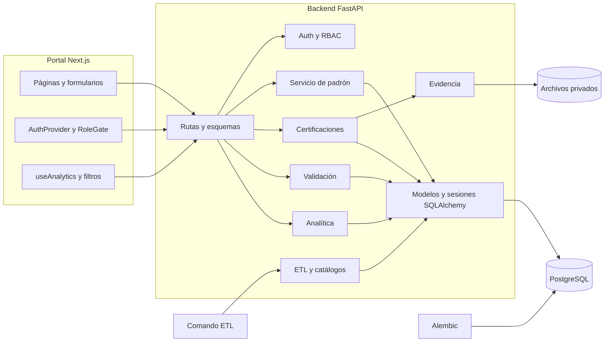

| **Componente** | **Contrato / responsabilidad** | **Verificación disponible** |
|---|---|---|
| Auth y RBAC | Identidad, sesión, permisos y usuario activo | `test_auth.py` |
| Padrón | CSV, lote y vinculación HMAC | `test_roster.py` |
| Certificaciones y evidencia | Registro propio, fechas y acceso a archivos | `test_certifications.py` |
| Validación | Estados, bloqueo y decisiones | `test_validation.py` |
| ETL | Fuente, calidad, idempotencia y transacción | `test_etl.py` |
| Analítica | Población, filtros, vigencia y agregados | `test_analytics.py` |
| Migraciones | Esquema consistente y evolución | `test_database_migrations.py` |
| Despliegue | Compose y configuración Render | Pruebas de configuración y scripts de operación |

Las suites representan cobertura automatizada del comportamiento definido, no una certificación de seguridad ni medición operativa de producción. Al modificar reglas deben actualizarse pruebas de frontera: duplicidad, denominador cero, vencimiento, titularidad y conservación de un corte válido ante errores.

#### 3.3.2. Diagrama de arquitectura del sistema

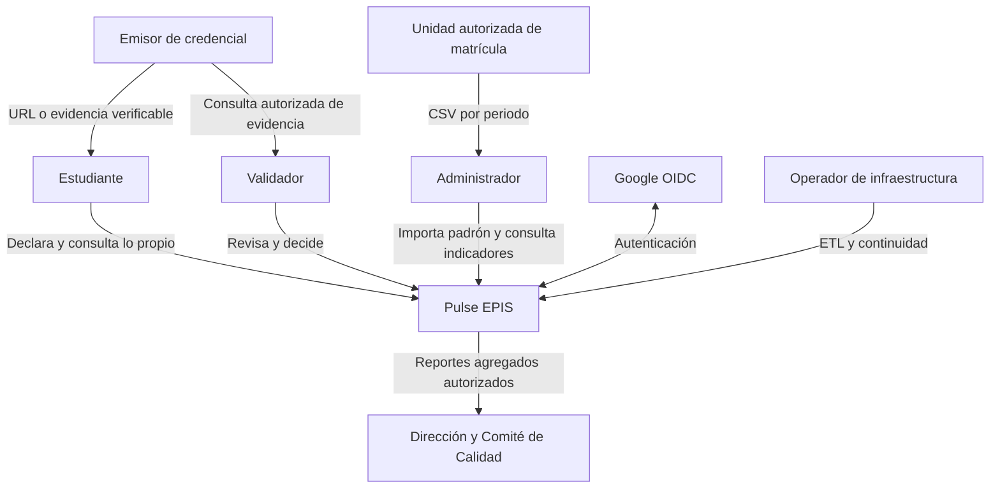

El diagrama no presupone integración automática con sistemas de matrícula o emisores. La entrada inicial del padrón es CSV; el validador contrasta evidencia por los medios autorizados. OIDC proporciona identidad y no recibe el padrón ni documentos de certificación como parte de su finalidad de autenticación.

| **Frontera** | **Control** | **Información intercambiada** |
|---|---|---|
| Navegador → API | Sesión, permiso y validación | Solicitudes y datos admitidos por contrato |
| API → PostgreSQL | Credenciales externas y consultas parametrizadas | Registros operativos y hechos |
| API → evidencia | Clave privada y acceso temporal | Binarios y metadatos vinculados |
| Fuentes → padrón | Autorización y conciliación | Población por periodo |
| Analítica → reporte | Lectura autorizada y agregación | Indicadores, filtros y corte |

Las vistas nominales y analíticas tienen finalidades distintas. El identificador HMAC permite relacionar hechos sin exponer el código original; no elimina la sensibilidad de las tablas que permiten vincular al titular.

### 3.4. Vista de procesos

La vista de procesos describe el recorrido del dato desde el padrón y la declaración del estudiante hasta el indicador publicado. Las operaciones interactivas se ejecutan mediante API; el ETL se ejecuta por lotes. Separar ambos recorridos evita que una credencial recién declarada sea interpretada como un resultado validado antes de pasar por revisión y publicación.

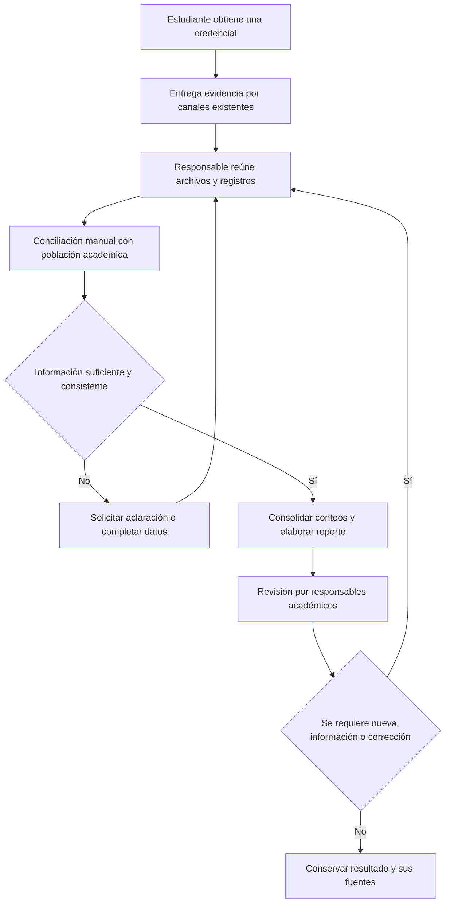

La dificultad reside en conservar vínculos uniformes entre población, evidencia y estado, además de reconstruir cambios de una consolidación. Deben identificarse los canales realmente usados y medir esfuerzo antes de atribuir ahorro al sistema. La falta de una cifra registrada no permite inferir un valor de cobertura institucional.

#### 3.4.1. Diagrama de Procesos del sistema

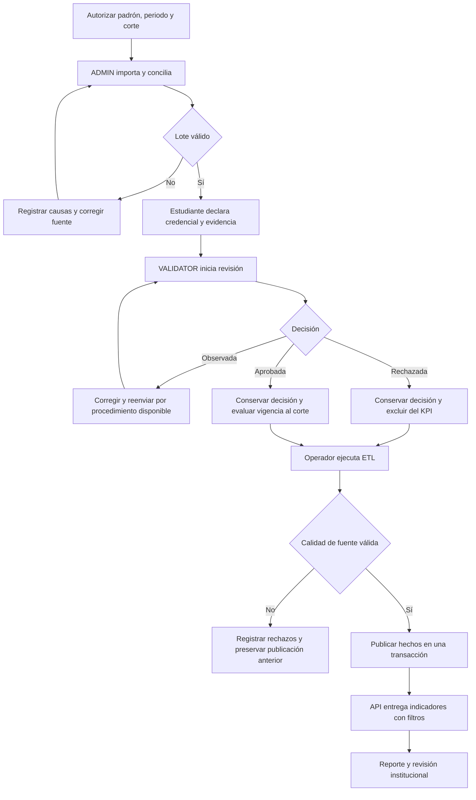

El diagrama admite una diferencia entre aprobación y vigencia: una credencial aprobada que venció al corte se conserva históricamente y no incrementa cobertura vigente. La observación puede corregirse por API, aunque la interfaz de reenvío aún requiere cierre. El operador publica ETL según procedimiento y los responsables deben confirmar el significado institucional del reporte.

La publicación es atómica para hechos del corte, no para todo el expediente distribuido entre base y archivos. El backup captura ambos recursos, pero no impide por sí mismo escrituras intercaladas; para un cierre recuperable se necesita una ventana consistente o mecanismo equivalente y comprobar vínculos después de restaurar.

### 3.5. Vista de Despliegue

En Compose se ejecutan frontend, backend y PostgreSQL, con volúmenes distintos para base y evidencia. PostgreSQL permanece en una red interna sin puerto publicado al host. Frontend y API se enlazan a loopback; el perfil de publicación incorpora Caddy como entrada HTTPS. Los secretos son configuración externa y no forman parte de imágenes o documentos.

Render constituye otra topología: portal y API se empaquetan en un servicio y PostgreSQL se aloja como recurso administrado. La demo usa evidencia temporal; la alternativa persistente incorpora disco. Ambas necesitan configuración y verificación externas, y no se presumen desplegadas por existir un archivo YAML.

#### 3.5.1. Diagrama de despliegue

El siguiente diagrama representa la topología Compose de publicación con el perfil correspondiente. El ETL se muestra como ejecución del código de backend mediante CLI o workflow, no como un contenedor de worker ya disponible.

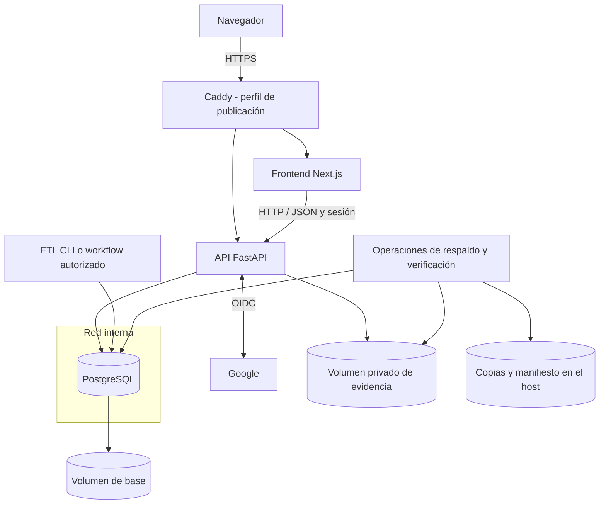

| **Contenedor / recurso** | **Responsabilidad** | **Persistencia / límite** |
|---|---|---|
| Frontend | Portal, formularios y gráficos | Consume API; no conserva archivos privados públicos |
| Backend | Permisos y servicios de dominio | Usa PostgreSQL y volumen de evidencia |
| PostgreSQL | Operación, auditoría y hechos | Volumen dedicado, sin puerto al host en Compose |
| Caddy | Entrada HTTPS de la topología Compose | Configuración y certificados en volúmenes propios |
| ETL | Transformación y publicación | Proceso CLI/workflow sobre la base configurada |
| Operaciones | Backup y prueba aislada | Copias locales; destino externo por completar |

En la alternativa Render, frontend y API se ejecutan en un servicio Docker y PostgreSQL se proporciona por separado. La demo guarda evidencia en ruta temporal; la configuración persistente usa un disco con otra ruta. Un procedimiento de respaldo de Compose que utiliza `/app/.data/evidence` no debe aplicarse sin adaptación a esa topología.

No se representa una cola, object storage o balanceador como componente instalado. El escalamiento horizontal exige revisar evidencia compartida, límites de conexión y comportamiento de sesiones, además de capacidad de base. La disponibilidad y los costos deben comprobarse para el plan finalmente seleccionado.

## 4. ATRIBUTOS DE CALIDAD DEL SOFTWARE

Los escenarios expresan situaciones del proyecto, la respuesta esperada y el criterio para comprobarla. Las metas no se presentan como resultados medidos. La aceptación debe registrar ambiente, datos, usuarios participantes y evidencia de prueba, de manera que un resultado local pueda distinguirse del funcionamiento institucional.

La funcionalidad evalúa el resultado del negocio; la confiabilidad, la integridad y recuperación; el rendimiento, el tiempo y consumo de recursos; y la mantenibilidad, el impacto de cambios. Escalabilidad, seguridad y portabilidad completan las condiciones necesarias para sostener el servicio.

### 4.1. Escenario de Funcionalidad

El escenario principal comprueba que el sistema transforme una declaración sustentada en información institucional interpretable. Cada resultado debe conservar su vínculo con la población y la decisión de revisión. El éxito no consiste únicamente en cargar certificados, sino en obtener indicadores cuyo numerador y denominador puedan explicarse.

| Atributo | Estímulo / Escenario | Respuesta del Sistema | Métrica / Meta |
|---|---|---|---|
| Funcionalidad — Población | ADMIN importa el padrón de un periodo. | Valida estructura, normaliza identidad y aplica el lote sin duplicar una carga repetida. | Conciliación entre filas aceptadas, rechazadas y población aplicada; repetición exacta sin nuevas matrículas. |
| Funcionalidad — Registro | STUDENT declara una credencial y adjunta evidencia propia. | Conserva datos, titularidad y archivo privado; informa por separado errores del adjunto. | Registro consultable por su titular y ausencia de acceso a expedientes ajenos. |
| Funcionalidad — Revisión | VALIDATOR revisa una credencial y decide. | Exige transición válida y comentario cuando corresponde; registra decisión e historial. | Una decisión confirmada conserva actor, credencial y transición; aprobación directa desde PENDING rechazada. |
| Funcionalidad — Inteligencia de negocios | Usuario autorizado consulta cobertura al corte. | Utiliza población académica activa y certificaciones admitidas por las reglas analíticas. | Coincidencia con cálculo de control; una credencial con varias habilidades no duplica el conteo de certificaciones. |

La prueba debe incluir población sin certificaciones, credenciales observadas, aprobadas, vencidas y con varias habilidades. El cálculo de control se realiza sobre un conjunto conocido y documentado. Los datos sintéticos permiten comprobar la fórmula, pero no demostrar cobertura real de la escuela.

### 4.2. Escenario de Usabilidad

Un estudiante debe comprender los datos que declara y el estado de su expediente; un usuario de gestión debe interpretar los indicadores sin confundir registros pendientes con certificaciones verificadas. La interfaz debe explicar errores y filtros en el contexto de la tarea.

| Atributo | Estímulo / Escenario | Respuesta del Sistema | Métrica / Meta |
|---|---|---|---|
| Usabilidad — Registro | Estudiante utiliza por primera vez el formulario. | Identifica campos obligatorios, informa errores recuperables y confirma el registro. | Medir finalización sin ayuda, tiempo y errores; acordar umbral y muestra antes del piloto. |
| Usabilidad — Evidencia | Se adjunta un tipo de archivo no admitido o uno demasiado grande. | Explica la restricción y permite corregir sin aparentar un envío completo. | Todos los casos de prueba informan el rechazo de forma comprensible y conservan el expediente recuperable. |
| Usabilidad — Analítica | Usuario cambia periodo, corte y filtros. | Hace visible el contexto seleccionado y distingue ausencia de datos de falla del servicio. | El usuario identifica población y corte del resultado en la prueba de interpretación. |
| Accesibilidad | Usuario navega mediante teclado y tecnologías de apoyo. | Ofrece etiquetas, foco visible y controles operables. | Objetivo WCAG 2.1 AA; comprobar con revisión automática y tareas manuales. |

La corrección de una observación requiere verificar el flujo completo en la interfaz. Un endpoint de reenvío implementado no demuestra una experiencia terminada. El piloto debe incluir computadora y dispositivo móvil, y registrar los problemas que impidan completar las tareas principales.

### 4.3. Escenario de confiabilidad

La confiabilidad protege decisiones y cortes frente a fallas y concurrencia. La recuperación comprende PostgreSQL y las evidencias: restaurar solo las tablas puede producir expedientes sin sustento, y recuperar únicamente archivos pierde asociaciones y decisiones.

| Atributo | Estímulo / Escenario | Respuesta del Sistema | Métrica / Meta |
|---|---|---|---|
| Confiabilidad — Transacciones | Dos validadores intentan cambiar una credencial simultáneamente. | Bloquea la fila y verifica el estado antes de persistir la decisión. | Ninguna transición incompatible confirmada; historial coherente con el estado final. |
| Confiabilidad — Publicación | ETL falla durante el reemplazo de hechos. | Revierte la transacción y evita un corte parcialmente publicado. | El corte válido anterior permanece íntegro ante una falla inducida. |
| Confiabilidad — Recuperación | Una falla exige restaurar el servicio. | Recupera base y evidencias y verifica relaciones antes de habilitar el acceso. | Metas RPO máximo 24 h y RTO máximo 4 h, sujetas a simulacro documentado. |
| Disponibilidad | Se interrumpe una dependencia. | Salud y readiness detectan indisponibilidad y el monitoreo alerta al responsable. | Meta 99,5% en la ventana mensual acordada, medida con historial del ambiente. |

Los scripts existentes producen dump de base, paquete de evidencias y hashes, y verifican el respaldo con restauración aislada. Esto no demuestra consistencia simultánea mientras siguen las escrituras ni reemplaza una prueba de archivos contra sus registros. Se requieren destino protegido fuera del servidor, conservación definida y ensayo conjunto. El rollback de código no revierte automáticamente una migración incompatible.

La conservación de historia también afecta la confiabilidad del análisis. El reemplazo de hechos del mismo corte y el uso de dimensiones mutables impiden afirmar que toda publicación anterior pueda reproducirse sin una política adicional de versionado.

### 4.4. Escenario de rendimiento

El rendimiento debe medirse con el volumen y la concurrencia previstos para el piloto. Las consultas analíticas deben responder sin bloquear las operaciones de registro y revisión. La arquitectura actual carga conjuntos en memoria para algunas agregaciones; su capacidad necesita evaluación antes de aumentar años o población.

| Atributo | Estímulo / Escenario | Respuesta del Sistema | Métrica / Meta |
|---|---|---|---|
| Rendimiento — Consulta | Usuarios autorizados consultan indicadores con filtros combinados. | Recupera hechos y calcula agregados del contexto elegido. | Percentil 95 inferior a 2 segundos bajo volumen y concurrencia acordados. |
| Rendimiento — Lote | Operador ejecuta ETL sobre un periodo representativo. | Procesa, identifica calidad y publica de forma transaccional. | Medir duración, memoria y filas procesadas; definir ventana operativa con la medición inicial. |
| Rendimiento — Concurrencia | Consulta y revisión coinciden con procesamiento del corte. | Mantiene integridad y evita agotamiento de conexiones. | Registrar latencias, errores, bloqueos y conexiones durante la prueba. |

La prueba incluirá credenciales con varias habilidades y cortes de diferentes tamaños. Se documentarán recursos, índices, configuración y distribución de tiempos. Si la meta no se cumple, se revisarán consultas y agregaciones antes de añadir cachés; cualquier caché futura deberá respetar permisos, filtros y versión del corte.

### 4.5. Escenario de mantenibilidad

La mantenibilidad depende de que los cambios de regla se localicen, se revisen y se verifiquen. La separación modular reduce el impacto, pero una modificación de fórmula también afecta contratos, documentación y expectativas de reportes.

| Atributo | Estímulo / Escenario | Respuesta del Sistema | Métrica / Meta |
|---|---|---|---|
| Mantenibilidad — Catálogos | Se incorpora un emisor o habilidad. | Utiliza los mecanismos de catálogo y relaciones existentes. | La credencial nueva se procesa sin alterar resultados esperados de casos previos. |
| Mantenibilidad — Indicadores | Se cambia una regla de vigencia o cobertura. | Actualiza servicio, pruebas, contrato y diccionario de indicadores. | Casos de control explican el resultado antes y después; versión metodológica definida si cambia la interpretación. |
| Mantenibilidad — Esquema | Se añade un atributo persistente. | Incluye migración y evalúa compatibilidad con despliegue y recuperación. | Migración verificada en un ambiente de prueba y estrategia de reversión o recuperación documentada. |

No se impone un tiempo arbitrario para cualquier cambio. El esfuerzo se evalúa por el alcance de módulos afectados, la claridad de las pruebas y la compatibilidad. La aceptación exige que una modificación no conceda permisos adicionales ni altere denominadores de forma silenciosa.

### 4.6. Otros Escenarios

Estos escenarios consideran crecimiento, protección y traslado entre ambientes. Cada uno requiere comprobar tanto el comportamiento funcional como las condiciones operativas. La existencia de contenedores o de una configuración de infraestructura no demuestra por sí sola capacidad de escala o despliegue institucional.

#### 4.6.1. Escalabilidad

La escala debe considerar estudiantes por periodo, número de credenciales, habilidades asociadas, tamaño de evidencias, cortes conservados y consultas simultáneas. El aumento de cuentas no es el único factor: una credencial con varias habilidades genera varios hechos, y cada corte agrega volumen. La capacidad de la infraestructura debe acompañar la política de conservación.

| Atributo | Estímulo / Escenario | Respuesta del Sistema | Métrica / Meta |
|---|---|---|---|
| Escalabilidad — Datos | Aumentan periodos, credenciales y cortes. | Mantiene integridad y mide consultas, memoria y almacenamiento. | Comparar cargas crecientes con la línea base; conservar la meta de consulta bajo la carga aceptada. |
| Escalabilidad — Usuarios | Aumentan consultas concurrentes. | Ajusta recursos y conexiones según mediciones. | Ausencia de agotamiento sostenido de conexiones y tasa de errores dentro del umbral acordado. |
| Escalabilidad — Evidencias | Crece el volumen de archivos privados. | Dimensiona almacenamiento y respaldo; evita depender del disco de una instancia si se requieren réplicas. | Recuperación conjunta comprobada con el volumen representativo y sin pérdida de asociaciones. |
| Escalabilidad — Ámbito | Se propone incorporar otra escuela. | Define separación institucional, permisos, población y catálogos antes de habilitar acceso. | Pruebas de aislamiento entre ámbitos; indicadores con denominadores identificables. |

El punto de partida admite crecimiento vertical mediante recursos de cómputo, memoria y base, sujeto a medición. El crecimiento horizontal exige resolver evidencias compartidas, configuración consistente, conexiones y coordinación del ETL. El disco privado actual no se convierte automáticamente en almacenamiento compartido entre instancias.

La API modular permite evolucionar responsabilidades, pero no existe una cola ni un worker dedicado que puedan darse por implementados. La migración a almacenamiento de objetos, las agregaciones en SQL, la paginación y una política de publicaciones históricas son alternativas que deben priorizarse con evidencia de carga. Además, la clave actual de `fact_certification` requiere revisión antes de representar la misma credencial y habilidad en varios periodos con el mismo corte.

#### 4.6.2. Seguridad (OWASP Top 10)

La revisión utiliza las categorías de [OWASP Top 10:2025](https://top10.owasp.org/2025/en/) para organizar riesgos de la aplicación. Su uso orienta controles y pruebas; no constituye una certificación de seguridad ni demuestra que todos los riesgos estén resueltos.

| Riesgo | Escenario en Pulse EPIS | Control o verificación requerida |
|---|---|---|
| A01 — Control de acceso | Usuario solicita un expediente ajeno o una decisión sin permiso. | RBAC y titularidad en API; pruebas de acceso directo y denegación. |
| A02 — Configuración | Ambiente publicado con secretos de desarrollo o acceso innecesario a base. | Variables externas, revisión del ambiente, PostgreSQL privado y configuración HTTPS. |
| A03 — Cadena de suministro | Dependencia o imagen incorpora una vulnerabilidad. | Revisar dependencias, archivos de bloqueo, imágenes y actualización de componentes. |
| A04 — Criptografía | Se expone una cookie, archivo o copia de respaldo. | HTTPS y manejo seguro de claves; evaluar cifrado y destino de respaldos. |
| A05 — Inyección | Entrada maliciosa llega a filtros o consultas. | Validación de esquemas y consultas parametrizadas; no concatenar entrada en SQL. |
| A06 — Diseño inseguro | Una declaración se trata como verificación o dos decisiones entran en conflicto. | Máquina de estados, revisión humana y bloqueo transaccional. |
| A07 — Autenticación | Correo del dominio se interpreta como acceso concedido. | OIDC, cuenta habilitada y vinculación; autenticación local limitada a desarrollo y pruebas. |
| A08 — Integridad | Se altera un archivo o una publicación analítica. | Hashes, metadatos y publicación transaccional; verificar evidencia y asociaciones. |
| A09 — Registro y alertas | Una operación sensible no deja evidencia o un incidente pasa inadvertido. | Auditoría de operaciones cubiertas; revisar alertas, conservación y ausencia de secretos en logs. |
| A10 — Condiciones excepcionales | Falla de adjunto o ETL deja una operación aparente como completa. | Errores explícitos, reversión y pruebas de fallas sin publicación parcial. |

El escenario de aceptación incluye un visitante sin sesión, un estudiante que cambia el identificador del expediente y un usuario que intenta decidir sin permiso. Todas las solicitudes no autorizadas deben rechazarse sin entregar evidencia ni modificar estado. También se probarán enlaces de descarga vencidos o alterados y archivos que incumplan límites.

Las sesiones y enlaces temporales reducen exposición, pero requieren claves y configuración adecuadas. El hash de un archivo permite comprobar integridad; no demuestra autenticidad del emisor. El uso de HMAC para identidad analítica depende de una clave estable y no elimina la necesidad de controlar el acceso a los datos de origen. La revisión de seguridad debe cubrir API, portal, infraestructura y procedimientos de operación.

#### 4.6.3. Portabilidad

La portabilidad permite trasladar la solución entre ambientes conservando comportamiento y datos. Los contenedores reducen diferencias de runtime, mientras que variables externas y migraciones permiten configurar conexiones y evolucionar el esquema. Los recursos persistentes requieren procedimientos propios.

| Atributo | Estímulo / Escenario | Respuesta del Sistema | Métrica / Meta |
|---|---|---|---|
| Portabilidad — Aplicación | Se instala el sistema en un nuevo host compatible. | Construye imágenes, aplica configuración y comprueba servicios. | Autenticación, registro, validación y consulta pasan las pruebas de humo. |
| Portabilidad — Datos | Se trasladan base y evidencias. | Restaura ambos recursos y verifica integridad y acceso privado. | Los expedientes de control conservan archivo, historial y asociaciones. |
| Portabilidad — Topología | Se cambia Compose por otra infraestructura. | Ajusta rutas persistentes, conexión, proxy y recuperación. | Prueba conjunta del nuevo ambiente; no reutilizar supuestos de rutas sin revisión. |
| Portabilidad — Navegador | Se accede desde navegadores de escritorio y móviles admitidos. | Mantiene formularios, sesión y visualizaciones operables. | Matriz de navegadores y tareas principales verificada para la entrega. |

Una configuración de Render y una de Compose no son intercambiables sin adaptación. El script de respaldo de Compose utiliza rutas concretas del contenedor; la topología con disco persistente debe contar con una recuperación equivalente. La migración debe conservar las claves necesarias para sesiones e identidad analítica mediante un procedimiento seguro y comprobar los permisos sobre archivos antes de habilitar el servicio.

La aceptación del traslado exige una prueba funcional y de recuperación en el destino. Una demo que guarda evidencias en almacenamiento temporal sirve para demostrar el flujo, pero no satisface la persistencia necesaria para una operación institucional.
