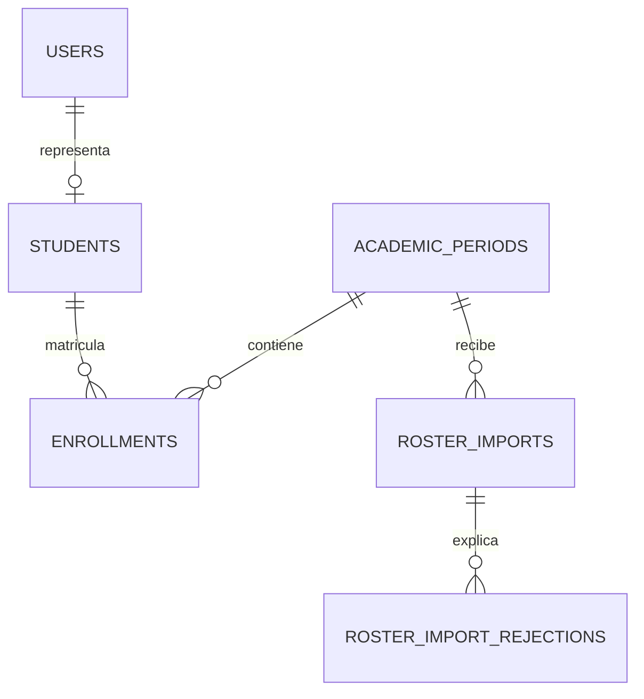
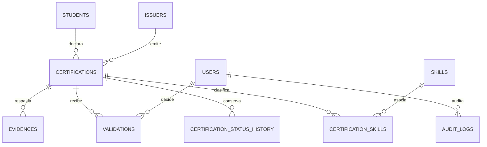
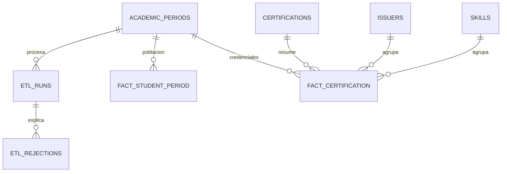

# Modelo de datos operacional y analítico

## Pulse EPIS — esquema operacional y analítico

Este modelo corresponde a los issues [#10 — Diseñar PostgreSQL y crear migraciones reproducibles](https://github.com/Kiara1616/pulse-epis/issues/10), [#11 — Implementar autenticación Google institucional y RBAC](https://github.com/Kiara1616/pulse-epis/issues/11), [#12 — Implementar importación y conciliación del padrón EPIS](https://github.com/Kiara1616/pulse-epis/issues/12), [#13 — Implementar registro de certificaciones y evidencias privadas](https://github.com/Kiara1616/pulse-epis/issues/13), [#14 — Implementar flujo de validación y auditoría de certificaciones](https://github.com/Kiara1616/pulse-epis/issues/14) y [#15 — Construir ETL idempotente y controles de calidad de datos](https://github.com/Kiara1616/pulse-epis/issues/15). Las migraciones se encuentran en `backend/migrations/versions/` y se ejecutan con Alembic.

El esquema separa la operación institucional de los hechos usados para indicadores. Las tablas analíticas conservan una fecha de corte para que los reportes sean reproducibles y no copian directamente el correo o código institucional.

`fact_student_period` conserva también cohorte y ciclo, de modo que la API analítica pueda aplicar esas dimensiones sin consultar ni exponer información personal del padrón.

## Vistas del esquema implementado

El [diagrama original completo](../recursos/diagramas/modelo-original.mmd) se conserva como recurso. Las siguientes vistas separan responsabilidades para que las figuras sean legibles en A4.

### Identidad y padrón

### Credenciales y auditoría

### ETL y hechos

## Reglas de integridad

- Los roles y estados se restringen mediante `CHECK` constraints para evitar valores fuera del contrato.
- `google_subject` es opcional hasta el primer login autorizado y luego vincula la cuenta local con el `sub` estable de Google mediante un índice único.
- El correo y el dominio de Google no reemplazan el padrón: una sesión solo se crea para un `users` provisionado y un `STUDENT` debe tener registro en `students`.
- Una importación del padrón se identifica por periodo y hash del archivo; los reintentos exactos no crean nuevos registros.
- Los lotes rechazados conservan únicamente metadatos y causas no sensibles por fila; el CSV original no se persiste.
- Una corrida ETL se identifica por periodo, fecha de corte y hash de la extracción; repetir la misma fuente es idempotente.
- `etl_runs` conserva filas, duplicados, calidad, estado y hash de fuente; `etl_rejections` conserva la causa por fila sin almacenar correos ni el extracto original.
- La publicación elimina y carga el snapshot de un periodo/corte dentro de la misma transacción; una corrida rechazada mantiene intacta la última publicación.
- El ETL extrae desde las tablas operativas autorizadas y no realiza búsqueda simulada por correo en Credly.
- `Enrollment` conserva escuela y plan por periodo para mantener el historial sin sobrescribir el contexto académico anterior.
- Una matrícula es única por estudiante y periodo (`student_id`, `period_id`).
- Una certificación es única por estudiante, emisor, nombre y fecha de emisión.
- El identificador externo de una certificación es único dentro de su emisor cuando existe.
- Una evidencia exige una URL o una clave de objeto y evita repetir el mismo hash para una certificación.
- Los archivos de evidencia se guardan con una clave aleatoria, metadatos de tipo/tamaño y `retention_until`; el acceso se entrega mediante tokens firmados de corta duración.
- La corrección de una certificación observada pasa a `RESUBMITTED` y no elimina las decisiones anteriores.
- Cada transición explícita agrega una fila en `certification_status_history`; la aplicación no ofrece actualización ni borrado de ese historial.
- `EXPIRED` es un estado derivado al evaluar una certificación `APPROVED` cuyo `expires_on` es anterior a la fecha de corte; el registro aprobado original se conserva.
- Solo `APPROVED` que siga vigente en la fecha de corte puede entrar en los KPI oficiales.
- Las fechas de periodo y certificación son consistentes; los contadores analíticos no pueden ser negativos ni superar el total.
- Las tablas de hechos incluyen fecha de corte y claves compuestas para evitar snapshots duplicados.
- Los índices cubren estados, periodos, estudiantes, emisores, validaciones, auditoría y consultas analíticas frecuentes.

Las migraciones se prueban con datos sintéticos contra PostgreSQL en CI y se revierten a `base` al finalizar la prueba. La conexión de identidad desde la API usa Google OIDC sin scopes de Gmail, sesiones firmadas y autorización RBAC en backend. El padrón se carga mediante un lote atómico, con HMAC para `student_key`, historial por periodo y reporte de rechazos sin PII. Las issues #13 y #14 cubren evidencias privadas, decisiones del validador y trazabilidad; el adaptador S3, la purga programada y la recuperación conjunta de base/evidencias siguen siendo brechas operativas, aunque Compose y workflows ya existen.

## Diccionario físico de tablas

Extraído de backend/app/db/models.py para el corte documentado. Las ocho migraciones versionadas complementan los tipos y restricciones. No se afirma cifrado por campo donde el modelo declara String.

### Tabla academic_periods

| Columna | Tipo | Nulo | Clave o referencia |
|---|---|---|---|
| `id` | UUID | No | PK |
| `code` | VARCHAR(32) | No | UK |
| `name` | VARCHAR(120) | No | - |
| `starts_on` | DATE | No | - |
| `ends_on` | DATE | No | - |
| `status` | VARCHAR(20) | No | - |

### Tabla issuers

| Columna | Tipo | Nulo | Clave o referencia |
|---|---|---|---|
| `id` | UUID | No | PK |
| `name` | VARCHAR(150) | No | UK |
| `website_url` | VARCHAR(2048) | Sí | - |
| `created_at` | TIMESTAMP WITH TIME ZONE | No | - |

### Tabla skills

| Columna | Tipo | Nulo | Clave o referencia |
|---|---|---|---|
| `id` | UUID | No | PK |
| `name` | VARCHAR(150) | No | UK |
| `category` | VARCHAR(100) | Sí | - |
| `created_at` | TIMESTAMP WITH TIME ZONE | No | - |

### Tabla users

| Columna | Tipo | Nulo | Clave o referencia |
|---|---|---|---|
| `id` | UUID | No | PK |
| `email` | VARCHAR(320) | No | UK |
| `google_subject` | VARCHAR(255) | Sí | - |
| `password_hash` | VARCHAR(512) | Sí | - |
| `role` | VARCHAR(20) | No | - |
| `is_active` | BOOLEAN | No | - |
| `created_at` | TIMESTAMP WITH TIME ZONE | No | - |

### Tabla audit_logs

| Columna | Tipo | Nulo | Clave o referencia |
|---|---|---|---|
| `id` | UUID | No | PK |
| `actor_user_id` | UUID | Sí | FK users.id |
| `action` | VARCHAR(100) | No | - |
| `entity_type` | VARCHAR(100) | No | - |
| `entity_id` | VARCHAR(100) | Sí | - |
| `before_data` | JSON | Sí | - |
| `after_data` | JSON | Sí | - |
| `idempotency_key` | VARCHAR(150) | Sí | UK |
| `created_at` | TIMESTAMP WITH TIME ZONE | No | - |

### Tabla etl_runs

| Columna | Tipo | Nulo | Clave o referencia |
|---|---|---|---|
| `id` | UUID | No | PK |
| `period_id` | UUID | No | FK academic_periods.id |
| `actor_user_id` | UUID | Sí | FK users.id |
| `cutoff_date` | DATE | No | - |
| `source_sha256` | VARCHAR(64) | No | - |
| `status` | VARCHAR(20) | No | - |
| `total_rows` | INTEGER | No | - |
| `accepted_rows` | INTEGER | No | - |
| `rejected_rows` | INTEGER | No | - |
| `duplicate_rows` | INTEGER | No | - |
| `quality_report` | JSON | Sí | - |
| `created_at` | TIMESTAMP WITH TIME ZONE | No | - |
| `completed_at` | TIMESTAMP WITH TIME ZONE | Sí | - |

### Tabla fact_student_period

| Columna | Tipo | Nulo | Clave o referencia |
|---|---|---|---|
| `student_key` | VARCHAR(64) | No | PK |
| `period_id` | UUID | No | PK, FK academic_periods.id |
| `cutoff_date` | DATE | No | PK |
| `cohort` | VARCHAR(32) | Sí | - |
| `cycle` | VARCHAR(32) | Sí | - |
| `enrollment_status` | VARCHAR(20) | No | - |
| `certification_count` | INTEGER | No | - |
| `approved_certification_count` | INTEGER | No | - |
| `loaded_at` | TIMESTAMP WITH TIME ZONE | No | - |

### Tabla roster_imports

| Columna | Tipo | Nulo | Clave o referencia |
|---|---|---|---|
| `id` | UUID | No | PK |
| `period_id` | UUID | No | FK academic_periods.id |
| `actor_user_id` | UUID | Sí | FK users.id |
| `source_sha256` | VARCHAR(64) | No | - |
| `status` | VARCHAR(20) | No | - |
| `total_rows` | INTEGER | No | - |
| `accepted_rows` | INTEGER | No | - |
| `rejected_rows` | INTEGER | No | - |
| `created_at` | TIMESTAMP WITH TIME ZONE | No | - |
| `completed_at` | TIMESTAMP WITH TIME ZONE | Sí | - |

### Tabla students

| Columna | Tipo | Nulo | Clave o referencia |
|---|---|---|---|
| `id` | UUID | No | PK |
| `user_id` | UUID | Sí | FK users.id, UK |
| `student_key` | VARCHAR(64) | No | UK |
| `entry_year` | SMALLINT | Sí | - |
| `status` | VARCHAR(20) | No | - |
| `created_at` | TIMESTAMP WITH TIME ZONE | No | - |

### Tabla certifications

| Columna | Tipo | Nulo | Clave o referencia |
|---|---|---|---|
| `id` | UUID | No | PK |
| `student_id` | UUID | No | FK students.id |
| `issuer_id` | UUID | No | FK issuers.id |
| `credential_name` | VARCHAR(200) | No | - |
| `external_id` | VARCHAR(200) | Sí | - |
| `issued_on` | DATE | No | - |
| `expires_on` | DATE | Sí | - |
| `status` | VARCHAR(20) | No | - |
| `source_url` | VARCHAR(2048) | Sí | - |
| `created_at` | TIMESTAMP WITH TIME ZONE | No | - |
| `updated_at` | TIMESTAMP WITH TIME ZONE | No | - |

### Tabla enrollments

| Columna | Tipo | Nulo | Clave o referencia |
|---|---|---|---|
| `id` | UUID | No | PK |
| `student_id` | UUID | No | FK students.id |
| `period_id` | UUID | No | FK academic_periods.id |
| `cycle` | VARCHAR(32) | Sí | - |
| `cohort` | VARCHAR(32) | Sí | - |
| `school` | VARCHAR(150) | Sí | - |
| `study_plan` | VARCHAR(120) | Sí | - |
| `status` | VARCHAR(20) | No | - |

### Tabla etl_rejections

| Columna | Tipo | Nulo | Clave o referencia |
|---|---|---|---|
| `id` | UUID | No | PK |
| `run_id` | UUID | No | FK etl_runs.id |
| `row_number` | INTEGER | No | - |
| `record_key` | VARCHAR(128) | Sí | - |
| `field_name` | VARCHAR(64) | No | - |
| `reason_code` | VARCHAR(64) | No | - |
| `message` | VARCHAR(255) | No | - |

### Tabla roster_import_rejections

| Columna | Tipo | Nulo | Clave o referencia |
|---|---|---|---|
| `id` | UUID | No | PK |
| `import_id` | UUID | No | FK roster_imports.id |
| `row_number` | INTEGER | No | - |
| `field_name` | VARCHAR(64) | No | - |
| `reason_code` | VARCHAR(64) | No | - |
| `message` | VARCHAR(255) | No | - |

### Tabla certification_skills

| Columna | Tipo | Nulo | Clave o referencia |
|---|---|---|---|
| `certification_id` | UUID | No | PK, FK certifications.id |
| `skill_id` | UUID | No | PK, FK skills.id |
| `level` | VARCHAR(50) | Sí | - |

### Tabla certification_status_history

| Columna | Tipo | Nulo | Clave o referencia |
|---|---|---|---|
| `id` | UUID | No | PK |
| `certification_id` | UUID | No | FK certifications.id |
| `actor_user_id` | UUID | Sí | FK users.id |
| `from_status` | VARCHAR(20) | Sí | - |
| `to_status` | VARCHAR(20) | No | - |
| `comment` | VARCHAR(2000) | Sí | - |
| `cutoff_date` | DATE | Sí | - |
| `changed_at` | TIMESTAMP WITH TIME ZONE | No | - |

### Tabla evidences

| Columna | Tipo | Nulo | Clave o referencia |
|---|---|---|---|
| `id` | UUID | No | PK |
| `certification_id` | UUID | No | FK certifications.id |
| `evidence_type` | VARCHAR(20) | No | - |
| `source_url` | VARCHAR(2048) | Sí | - |
| `object_key` | VARCHAR(512) | Sí | - |
| `sha256` | VARCHAR(64) | Sí | - |
| `original_filename` | VARCHAR(255) | Sí | - |
| `content_type` | VARCHAR(100) | Sí | - |
| `byte_size` | INTEGER | Sí | - |
| `retention_until` | TIMESTAMP WITH TIME ZONE | Sí | - |
| `uploaded_at` | TIMESTAMP WITH TIME ZONE | No | - |

### Tabla fact_certification

| Columna | Tipo | Nulo | Clave o referencia |
|---|---|---|---|
| `certification_id` | UUID | No | PK, FK certifications.id |
| `skill_id` | UUID | No | PK, FK skills.id |
| `cutoff_date` | DATE | No | PK |
| `period_id` | UUID | No | FK academic_periods.id |
| `issuer_id` | UUID | No | FK issuers.id |
| `status` | VARCHAR(20) | No | - |
| `level` | VARCHAR(50) | Sí | - |
| `issued_on` | DATE | No | - |
| `expires_on` | DATE | Sí | - |
| `loaded_at` | TIMESTAMP WITH TIME ZONE | No | - |

### Tabla validations

| Columna | Tipo | Nulo | Clave o referencia |
|---|---|---|---|
| `id` | UUID | No | PK |
| `certification_id` | UUID | No | FK certifications.id |
| `validator_user_id` | UUID | No | FK users.id |
| `decision` | VARCHAR(20) | No | - |
| `comment` | VARCHAR(2000) | Sí | - |
| `decided_at` | TIMESTAMP WITH TIME ZONE | No | - |
