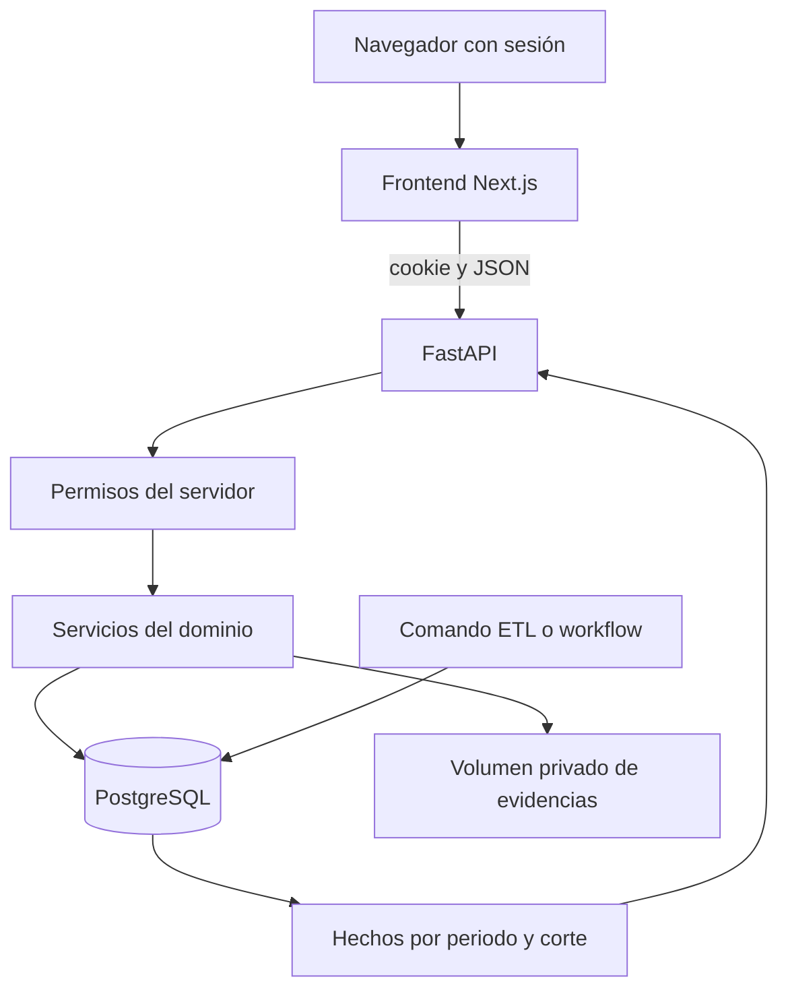

# Arquitectura técnica implementada

Pulse EPIS usa frontend Next.js 16.3.3 y React 19.2.8, API FastAPI y persistencia SQLAlchemy/Alembic sobre PostgreSQL 16 en Compose. Las versiones frontend proceden de package.json; el lock fija las dependencias npm. Las versiones Python se resuelven con requirements y deben registrarse al generar artefactos.

## Componentes y responsabilidad

| Componente | Ubicación | Responsabilidad |
|---|---|---|
| Portal | dashboard-app/src/app | Analítica, padrón, perfil, validación y administración |
| Sesión | dashboard-app/src/features/access | Configuración de login, sesión y restricciones visuales |
| Analítica frontend | dashboard-app/src/features/analytics | Consulta común y filtros de snapshots |
| API | backend/app/api/routes | Contratos HTTP, autorización y errores |
| Servicios | backend/app/auth, roster, certifications, validation, etl, analytics | Reglas de dominio y operaciones transaccionales |
| Persistencia | backend/app/db y backend/migrations | 18 tablas y ocho migraciones versionadas |
| Evidencias | backend/app/evidence | Archivos privados con hash y acceso firmado |
| Operación | compose.yaml, deploy y .github/workflows | Contenedores, HTTPS y tareas operativas |

## Flujo y fronteras

La importación forma la población por periodo. STUDENT declara; VALIDATOR revisa y decide; el operador ejecuta ETL para publicar un snapshot. La API analítica lee hechos publicados y devuelve agregados. AuthBoundary/RoleGate restringen la experiencia visual, mientras require_permissions aplica autorización efectiva en cada ruta protegida.

No hay archivos mock-data.json ni etl_data.json en la rama revisada. Los datos de semilla y pruebas son sintéticos. No hay servicio S3 ni worker distribuido en Compose: su incorporación es una alternativa futura. Las tareas de exportación CSV ocurren en navegador; el PDF académico es documentación generada por scripts.

## Consistencia y limitaciones

La base y las evidencias se guardan en volúmenes distintos. Se debe respaldar ambos para recuperar un expediente. Crear credencial y adjuntar archivo son dos solicitudes; falla del adjunto puede dejar PENDING sin binario. El backend ofrece corrección, pero la interfaz de edición y captura de habilidades aún no está completa. Consulta [API y contratos](15-API-y-contratos.md), [modelo](05-Modelo-de-datos.md) y [SAD](../academico/FD04-Arquitectura-Software.md).
