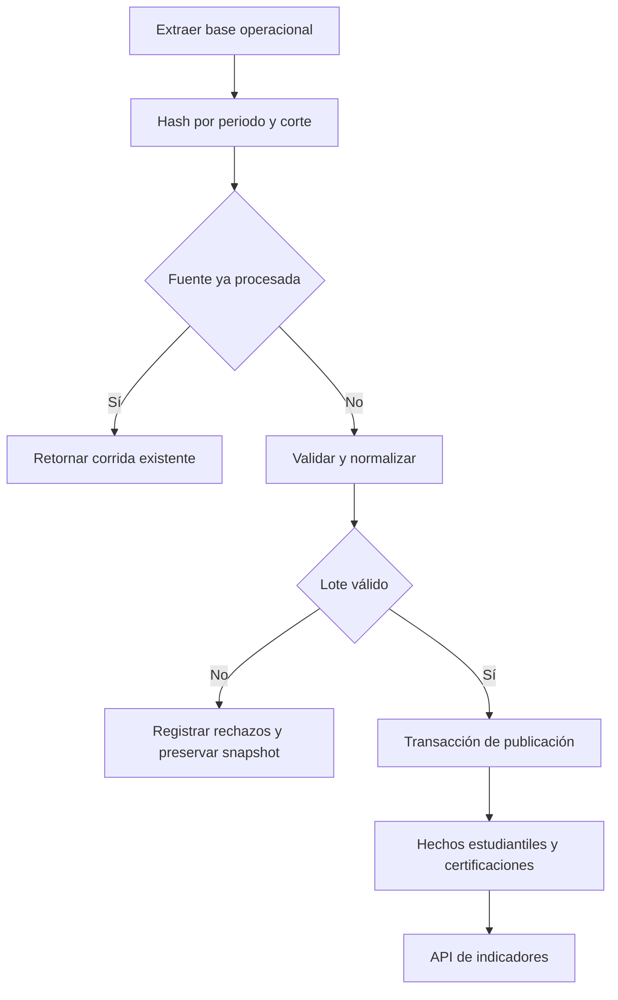

# ETL y calidad de datos

## Entrada salida y ejecución

El ETL lee estudiantes, matrículas, certificaciones, emisores, habilidades y decisiones de la base operacional autorizada. No consulta personas por correo en Credly ni realiza scraping. Se ejecuta desde la raíz con base migrada y periodo existente.

```bash
python -m backend.scripts_etl.main --period-code 2026-II --cutoff-date 2026-10-02
```

La fecha del comando es ilustrativa; el operador debe sustituirla por el corte aprobado. PULSE_DATABASE_URL identifica la base. El workflow etl-scheduled requiere ese secreto y ETL_PERIOD_CODE/ETL_CUTOFF_DATE. El operador necesita acceso de infraestructura: no hay botón web ni endpoint general para ejecutar corridas.



## Reglas e idempotencia

La corrida identifica periodo, corte y hash determinista de fuente. Fuente idéntica reutiliza su reporte. Alias de emisores, niveles y habilidades se normalizan con catálogos versionados. Se verifican fechas, campos obligatorios, estados y duplicidad. Los rechazos almacenan causas genéricas sin CSV, código ni correo.

Una corrida inválida conserva el último snapshot; una publicación válida reemplaza los hechos del periodo/corte de forma atómica. FactStudentPeriod fija población ACTIVE, cohorte y ciclo; FactCertification conserva credencial, habilidad, estado efectivo y corte. EXPIRED se deriva de fecha y aprobación, permanece en histórico y queda fuera del KPI corriente APPROVED.

## Interpretación y seguimiento

Consultar etl_runs y etl_rejections por el procedimiento de base autorizado; no existen una pantalla ni API administrativa de corridas completas. Guardar identificador, hash, periodo, corte, conteos y responsable fuera de registros nominales. Conciliar una muestra manual contra padrón, evidencias y decisiones antes de dar un cierre por oficial.

Las métricas de completitud y duplicados provienen de la corrida; no todos esos campos se incluyen en AnalyticsOverview. La ventana expiring_soon es de 90 días. La brecha skill_gaps es población activa menos estudiantes certificados por habilidad; no se interpreta como demanda externa. Ver [Diccionario](09-Diccionario-indicadores.md) y [Objetivos](01-Objetivos-medibles.md).

## Errores y recuperación

Ante periodo inexistente, preparar el catálogo autorizado; ante error de conexión, revisar readiness y variable de base. Ante datos inválidos, corregir la fuente operacional y volver a ejecutar con el mismo periodo/corte: el hash cambiado permite una corrida distinta. No borrar el último snapshot para ocultar rechazos ni publicar cifras parciales. Probar idempotencia y rollback con backend/tests/test_etl.py.
